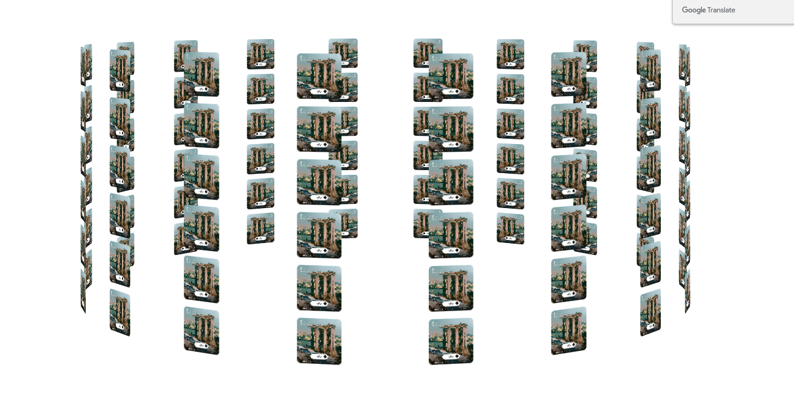
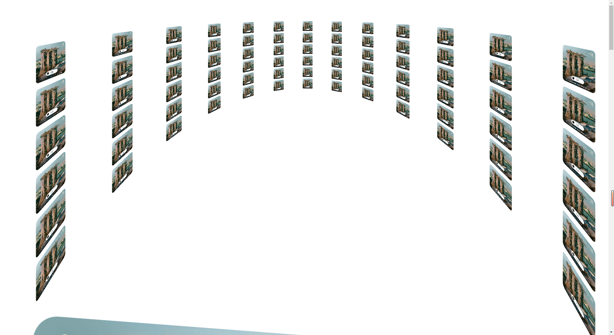

## transform-style: preserve-3d 和 perspective

这两个属性是css实现3d的重要属性，第一个标识将嵌套元素以3d的形式展现，第二个则表示的是眼睛到屏幕的观察距离。距离的不同呈现出的效果也会不同。

下面就一起来看看如何实现这个3d大圆柱吧
```html
<div class="view">
    <div class="container">
    </div>
</div>
```

```js
    /**
     * 轮播宽度修改translateZ的值，轮播方位调整perspective的值（这个值表示眼睛观看屏幕的距离），整个盒子宽度要和子元素
     * 相同，旋转才会围绕中心点
     * @type {Element}
     */
    const wapper = document.getElementsByClassName('container')[0]

    for (let i=0;i<108;i++){
        const div = document.createElement('div')
        const image = document.createElement('img')
        image.src = 'Frame 6388.png'
        div.className = `box`
        div.append(image)
        div.style.transform = `rotateY(${(i%18)*20}deg) translateZ(500px) translateY(${parseInt(i/18)*70}px)`
        wapper.appendChild(div)
    }
    setTimeout(()=>{
        document.getElementsByClassName('view')[0].style.transform = 'scale(1)'
    },1000)
```

```css
<style>
    .view {
        perspective: 60cm;
        transition: all 1s;
        transform: scale(0);
    }

    .container {
        width: 60px;
        height: 60px;
        font-size: 80px;
        color: white;
        text-align: center;
        transform-style: preserve-3d ;
        margin: 0 auto;
        animation: animation 15s linear infinite;
    }
    .box {
        width: 60px;
        height: 60px;
        position: absolute;
        top: 60px;
        border-radius: 5px;
    }
    .box>img{
        border-radius: 5px;
        width: 100%;
        height: 100%;
        object-fit: cover;
    }

    @keyframes animation {
        100% {
            transform: rotateY(-360deg) ;
        }
    }

</style>

```
几个重要的点

- translateZ：影响整体圆柱的宽度，本身我们的dom其实只有一点点大，而圆柱的宽度是需要通过translateZ来扩大的。
- perspective： 调整圆柱的呈现样式，具体的值可以是cm和无单位。
- 整个盒子宽度要和子元素相同，旋转才会围绕中心点

下面一起来看看效果



调整一下perspective的值，还可以实现沉浸式观影的效果


下面贴一下完整的可运行的demo
```html
<!DOCTYPE html>
<html lang="en">
<head>
    <meta charset="UTF-8">
    <title>3D - 轮播图</title>
    <script src="https://cdn.bootcdn.net/ajax/libs/snabbt.js/0.6.4/snabbt.min.js"></script>
</head>
<style>
    .view {
        perspective: 60cm;
        transition: all 1s;
        transform: scale(0);
    }

    .container {
        width: 60px;
        height: 60px;
        font-size: 80px;
        color: white;
        text-align: center;
        transform-style: preserve-3d ;
        margin: 0 auto;
        animation: animation 15s linear infinite;
    }
    .box {
        width: 60px;
        height: 60px;
        position: absolute;
        top: 60px;
        border-radius: 5px;
    }
    .box>img{
        border-radius: 5px;
        width: 100%;
        height: 100%;
        object-fit: cover;
    }

    @keyframes animation {
        100% {
            transform: rotateY(-360deg) ;
        }
    }

</style>
<body>
<div class="view">
    <div class="container">
    </div>
</div>

<script>
    /**
     * 轮播宽度修改translateZ的值，轮播方位调整perspective的值（这个值表示眼睛观看屏幕的距离），整个盒子宽度要和子元素
     * 相同，旋转才会围绕中心点
     * @type {Element}
     */
    const wapper = document.getElementsByClassName('container')[0]

    for (let i=0;i<108;i++){
        const div = document.createElement('div')
        const image = document.createElement('img')
        image.src = 'Frame 6388.png'
        div.className = `box`
        div.append(image)
        div.style.transform = `rotateY(${(i%18)*20}deg) translateZ(500px) translateY(${parseInt(i/18)*70}px)`
        wapper.appendChild(div)
    }
    setTimeout(()=>{
        document.getElementsByClassName('view')[0].style.transform = 'scale(1)'
    },1000)

</script>
</body>
</html>

```
这种3d效果比较简单，能实现的样式也比较单一，和three.js webgl那种3d技术实现的肯定是有一定差距的
