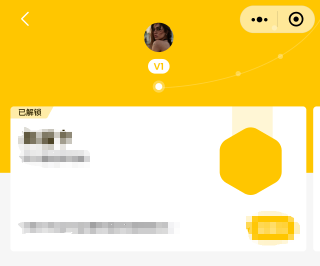

## 前言
>接到一个新需求，里面有一处vip等级的卡片交互，效果大概如下，等级信息可滑动，滑动的时候需要带动等级的星轨一起动。就像网易云的会员等级交互一样



看上图中v1下面那条轨道，他需要跟着卡片滑动一起滑动。大致需求就是这样下面就来讲一讲实现。

## 思路一：通过css实现
一开始想通过css来实现，画一个半圆，然后让他以圆心为中点去旋转，试验之后发现次方法并不太靠谱。首先圆弧的长度控制不自由，并且dom的层级也很杂乱，需要用各种定位，遮盖。旋转也不是特别好用，综上所述，这个方案被pass了。

## 思路二：通过canvas实现
通过canvas去绘制一段圆弧就比较轻松了，旋转动画就通过计算每一帧的角度然后在规定的动画时间内不停的重新绘制canvas就可以了。

首先熟悉一下需要用到的canvas api。
- arc：这是canvas中用来绘制圆弧的方法，通常以这个函数去约束一个圆弧的各种参数，然后再调用绘制线条的函数就可以画出一个圆弧
  - ctx.arc(centerX, centerY, radius, startAngle, endAngle)，arc共接收五个参数，分别是圆心的横坐标，纵坐标，圆弧的半径长度，圆弧的起始角度以及结束角度。有了这个api不但可以绘制任意的圆弧还可以绘制一整个圆
- beginPath：这个api作用是开辟一个新的路径，那什么是新的路径呢？众所周知，canvas的图层结构是有先后顺序的，比如你先绘制一个图形，后续你想绘制另一个图形的时候你就需要开辟一个新的路径，不然你后续所有操作都会作用在上一个图形上。
- setLineWidth：设置线条的宽度
- setStrokeStyle：设置边框的颜色
- stroke：绘制当前边框的路径，上面那些api可以理解为是在设置样式，这个api就是用来实际绘制图的
- setFillStyle：设置填充颜色
- fill：填充

好了，有了以上这些api，我们就可以着手去绘制这个圆弧星轨啦

首先我们需要确定arc的几个参数，圆心的坐标就去canvas画布的圆心，半径当然也是画布的圆心到最短边的距离了（画布可能是长方形，不是正方形，所以这里为了将圆画在画布中间需要取圆心到最短边的距离作为圆的半径）。最后剩下的就是确定其实角度和结束角度。

圆心很简单，我们直接获取canvas的长和宽的一半就是圆心点的坐标。
```js
const ctx = uni.createCanvasContext('myCanvas', this);
const centerX = canvasWidth / 2;
const centerY = canvasHeight / 2;
// 接着确定半径
const radius = Math.min(canvasWidth,canvasHeight) / 2;
```
关于起始角度这一步我需要提一嘴，canvas的角度是从x轴右边开始顺时针计算的，也就是x轴左边是180°右边是0°。我画一个图大家就比较容易理解了


计算角度可以通过这个函数
```js
Math.PI * ( 1 / 180) // 这个就代表1°
```
这里我将星轨定制为每个等级的原点之间间隔40°，一共有三个等级，所以圆弧的总跨度是120°，而第一级是处于正下方，也就是90°的位置，所以我们的起始度数就是90-40*2也就是10°。

```js
    const startAngle=Math.PI * ((90-(40 * 2)) / 180) // 起始角度，转换为弧度
    const endAngle=Math.PI * ( 90 / 180) // 结束角度，转换为弧度90°
    const ctx = uni.createCanvasContext('myCanvas', this);
    const centerX = canvasWidth / 2;
    const centerY = canvasHeight / 2;
    const radius = Math.min(canvasWidth,canvasHeight)/ 2;
    const startAngle = this.startAngle
    const endAngle = this.endAngle
    ctx.beginPath();
    ctx.arc(centerX, centerY, radius, startAngle, endAngle);
    ctx.setLineWidth(2); // 设置线条宽度
    ctx.setStrokeStyle('#fff'); // 设置线条颜色
    ctx.stroke(); // 绘制圆弧
```
这样我们就得到了整个星轨的圆弧了，为了美观，可以在尾巴上多画一段，调整一下起始角度就行了。

接下来需要绘制每一个等级的圆点，首先我们制定一个循环，从90°开始到10°的逆向或者顺向都行，起始就是再这个圆弧上以40°为界限去循环绘制每一个等级的圆点。
```js
for (let angle = endAngle; parseFloat(angle.toFixed(4)) >= parseFloat(startAngle.toFixed(4)); angle -= Math.PI * (40 / 180)) {
...
}
```
这里我采用了逆向去循环，以结束角度开始，也就是90°开始，然后递减40°，直到他小于开始角度，也就是小于1°

接下来一个难点就是计算小圆的圆心坐标，我直接问机器人了QAQ...
```js
      for (let angle = endAngle; parseFloat(angle.toFixed(4)) >= parseFloat(startAngle.toFixed(4)); angle -= Math.PI * (40 / 180)) {
        const smallCircleCenterX = centerX + Math.cos(angle) * radius;
        const smallCircleCenterY = centerY + Math.sin(angle) * radius;
        // 绘制小圆
        ctx.beginPath();
        if(parseFloat(this.currentCardAngel.toFixed(4)) === parseFloat(angle.toFixed(4))){
          // 绘制被选中的圆
          ctx.arc(smallCircleCenterX, smallCircleCenterY, 4, 0, 2 * Math.PI);
          ctx.setFillStyle(this.LvStyle.startColor);
          ctx.fill();
          ctx.arc(smallCircleCenterX, smallCircleCenterY, 7, 0, 2 * Math.PI);
          ctx.setFillStyle(this.LvStyle.startBgColor);
          ctx.fill();
        }else{
          // 绘制其他小圆
          ctx.arc(smallCircleCenterX, smallCircleCenterY, smallCircleRadius, 0, 2 * Math.PI);
          ctx.setFillStyle(this.LvStyle.startBgColor);
          ctx.fill();
        }
      }
      ctx.draw();
```
关于小圆的圆心坐标，机器人给出的解释如下：

::: tip

在数学中，单位圆是以原点为圆心、半径为1的圆。单位圆上的任意一点的坐标可以由该点与单位圆中心的连线与x轴的夹角来表示。
余弦函数(cosine)和正弦函数(sine)是用来描述角度与单位圆上点的坐标之间的关系的函数。具体而言：

- 余弦函数(cosine)：给定一个角度，它返回单位圆上对应点的x坐标。
- 正弦函数(sine)：给定一个角度，它返回单位圆上对应点的y坐标。

当我们将角度(angle)乘以半径(radius)后，就可以得到从单位圆的圆心到对应点的距离（即x坐标或y坐标）。然后，将这个距离加上大圆的圆心坐标(centerX和centerY)，就可以得到小圆的圆心坐标。
通过使用余弦和正弦函数，我们可以利用三角函数的性质来计算小圆相对于大圆的偏移量，从而确定小圆的圆心位置。

:::

得到圆心之后就是填充一下颜色，以及给当前等级的圆增加一个选中状态，就不多说了代码比较简单。

写到这里，我们就把基本样貌都已经绘制完成了。接下来需要去实现动画

动画就比较简单了，通过定时器实现，确定一下动画时间，计算出每一帧执行的间隔以及每一帧绘制的角度。
```js
    startAnimation(type,deg = 40) {
      const frames = Math.floor(400 / 16.7); // 每帧持续时间为16.7ms，根据动画持续时间计算总帧数
      let frameCount = 0;
      const angleIncrement = (Math.PI * deg / 180) / frames; // 每帧递增的角度
      this.timer = setInterval(() => {
        if (frameCount < frames) {
          if(type==='add'){
            this.startAngle += angleIncrement;
            this.endAngle += angleIncrement;
          }else{
            this.startAngle -= angleIncrement;
            this.endAngle -= angleIncrement;
          }
          frameCount++;
          this.redrawCanvas();
        } else {
          clearInterval(this.timer);
        }
      }, 16.7);
    }
```
在上述代码中，我们限定动画执行时间为400毫秒，旋转角度由调用方传入，默认值为40°。以16.7毫秒为一帧，计算出总帧数，并且计算出一帧旋转的角度，然后就是用定时器去不停的绘制星轨啦。type的作用是判断星轨是左滑还是右滑。

## 总结
> 本文简单描述了如何用canvas绘制一个可旋转的圆弧，并简单介绍了一些canvas常用的api以及canvas的图层原理。上述效果还可以配合监听手指滑动做到星轨跟随手指一起动，这里偷了个懒就没写了，感兴趣的同学可以自行添加一下这个逻辑。
