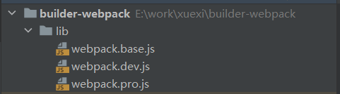
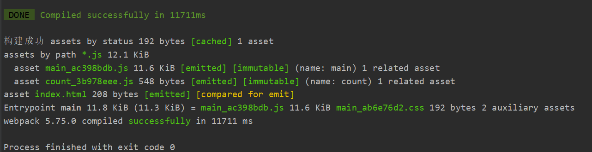

## 前言
>因为在日常开发的过程中，大多数项目的webpack构建配置都是相似的。所以我们可以将webpack的构建配置抽离成一个npm包，这样以后有项目需要用到就可以直接从npm上下载下来直接用了，而且拓展起来也非常的方便

<br/>

::: warning
本文着重讲解开发一个工具包的过程，至于文中webpack的具体配置仅供参考
:::

## 首先初始化一个项目

新建一个文件夹```builder-webpack```。然后进入这个文件夹初始化一下项目
```js
npm init
```

## 接着在跟目录下新建一个lib文件夹

在lib文件夹下新建三个js文件 分别是```webpack.base.js webpack.dev.js webpack.pro.js```分别对应我们的基本配置以及生产环境和开发环境的配置



## 编写脚本
准备工作都做好了，下面就来写一下我们的配置内容吧

- 1.首先是我们的```webpack-base.js``` 也就是我们的基本配置
```js
const path = require('path');// nodejs的核心模块，专门用来处理路径问题
const { VueLoaderPlugin } = require('vue-loader');// 解析vue文件得loader
const FriendlyErrorsWebpackPlugin = require('friendly-errors-webpack-plugin');
const MiniCssExtractPlugin = require('mini-css-extract-plugin');// 将css单独生成文件通过link引入得插件
const CssMinimizerPlugin = require('css-minimizer-webpack-plugin');// 压缩css得插件
const HtmlWebpackPlugin = require('html-webpack-plugin');

module.exports = {
  output: {
    path: path.resolve(__dirname, 'dist'),
    filename: '[name]_[chunkhash:8].js',
    clean: true,
  },
  module: {
    rules: [
      {
        test: /\.js$/,
        use: [
          'babel-loader',
        ],
      },
      {
        test: /\.vue$/,
        use: [
          'vue-loader',
        ],
      },
      {
        test: /\.css$/, // 只检测.css文件
        use: [ // 执行顺序：从右到左或者从下到上，最末尾的loader最先执行
          // "style-loader",//将js中的css通过创建style标签的形式添加到html中，以生效
          MiniCssExtractPlugin.loader,
          'css-loader', // 将css资源编译成common.js的模块到js中,
          'postcss-loader', // css处理器，类似于js的babel
          {
            loader: 'px2rem-loader', // 自动将px转成rem
            options: {
              remUnit: 75, // 设计稿的宽度/10
              remPrecision: 8, // 转换之后的保留小水点后几位
            },
          },
        ],
      },
      // less loader
      {
        test: /\.less$/,
        // loader:'xxx' 只能使用一个loader，use可以使用多个loader链式调用
        use: [
          // "style-loader",//将js中的css通过创建style标签的形式添加到html中，以生效
          MiniCssExtractPlugin.loader,
          'css-loader', // 将css资源编译成common.js的模块到js中
          'postcss-loader', // css处理器，类似于js的babel
          'less-loader', // 将less文件编译成css文件
        ],
      },
      // sass loader
      {
        test: /\.s[ac]ss$/, // 编译sass或者scss后缀的文件
        use: [
          MiniCssExtractPlugin.loader,
          // "style-loader",//将js中的css通过创建style标签的形式添加到html中，以生效
          'css-loader', // 将css资源编译成common.js的模块到js中
          'postcss-loader', // css处理器，类似于js的babel
          'sass-loader', // 将less文件编译成css文件
        ],
      },
      // 打包图片资源
      {
        test: /\.(png|jpe?g|gif|webp|svg)$/,
        use: [
          {
            loader: 'url-loader',
            options: {
              limit: 10 * 1024,
            },
          },
        ],
      },
      // 对图片资源进行优化
      {
        test: /\.(png|jpe?g|gif|webp|svg)$/,
        type: 'asset',
        parser: {
          dataUrlCondition: {
            // 小于10kb的图片进行base64的转换
            // 优点：base64图片不用发请求就能被识别，缺点，转成base64之后体积会变大
            maxSize: 10 * 1024, // 10kb
          },
        },
        generator: {
          // 修改输出的图片路径
          // hash 图片的哈希值，ext图片扩展名，query查询参数
          // hash：10代表只取前10位
          filename: 'static/image/[hash:10][ext][query]',
        },
      },
    ],
  },
  plugins: [
    new VueLoaderPlugin(),
    // 使用此插件将css分离出文件通过link引入
    new MiniCssExtractPlugin({
      filename: '[name]_[contenthash:8].css',
    }),
    // 自动生成模板html
    new HtmlWebpackPlugin({
      filename: 'index.html',
      template: 'public/index.html',
      inject: true, // 配置所有js资源放置在html得哪个位置
      minify: {
        // 压缩配置
        collapseWhitespace: true,
        preserveLineBreaks: false,
        html5: true,
        minifyCSS: true,
        minifyJS: true,
        removeComments: true,
      },
    }),
    // 更友好的编译提示
    new FriendlyErrorsWebpackPlugin(),
  ],
  optimization: {
    // 配置自定义插件覆盖默认得压缩插件
    minimizer: [
      new CssMinimizerPlugin(),
    ],
  },
  stats: 'errors-only',
};
```


- 2.接下来是webpack.dev.js
- 这里用到了webpack-merge这个库，他的作用就是合并我们传入的webpack配置项，具体的合并规则可以自行查文档，这里就不过多赘述了
```js
const {merge} = require('webpack-merge');
const baseConfig = require('./webpack.base');

const devConfig = {
  mode: 'development', // 开发环境
  devtool: 'source-map', // 输出源代码
};
module.exports = merge(baseConfig, devConfig);
```

- 3.webpack.pro.js
- 生产环境我们就把代码分割规则加上，做一个小优化
```js
const {merge} = require('webpack-merge');
const baseConfig = require('./webpack.base');

const proConfig = {
  optimization: {
    splitChunks: {
      /**
             * 这表明将选择哪些 chunk 进行优化。当提供一个字符串，有效值为 all，async 和 initial。
             * 设置为 all 可能特别强大，因为这意味着 chunk 可以在异步和非异步 chunk 之间共享。
             */
      // chunks:'all',
      // minSize: 3000,//需要处理的chunks的最小字节
      // maxSize: 0,//同上，相反
      // minChunks:1,//chunks最小被引用次数，超过这个次数就会被处理
      minSize: 0, // 只要引用了就会被成单独的chunks
      cacheGroups: { // 配置分离出来的chunks
        vendors: {
          test: /(vue)/,
          name: 'vendors',
          chunks: 'all',
        },
        common: {
          name: 'common',
          chunks: 'all',
          minChunks: 2, // 只要引用了两次以上就会被处理
        },
      },
    },
  },
  mode: 'production', // 开发环境
  devtool: 'source-map', // 输出源代码
};
module.exports = merge(baseConfig, proConfig);
```

这样依赖三个文件就初步写好了，

**作为一个安全可靠的库怎么能少得了eslint校验呢。下面就来安装一下eslint校验**

## 安装一下eslint
```js
npm i eslint eslint-config-airbnb-base @babel/eslint-parser @babel/preset-env @babel/core -D
```
安装完之后 准备一个```.babelrc```文件和一个```.eslintrc.js```文件，用来配置一下babel和eslint。
```js
.babelrc

{
    "presets":[
    "@babel/preset-env"
],
    "plugins":[
]
}

```
```js
.eslintrc.js

module.exports = {
    parser: '@babel/eslint-parser',
    env: {
        browser: true,
        commonjs: true,
        node: true,
    },
    extends: 'airbnb-base', //继承airbnb-base这个库的规则
    overrides: [
    ],
    parserOptions: {
        ecmaVersion: 'latest',
    },
    rules: { //自定义配置规则
    },
};

```

运行script命令``` eslint ./lib --fix``` eslint就会自动帮你整理代码

## 冒烟测试

下面把我们的脚本做一个简单的冒烟测试

首先安装一下rimraf这个库，他可以帮助我们删除打包生成的dist文件夹，方便我们的测试

```shell
npm i rimraf
```

下面编写测试脚本
```js
const path = require('path');
const webpack = require('webpack');
const rimraf = require('rimraf'); // 删除dist目录的库

process.chdir(path.join(__dirname, 'template')); // 进入template文件夹

rimraf('./dist').then(() => {
    const prodConfig = require('../../lib/webpack.pro');
    webpack(prodConfig, (err, stats) => {
        if (err) {
            console.log('构建错误', err);
        }
        console.log('构建成功', stats.toString({
            colors: true,
            modules: false,
            children: false,
        }));
    });
});


```
在package.json里配置一下脚本运行命令
```js
 "scripts": {
    "eslint-fix": "eslint ./lib --fix",
    "test": "node ./test/smock/index.js"
  },
```
运行我们的测试脚本就可以看到构建结果



在运行脚本期间，发现mini-css-extract-plugin这个插件报了个错出来

```js
Cannot find module 'ajv/dist/compile/codegen'
```
最终搜了一下，发现安装高版本的ajv库可以解决问题
```js
npm install --save-dev ajv@^7 
```
这样我们这个库就基本完成拉，接下来就是打包发布到npm上去，在这之前我们可以配置一下这个代码库的提交规范，以及完善一下版本管理。

## 提交规范

前往这篇文章[git提交信息规范-commitlint](/pages/e49859/)

## 版本管理

前往这篇文章[仓库版本管理-standard-version](/pages/69b843/)

## 发布npm
前往这篇文章[发布一个npm包](/pages/59abc9/)
 
