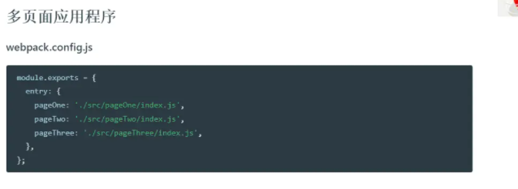
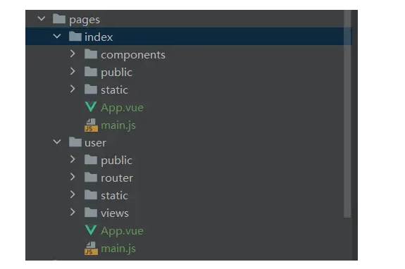
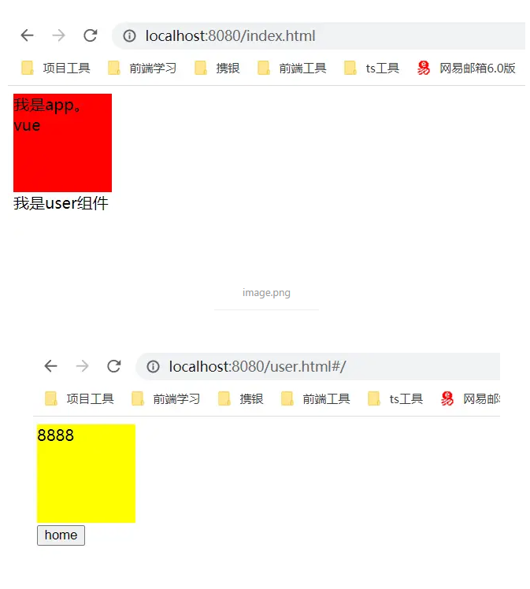

  
## 前言
>和传统的单页面应用打包不同，多页面应用其实就是配置多个入口，生成多个bundle。
下面就来看看具体应该怎么操作吧



这是官方提供的示例，可以看到，entry变成了一个对象，而里面每一个键值对则就对应了我们每一个最终生成的bundle。文档地址：https://www.webpackjs.com/concepts/entry-points/#separate-app-and-vendor-entries


其实还是非常简单的，原理上来说就是配置多个入口文件，使webpack生成多个依赖关系，从而构建出多个bundlejs。这样我们在不同的html文件引入对应的bundle就行了。

但是有一个问题，这样的配置我们每增加一个子页面都需要去写一个entry的键值对，非常的麻烦。那有没有什么办法可以一次性获取到这些子页面然后自动生成entry呢？

答案是有的，借助glob这个库就可以完成。

glob这个库有个sync的方法，可以获取指定路径下的所有文件，有了这个我们不就可以一次性拿到所有的子页面了嘛。下面一起来看看具体操作吧

首先下载以下这个库

```shell
npm i glob -D
```
```js
const setMPA = ()=>{
    const entry = {}
    const htmlWebpackPlugin = []
    const entryFile = glob.sync('./pages/*/main.js')
    entryFile.forEach((filePath,index)=>{
        //根据获取到的路劲生成多入口entry对象
        const entryName = filePath.split('/pages/')[1].split('/main.js')[0]
        entry[entryName] = filePath
        //接着生成每个入口的html模板
        htmlWebpackPlugin.push(
            new HtmlWebpackPlugin({
                filename: `${entryName}.html`,
                template: path.resolve(__dirname,`./pages/${entryName}/public/index.html`),
                chunks: [entryName], //只打入指定的chunks，不然的话webpack会将所有bundle都引入
                inject: true,//配置所有js资源放置在html得哪个位置
                minify:{
                    //压缩配置
                    collapseWhitespace: true,
                    preserveLineBreaks:false,
                    html5:true,
                    minifyCSS:true,
                    minifyJS:true,
                    removeComments: true,
                }
            })
        )
    })
    return{
        entry,
        htmlWebpackPlugin
    }
}
```

有了这个函数，就能拿到最新的entry以及最新的htmlWebpackPlugin配置。

目录结构如下


下面来看看效果


