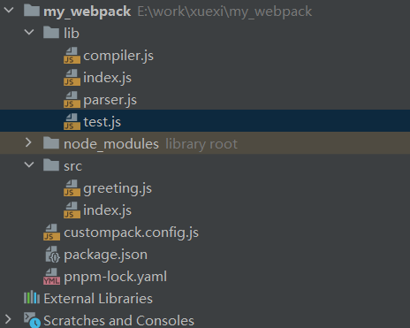

## 前言

>前端构建工具在日常开发中已经必不可少了，下面就让我们一起从零开始手动实现一个简易的webpack，揭下webpack神秘的面纱

在手写webpack之前，首先要熟悉两个概念。一个是js的```模块化机制```，另一个就是```AST抽象语法树```
模块化机制这里就不多做赘述了，而Ast树可是大有用途。

## 什么是抽象语法树

抽象语法树其实就是通过树状结构来描述一段代码。他的作用非常多，比如在对不同版本代码的升降级处理，以及代码的跨平台实现。例如，我们平时书写的es6代码浏览器是不兼容的，那大家都知道需要通过babel去将es6转换成es5.而babel是怎么去转换的呢？
其实就是通过将es6代码编译成一颗AST树，然后再用es5的语法去将这棵树实现一遍。同样的例子还有框架中的虚拟dom，其实也是一颗ast树。来描述我们的dom节点。

## 开始
好了，铺垫完了。开始正文，首先我们这个简易版的webpack需要实现这样几个功能，
- 可以将es6转成es5语法
1. 通过babylon生成ast树
2. 通过babel-core将ast重新生成源码
- 可以分析模块之间的依赖关系
1. 通过babel-traverse的ImportDeclaration方法获取依赖属性
- 最终生成的js文件可以在浏览器中运行
明确了我们的目标，接下来就开始动手吧
## 目录结构


目录结构大概长这样
- lib目录下存放我们的webpack代码
1. index是主要文件
2. parser.js主要用来生成ast，转换代码，以及确立依赖关系
3. complier.js主要做模块的构建和输出
- src下是需要被打包的代码
- 最后再来一个配置文件模拟一下webpack的合并配置

下面我们就开始着手去编码了
首先我们在配置文件里写上出口入口的配置
```js 
// custompack.config.js

const path = require('path')

module.exports = {
    entry:path.join(__dirname,'./src/index,js'),
    output:{
        path:path.join(__dirname,'./dist'),
        filename:'main.js'
    }
}

```
简单书写了一下出口和入口之后，我们得先把ast这一步处理好，所以来到我们的parser.js中

这里安装一下两个库```babylon``` ```babel-traverse```,他们的作用在js代码中会有体现

```js
// parser.js
//解析ast语法树。将es6转成es5，并且分析依赖
const babylon = require('babylon')//转换ast
const fs = require('fs') //读取文件
const traverse = require('babel-traverse').default  //获取依赖


module.exports = {
    getAst:(path)=>{
        //读取到文件内容
        const source = fs.readFileSync(path,'utf-8')
        //通过babylon.parse讲读取到的文件内容专程ast树
        return babylon.parse(source,{
            sourceType:'module'
        })
    },
    getDependencies:(ast)=>{
        const dependencies = []
        //传入ast，并且配置ImportDeclaration属性，traverse就会把ast中所有的import依赖都找出来
        traverse(ast,{
            ImportDeclaration:({node})=>{
                dependencies.push(node.source.value)
            }
        })
        return dependencies
    }
}

```
可以看到上面已经写好了两个方法，分别是生成ast树，以及找到ast树里的依赖关系
我们可以在test.js中引入并且打印看一下效果
```js
// src/index.js

import {greeting} from './greeting'

greeting()

console.log('main')


```
```js
// lib/test.js

const {getAst,getDependencies}  =require('./parser')
const path = require('path')

const ast = getAst(path.join(__dirname,'../src/index.js'))
console.log(ast,'getAst')

console.log(getDependencies(ast),'getDependencies')

```


可以看到，这里已经打印出来了ast以及依赖。

接下来再准备一个将ast转成js代码的方法
```js
// parser.js
//解析ast语法树。将es6转成es5，并且分析依赖
const babylon = require('babylon')//转换ast
const fs = require('fs') //读取文件
const traverse = require('babel-traverse').default  //获取依赖
const {transformFromAst} = require('babel-core') //将ast转成js

module.exports = {
    ...
    transform: (ast) => {
        const {code} = transformFromAst(ast, null, {
            presets: ['env']
        })
        return code
    }
}

```
这里同样需要安装一个依赖
```shell
pnpm i babel-preset-env
```
并且配置一下babelrc文件

```json
//.babelrc

{
  "presets": [
    "@babel/preset-env"
  ]
}

```
接下来在test中测试一下transform方法
可以看到打印

到这里我们已经完成了ast和js代码的互相转换，以及依赖关系的查找。

## compiler
下面开始去写最重要的一环---compiler。
前面我们编写的几个方法都只是工具，真正的构建逻辑是在compiler里完成的，首先我们的compiler类会有一个run函数，作为开始函数，然后会有一个buildModule函数用来编译文件
```js
//模块的构建和输出 compiler.js
const {getAst,getDependencies,transform}  =require('./parser')
const path = require('path')
const fs = require('fs')
module.exports = class compiler {
    constructor(options) {
        const {entry, output} = options
        this.entry = entry //传入的入口文件配置
        this.output = output //传入的出口配置
        this.modules = [] //存放所有模块的数组
    }

    /**
     * 作为开始函数，递归的去调用buildModule函数，把所有依赖项的代码都编译一遍
     */
    run() {
        const entryModule = this.buildModule(this.entry,true)
        this.modules.push(entryModule)
        this.modules.forEach(module=>{
            module.dependencies.forEach(dependency=>{
                this.modules.push(this.buildModule(dependency))
            })
        })
        this.emitFiles()
        console.log(this.modules)
    }

    /**
     * 这个函数就是用来生成ast，查找依赖，同时将es6转es5
     * @param filename
     * @param isEntry
     * @returns {{filename, source: *, dependencies: *}}
     */
    buildModule(filename,isEntry) {
        let ast
        if(isEntry){
            ast = getAst(filename)
        }else{
            const absolutePath =path.join(process.cwd(),'./src',filename)
            ast = getAst(absolutePath)
        }
        return{
            filename,
            dependencies:getDependencies(ast),
            source:transform(ast)
        }
    }

    emitFiles() {

    }

}
```
编译文件到这里就结束了，接下来就是将我们编译好的代码生成出文件来，就大功告成了。
```js
emitFiles() {
        const outputPath = path.join(this.output.path,this.output.filename)
        let modules = '';
        this.modules.forEach(module=>{
            modules +=`'${module.filename}':function(require,module,exports) {${module.source}`
        })

        const bundle = `(function(modules){
            function require(filename){
             var fn = modules[filename]
             var module = {exports:{}}
             fn(require,module,module.exports)
             
             return module.exports 
            }
            
            require(${this.entry})
        })(${modules})`

        fs.writeFileSync(outputPath,bundle,'utf-8')
    }
```
最终生成的文件里的内容就是bundle的内容拉。

## 总结

下面来梳理一下整个webpack打包的过程，首先会去执行```compiler```类的```run```方法，这是最开始的步骤，然后开始构建```入口文件```，构建文件这一过程包括```生成ast```，```收集依赖关系```，以及```ast转成js```代码。
然后再run方法中会去做一个```递归```的遍历，也就是将从入口文件开始，所有有依赖关系的文件全都编译一遍。当所有的文件都编译结束之后，就会生成新的文件```输出```到指定的目录下。当然webpack在这一过程中还有一套自己的```事件流```机制，这个事件流机制就是用来将各种```插件```串联起来的
。他会抛出一系列的```钩子```，提供给插件```订阅```，然后再特定的实际去```执行```这些订阅者的```回调```。从而达到更改输出结果的目的。最后附上一张流程图

