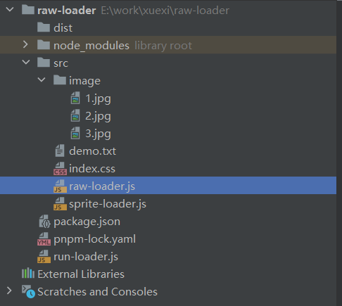

## 前言
> 前面我们描述了如何实现一个简单的``loader``，本文将通过一个实战--``合成雪碧图``，更深入的去体验一下一个``loader``的实现过程。

## 准备
首先我们要做一下准备工作，准备几张图片。然后新建立一个项目，安装``loader``的运行环境``loader-runner``这个库（这个库是专门用来测试loader用的，可以无需依赖webpack环境直接运行loader）



准备好上面的目录，开干

## spritesmith
``spritesmith``是一个合成雪碧图的工具库，下面简单演示一下他的用法
```js
const Spritesmith = require('spritesmith');
const path = require('path')
const fs = require("fs");

const sprites = [
    path.join(__dirname,'./image/1.jpg'),
    path.join(__dirname,'./image/2.jpg'),
    path.join(__dirname,'./image/3.jpg'),
];
Spritesmith.run({src: sprites}, function handleResult (err, result) {
    console.log(result,err)
    fs.writeFileSync(path.join(__dirname,'../dist/sprite.jpg'),result.image)
    // result.image; // Buffer representation of image
    // result.coordinates; // Object mapping filename to {x, y, width, height} of image
    // result.properties; // Object with metadata about spritesheet {width, height}
});
```
用法也非常的简单，只需要调用``run``方法，传入一个图片数组，就可以了。在``reslut``里面我们能拿到合成后的图片``buffer``，以及图片的一系列``信息``，具体的这里就不贴图了，可以看看[官网的示例](https://www.npmjs.com/package/spritesmith)

## sprite-laoder
熟悉了``雪碧图``如何生成，下面就来看看这个``loader``怎么写吧。

在学习了前面的内容之后，我们能很清楚的明白，其实``loader``就是一个``函数``。``webpack``会在``调用``这个函数的时候把当前文件的``字符串``传入（当然也可以选择接收``buffer``）。我们只需要对他进行操作，最后``return``出去就可以了

这样一来，我们的``loader``雏形就出来了
```js
const Spritesmith = require('spritesmith');
const path = require('path')
const fs = require("fs");

module.exports = function (source){
    const callback = this.async()
    const imgs = source.match(/url\((\S*)\?__sprite/g)
    const matchedImgs = []
    imgs.forEach(d=>{
        const img = d.match(/url\((\S*)\?__sprite/)[1]
        matchedImgs.push(path.join(__dirname,img.slice(1,img.length)))
    })
    callback(err,source)
}
```
上面的操作，其实就是在匹配我们的``source``中所有的图片路径，然后经过处理之后将他添加到一个数组中。

现在图片收集到了，我们要做的就是去调用``spritesmith``这个库合成一下，然后将合成后的图片路径``替换``掉原来的就可以了
```js
// sprite-loader.js
module.exports = function (source){
...
    Spritesmith.run({src: matchedImgs}, function handleResult (err, result) {
    console.log(result,err)
    fs.writeFileSync(path.join(process.cwd(),'dist/sprite.jpg'),result.image)
    source = source.replace(/url\((\S*)\?__sprite/g,(match)=>{
        return `url("dist/sprite.jpg`
    })

    fs.writeFileSync(path.join(process.cwd(),'dist/index.css'),source)
    callback(err,source)
});
}
```
下面我们来写个``loader-runner``测试一下
```js
//run-loader.js

const {runLoaders} = require('loader-runner')
const fs = require('fs')
const path = require('path')

runLoaders({
    resource:path.join(__dirname,'./src/index.css'),
    loaders:[
        path.join(__dirname,'./src/sprite-loader.js')
    ],
    content:{
        minimize:true
    },
    readResource:fs.readFile.bind(fs)
},(err,result)=>{
    err?console.log(err):console.log(result)
})

```
这里我们还要准备一个``index.css``。也就是我们要操作的文件
```css
/*//index.css*/
.bg1{
    background: url("/image/1.jpg?__sprite");
}
.bg2{
    background: url("/image/2.jpg?__sprite");
}
.bg3{
    background: url("/image/3.jpg?__sprite");
}
```
运行我们的``run-loader.js``看看结果吧


## 总结
经过以上的实践，相信大家对``loader``的编写印象会更深了。总的来说``loader``就是非常简单的一个``函数``，``webpack``提供给你文件的``内容``，你在``loader``里对他操作。操作完``return``出去就行了
