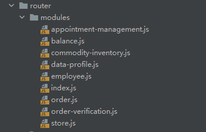
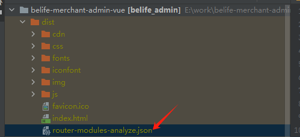
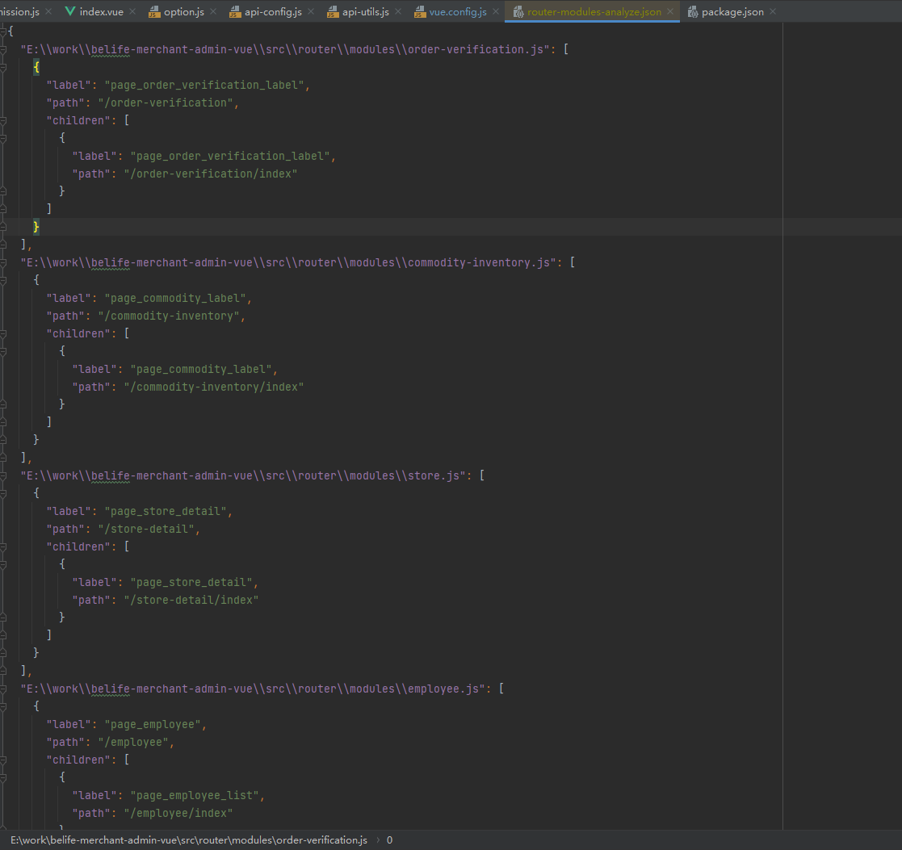

  
## 前言
>B端系统的路由权限相信大家都做过，其实实现过程并不复杂，服务端返回一份路由数据，前端根据这个路由数据进行拦截 或者只挂在对应路由以此达到权限的目的。相对应的 一般还会有一个中台系统
> 专用于给角色配置权限，那么久会存在一个问题，前端每次新增了路由 都需要在中台手动的添加一个路由配置，这样既费时又费力而且还容易出错。如果有一个工具能自动检索当前项目的前端路由 并生成一份可用的
> 路由数据自动上报到服务端就好了，本文就手把手带你实现一个自动收集路由数据的小工具

## 技术选型
::: tip

要自动收集路由数据，那必不可少的就是对本地项目文件的检索。而我们日常用的构建工具其实就是在对本地文件做处理，首当其冲的就会想到通过构建工具来去实现这个需求。本文采用以webpack为构建工具的项目作为例子，去实现我们的需求

:::


## webpack知识科普
因为涉及到对文件的操作，所以这里选择以插件的形式去完成，前置条件当然是要了解一下``webpack``插件啦。

``webpack``插件其实就是一个含有``apply``属性的对象，``webpack``会在初始化之后去调用注册的插件的``apply``函数，并将当前初始化的生命周期对象传入。开发者可以
通过这个对象去订阅``webpack``的各种钩子，在这些钩子中完成对文件的改写从而改变输出结果。

```js
class myPlugins{
    apply(compiler){
        
    }
}
```
以上就是一个插件的雏形，其实很简单，这里我们主要需要了解一下``webpack``的钩子以及执行过程。

### compiler和compilation
为什么要认识这两个东西呢，因为``webpack``的整个执行过程其实就是这两个对象完成的，首先在我们执行``build``命令或者``run``命令之后 ``webpack``会在解析完用户自定义配置之后初始化一个``compiler``对象，
这个``compiler``就像是``webpack``的大脑，他控制着一切``webpack``的行动，那行动由谁去完成呢？自然就是我们的``compilation``对象，他就像是手脚一样 接收到来自大脑的指令，然后去完成这个指令。

``compiler``对象在整个执行过程中只会有一个，但``compilation``对象可能会有多个。

在整个执行过程中如何让开发者参与到其中呢？``webpack``采用发布订阅的模式，``compiler``身上有非常多的钩子函数，并且提供了相对应的订阅方法，开发者只需要在``compiler``对象身上订阅各种钩子，``webpack``就会在
执行到这个过程的时候去执行开发者传入的回调函数，以此来完成整个构建过程。

在翻阅了文档之后发现，``compiler``和``compilation``都有许许多多的钩子，那两者之间的订阅关系该如何梳理呢？换句话说，我该如何确定我要完成的事情应该订阅谁的钩子，订阅的是哪个钩子。

仔细观察一下会发现``compiler``的钩子都是宏观上的，也就是整个大生命周期过程中的钩子，这是因为他不负责编译，值负责任务的调度。而``compilation``的钩子则对应了非常非常多的修改输出资源的方法。

我们需要通过订阅``compiler``的提供``compilation``对象的钩子，然后在订阅这个``compilation``上的某个钩子来完成我们的需求

::: tip

这里需要注意一点东西：很多人会对``compiler``的钩子和``compilation``的钩子产生一个误解，那就是什么时候订阅 他就会什么时候触发。其实不是这样的，订阅并不等于触发，例如我们在``compiler``某个钩子中订阅``compilation``的钩子，他并不会在
``compiler``的钩子触发后就立即触发，而是在这个钩子中去进行订阅，然后在``compilation``的钩子执行后才会执行被订阅的函数，所以订阅的顺序不对 很可能出现失效的问题。例如我们在``compiler``结束的钩子里订阅``compilation``初始化的钩子，这个时候肯定是不行的。

:::

## 开始

对于``compiler``和``compilation``我们就粗略了解到此，下面开始正式着手去写这个插件

首先勾勒出一个插件的基础样子
```js
class AnalyzeRouterPlugin {
  constructor(option) {
  }
  apply(compiler) {
    let _this = this
    if (compiler.options.mode !== 'production') return
    
  }
}
```
由于我们只需要再``build``的时候进行这个操作，所以这里在``apply``函数中进行了一层拦截。

接下来就是最重要的去订阅钩子了：由于我们需要在所有模块构建完成之后，输出到目录之前去进行收集数据，所以钩子我这里采用``compile``r的``compilation``钩子以及``compilation``的``finishModules``钩子

- ``compilation``钩子：
  - ``SyncHook``  
  - ``compilation`` 创建之后执行。
  - 回调参数：``compilation``, ``compilationParams``
- ``finishModules``：
  - ``AsyncSeriesHook``
  - 所有模块都完成构建并且没有错误时执行。
  - 回调参数：``modules``
  
```js
class AnalyzeRouterPlugin {
  constructor(option) {
  }
  apply(compiler) {
    let _this = this
    if (compiler.options.mode !== 'production') return
      compiler.hooks.compilation.tap('AnalyzeRouterPlugin', (compilation) => {
          compilation.hooks.finishModules.tapAsync('AnalyzeRouterPlugin',(modules,cb)=>{
              cb()
          })
      });
  }
}
```
因为我这里对路由文件进行了拆分 ，目录长下面这样子




所以这里我需要搜集到所有的路由模块文件 然后进行值的匹配。
```js
  apply(compiler) {
    let _this = this
    if (compiler.options.mode !== 'production') return
    compiler.hooks.compilation.tap('AnalyzeRouterPlugin', (compilation) => {
      compilation.hooks.finishModules.tapAsync('AnalyzeRouterPlugin',(modules,cb)=>{
        // 获取到所有的路由文件
        const routerModules = modules.filter(m=> m.resource && m.resource.startsWith(compilation.options.context + '\\src\\router\\modules\\'))
        // 开始解析路由文件
        const modulesData = _this.analyzeRouter(routerModules)
        // 将所有模块信息输出到一个文件
        if (Object.keys(modulesData).length > 0) {
          const allModulesDataString = JSON.stringify(modulesData, null, 2);
          const outputFilePath = _this.fileName; // 输出文件名
          compilation.assets[outputFilePath] = { // compilation.assets就是最终输出的内容
            source: () => allModulesDataString,
            size: () => allModulesDataString.length
          };
        }
        cb()
      })
    });
  }
```
这里步骤其实也很简单，就是先获取到所有的路由文件，然后对他进行一个解析，最后将解析到的数据写入``compilation.assets``中。

下面来看看``analyzeRouter``函数
```js
analyzeRouter(routerModules){
    const modulesData = {};
    routerModules.forEach((module) => {
      try {
        if(module.resource.endsWith('index.js')) return
        const source = module._source.source();
        // 使用正则表达式匹配export default后面的数组
        const regex = /export\s+default\s+(.+?);/s;
        const match = source.match(regex);
        // 清理字符串，将所有非双引号的值转换为双引号，并修复可能的语法错误
        let cleanedString = match && match[1]
            .replace(/([^"'])([a-zA-Z_$][a-zA-Z_$0-9]*)\s*:/g, '$1"$2":')
            .replace(/'/g, '"'); // 将单引号转换为双引号
        const regexComponent = /"component"\s*:\s*([^\s,]+)/g;
        // 替换component字段的值为字符串
        cleanedString = cleanedString.replace(regexComponent, '"component": ""');
        try {
          // 尝试解析清理后的字符串
          let data = JSON.parse(cleanedString);
          function filterString(list){
            if(!Array.isArray(list)||list.length===0) return
            let result = []
            list.forEach(item=>{
              const temp = {
                label:item.label,
                path:item.path
              }
              if (item.children&&item.children.length>0){
                temp.children = filterString(item.children)
              }
              result.push(temp)
            })
            return result
          }
          modulesData[module.resource] = filterString(data)
        } catch (error) {
          console.error("Parsing error:", error);
        }
      } catch (err) {
        console.error(`Error extracting content from ${module.resource}:`, err);
      }
    });
    return modulesData
  }
```
这个函数主要作用就是去解析文件内容了，因为拿到的是字符串并不能直接使用，所以这里通过一系列的正则表达式去进行内容的匹配。当然还可以通过``Acorn``这个库来解析，但是因为我这里
需求比较简单所以就没使用了，感兴趣的同学可以了解一下。

整个插件其实到这里就完成了，下面我们来看一下最终效果




可以看到，构建好的文件中已经生成了一份``json``文件



文件里已经把所有的路由数据都提取出来了，并且转化成了可用的数据结构。后续我们就可以自行将他上传到服务器，这样在新增了路由之后就无需手动去中台添加路由数据啦。只需要``build``一下，路由数据就会自动上报。

## 完整插件代码

```js
class AnalyzeRouterPlugin {
  constructor(option) {
    this.fileName = option&&option.fileName||'router-modules-analyze.json'
  }
  analyzeRouter(routerModules){
    const modulesData = {};
    routerModules.forEach((module) => {
      try {
        if(module.resource.endsWith('index.js')) return
        const source = module._source.source();
        // 使用正则表达式匹配export default后面的数组
        const regex = /export\s+default\s+(.+?);/s;
        const match = source.match(regex);
        // 清理字符串，将所有非双引号的值转换为双引号，并修复可能的语法错误
        let cleanedString = match && match[1]
            .replace(/([^"'])([a-zA-Z_$][a-zA-Z_$0-9]*)\s*:/g, '$1"$2":')
            .replace(/'/g, '"'); // 将单引号转换为双引号
        const regexComponent = /"component"\s*:\s*([^\s,]+)/g;
        // 替换component字段的值为字符串
        cleanedString = cleanedString.replace(regexComponent, '"component": ""');
        try {
          // 尝试解析清理后的字符串
          let data = JSON.parse(cleanedString);
          function filterString(list){
            if(!Array.isArray(list)||list.length===0) return
            let result = []
            list.forEach(item=>{
              const temp = {
                label:item.label,
                path:item.path
              }
              if (item.children&&item.children.length>0){
                temp.children = filterString(item.children)
              }
              result.push(temp)
            })
            return result
          }
          modulesData[module.resource] = filterString(data)
        } catch (error) {
          console.error("Parsing error:", error);
        }
      } catch (err) {
        console.error(`Error extracting content from ${module.resource}:`, err);
      }
    });
    return modulesData
  }

  apply(compiler) {
    let _this = this
    if (compiler.options.mode !== 'production') return
    compiler.hooks.compilation.tap('AnalyzeRouterPlugin', (compilation) => {
      compilation.hooks.finishModules.tapAsync('AnalyzeRouterPlugin',(modules,cb)=>{
        // 获取到所有的路由文件
        const routerModules = modules.filter(m=> m.resource && m.resource.startsWith(compilation.options.context + '\\src\\router\\modules\\'))
        // 开始解析路由文件
        const modulesData = _this.analyzeRouter(routerModules)
        // 将所有模块信息输出到一个文件
        if (Object.keys(modulesData).length > 0) {
          const allModulesDataString = JSON.stringify(modulesData, null, 2);
          const outputFilePath = _this.fileName; // 输出文件名
          compilation.assets[outputFilePath] = {
            source: () => allModulesDataString,
            size: () => allModulesDataString.length
          };
        }
        cb()
      })
    });
  }
}
```
## 结语
> 本文描述了如何通过``webpack``插件来收集路由数据的这么一个需求场景，可以看到代码其实并不复杂，最重要的是在这个过程中我们要深入理解``webpack``的构建流程，以及``compiler``和``compilation``这两个对象
> 包括``webpack``的钩子如何订阅，异步钩子和同步钩子的订阅方式以及使用方式有什么不同。掌握了这些，我们就可以各种``diy``插件去完成我们想完成的事。
