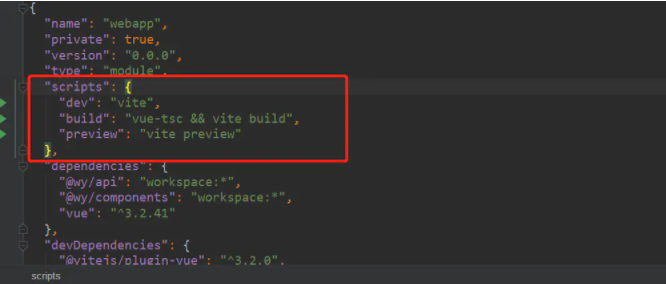
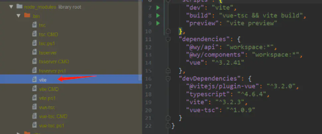
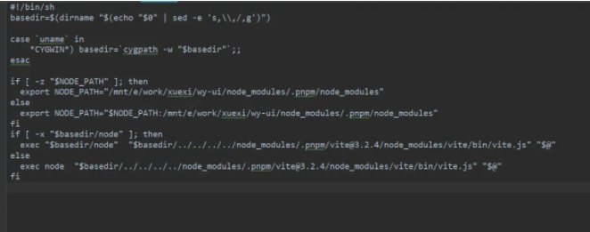
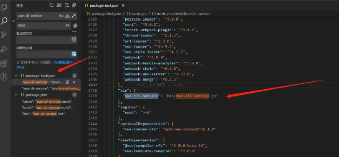

  
>当我们使用npm来管理项目的时候，会生成一个package.json文件。 这个文件就是用来描述整个项目的情况的。其中有一个script的对象，这里面会存放一些可执行的脚本命令。如 npm run build npm run dev 等等。具体的内容如下

对象的键名就是npm run xxx 而其对应的值就是可被执行的脚本。

在我们执行npm run dev的时候首先他会去到node_modules下的.bin文件夹下找到对应的可执行脚本。
比如我们执行npm run dev ，这里dev对应的是vite。那么他就回去.bin文件夹下找到名为vite的脚本文件

vite文件内容

那么此时可能大家就会有个疑问了，这个.bin目录下的脚本又是哪儿来的呢，可以看我们的package-lock.json文件里搜索一下bin

当我们npm install的时候，npm 读到该配置后，就将该文件软链接到 ./node_modules/.bin 目录下，而 npm 还会自动把node_modules/.bin加入$PATH，这样就可以直接作为命令运行依赖程序和开发依赖程序，不用全局安装了。

假如我们在安装包时，使用 npm install -g xxx 来安装，那么会将其中的 bin 文件加入到全局，比如 create-react-app 和 vue-cli ，在全局安装后，就可以直接使用如 vue-cli projectName 这样的命令来创建项目了

