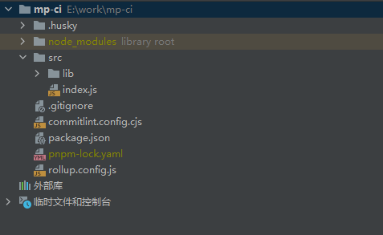

## 前言
>在开发小程序的过程中会遇到发布版本需要提交代码这个步骤。那有没有什么办法可以像正常的前端项目的流水线自动化的去执行这一步呢？微信官方是有提供一个ci的工具库的，下面我们就基于这个工具库封装一个自己的ci工具，发布到npm上

## 小程序持续集成
⏱ 小程序持续集成 ci，基于 [miniprogram-ci](https://www.npmjs.com/package/miniprogram-ci) 实现

具体的文档可以自行查阅，下面来简单描述一下我们自己的工具包应该如何开发

## 初始化
首先初始化一个项目，并建立好目录结构


把一些流程化的工具安装好，比如commitlint，standard-version，husky，rollup等等。还有其他需求的可以自己安装。

下面就开始去写构建脚本
## lib
先安装一下微信的ci **(注意，这里安装包需要严格区分一下devDependencies和dependencies，作为一个工具，被用户安装的时候是只会下载dependencies里的依赖的，所以你的包运行必须要的依赖请卸载dependencies里)**
```shell
pnpm install miniprogram-ci
```

miniprogram-ci的使用非常简单，看文档就行。我们这里主要是对他进行一个二次封装，使用起来更加的方便

在我们的ci文件里写上如下内容
```js
const ci = require('miniprogram-ci')
const utils = require('./utils')

export default class mpCi {
    constructor(options) {
        this.options = options
        this.project = null
    }

    init() {
        this.project = new ci.Project({...this.options.config()})
        const baseConfig = () => ({
            project: this.project,
            version: this.options.baseConfig().version || utils.getVersion(),
            desc: this.options.baseConfig().desc,
            robot: this.options.baseConfig().desc.robot || 30,
            setting: this.options.baseConfig().setting ?? {
                es6: true,
                es7: true,
            },
        })
        this.upload(baseConfig)
        this.preview(baseConfig)
    }

    upload(baseConfig) {
        ci.upload({
            ...baseConfig(),
            onProgressUpdate: ({_status, _msg}) => {
                if (_status === 'done') {
                    console.log(`🚁  ${_msg}\n`)
                }
            },
        }).then(({subPackageInfo}) => {
            console.log(
                '\n🌈 体验版上传成功\n\n' +
                '分包信息：\n' +
                subPackageInfo.reduce((pre, curr) => {
                    return pre + `${curr.name}: ${curr.size / 1000}kb\n`
                }, ''),
            )
        }).catch((e) => {
            console.log('\n🛠 体验版上传失败\n', e)
            process.exit(1)
        })
    }

    preview(baseConfig) {
        ci.preview({
            ...baseConfig(),
            onProgressUpdate: () => {
            },
            qrcodeFormat: 'base64',
            qrcodeOutputDest: 'qrcode.text',
        }).then(({subPackageInfo}) => {
            console.log(
                '\n🌈 预览上传成功\n\n' +
                '分包信息：\n' +
                subPackageInfo.reduce((pre, curr) => {
                    return pre + `${curr.name}: ${curr.size / 1000}kb\n`
                }, ''),
            )
        }).catch((e) => {
            console.log('\n🛠 预览上传失败\n', e)
            process.exit(1)
        })
    }
}

```
## index
```js
import mpCi from './lib/ci'

function tyrGet(target){
    if(!target){
        return null
    }
    if(target instanceof Function){
        return target()
    }
    return target
}
export const run = function (options){
    const {config,baseConfig} = options
    try {
        const ci = new mpCi({config:tyrGet(config),baseConfig:tyrGet(baseConfig)})
        ci.init()
    }catch (err){
        console.log('初始化失败：'+ err)
    }
}

```
## 使用
```js
run({
    config(){
        return{
            appid: "wxsomeappid",
            type: "miniProgram",
            projectPath: path.resolve(process.cwd(), "./dist/"),
            privateKeyPath: path.resolve(process.cwd(), "./dist/"),
            ignores: ["node_modules/**/*"],  
        }
    },
    baseConfig(){
        return{
            version:"版本号",
            desc: "更新描述",
            robot: "机器人序号",
            setting: {
                es6: true,
                es7: true,
            },
        }
    }
})
```
## 注意

其他没什么好说的主要提一下```privateKeyPath```,在初始化ci的时候可以选择传入```privateKeyPath```或者```privateKey```，二者选择其一就行。这个```密钥```是在```微信公众平台```下载的，下载方法可以看文章开头贴的ci的官方文档。
。如果有流水线的话推荐使用密钥的值的方式。我们可以在仓库流水线的变量里将密钥配置进去。然后在ci脚本里执行我们这个upload脚本的时候通过`````--xxx```的形式把密钥输入上去。在脚本中可以通过```process.argv```获取到这个--xxx参数。
这种办法既安全有省力。

下面简单演示一下

```js
//假设我们的准备工作都已经做好了，这个时候该怎么去获取这个privateKey呢

/**
 * 通过这函数，去获取在执行shell脚本的时候的参数
 * @param key
 * @returns {string}
 */
function getCliArg(key) {
    const args = process.argv
    const index = args.lastIndexOf(key)
    if (index !== -1) {
        return args[index + 1]
    }
}

```
在流水线脚本里这样写
```yaml
 script:
    - yarn
    - yarn build:mp-weixin:test
    - yarn mp-ci --key $MP_CLI_KEY --branch ${CI_COMMIT_BRANCH}
```
注意到上面脚本中的--key没有，他后面跟的$MP_CLI_KEY 就是我们预先在流水线变量里配置好的key了。
这样一来只要运行我们写的ci脚本并且传入--key。我们就只需要在代码中去获取这个--key就可以了 
```js
run({
    config(){
        return{
             ···
            privateKey:getCliArg('--key') ,
        }
    },
    baseConfig(){
        ...
    }
})
```

## 构建
在构建这一块选择使用rollup，因为他比较轻量级，简单好用，并且天然支持esm
安装好rollup以及rollup-plugin-terser后，写个rollup.config.js，并写入如下配置
```js
import { terser } from "rollup-plugin-terser";

export default {
    input: 'src/index.js',
    output: {
        file: 'dist/index.js',
        format: 'esm'
    },
    plugins: [
        terser({ compress: { drop_console: true } })    
    ]
};

```
```shell
 "build": "npx rollup -c",
```
执行一下就可以看到打包后的结果了。

## 关于构建
我们把代码托管到github上,交由github action来去完成这一些列的动作。
具体的yml脚本可以这样写
```yaml
# 1
name: mp-ic Package

on:
  push:
    branches:
      - master

jobs:
  build:
    runs-on: ubuntu-latest
    steps:
      - uses: actions/checkout@v3
#      采用pnpm的方式去安装依赖
      - uses: pnpm/action-setup@v2
        with:
          #      指定pnpm版本
          version: 7
      - name: Use Node.js ${{ matrix.node-version }}
        uses: actions/setup-node@v3
        with:
          node-version: ${{ matrix.node-version }}
          cache: 'pnpm'
      - name: install
        run: pnpm install
      - name: build
        run: pnpm run build
      - name: publish
        run: npm publish
        env :
          NODE_AUTH_TOKEN: ${{ secrets.MPCI_NPM_TOKEN }}
```
MPCI_NPM_TOKEN是在npm里生成的，据说把他配到github 的action里就可以直接发布。但我试过了好像不太行。最终还是采用手动的形式去发布。如果要自动化的话也不是不行。网上还是有很多免登录的方案的。这里就不去做过多的纠结了。直接采用本地发。

注意在流水线里每一个jobs的环境都是独立的，也就是说，你在上一个jobs里安装的东西。在下一个jobs里是不能用的。所以最好把有关联的步骤都放在同一个jobs里去执行。


## 结语

整体的开发就是这样了，剩下就是将这个项目发布到npm上。具体的过程这里就不多说了。有需要可以自行移步博客里的npm教程
