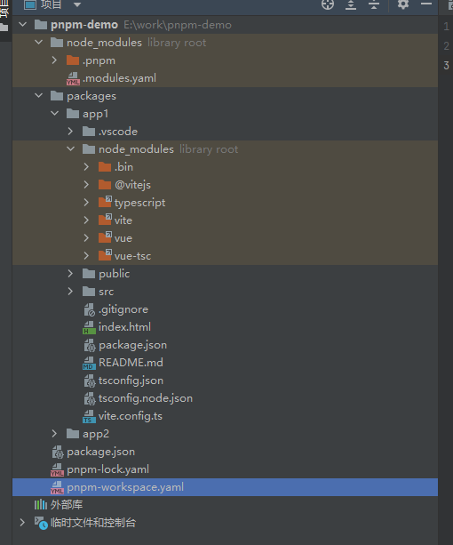
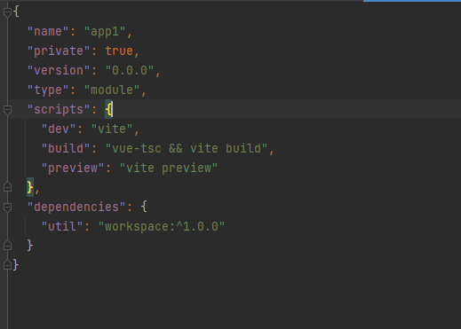
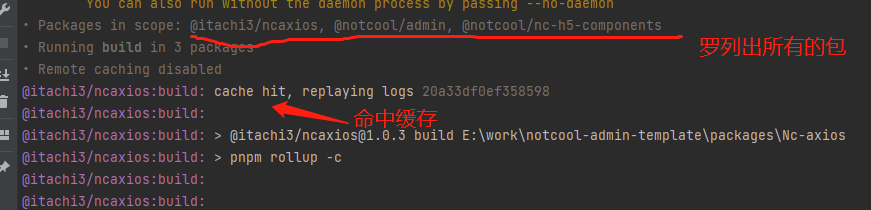

## 前言
>最近写了一个基于monorepo的管理系统，将装修组件库和一些工具包拆分了出来，方便在别的项目复用。在开发过程中体验到了monorepo的方便同时也遇到了一些痛点，本文就展开说一下如何搭建一个monorepo工程以及如何解决开发过程中遇到的痛点

## 什么是monorepo

>引用网上的一段话：
> 
>Monorepo 是一种项目``代码管理方式``，指单个仓库中管理多个项目，有助于简化``代码共享``、``版本控制``、``构建和部署``等方面的复杂性，并提供更好的``可重用性``和``协作性``。Monorepo 提倡了开放、透明、共享的组织文化，这种方法已经被很多大型公司广泛使用，如 Google、Facebook 和 Microsoft 等。

总结一下monorepo就是把多个项目的代码放在同一个仓库中管理，这样对某些工具的``抽离``以及基建的``复用``是非常友好的，尤其是在面对一些``相似度``非常高的项目的时候就特别好用。目前也是有很多开源大项目都采取这种方式去管理代码

## pnpm

``pnpm``和``npm``、``yarn``一样，也是一个包管理工具，官网对他是这样介绍的
- pnpm 比其他包管理器快``` 2``` 倍
- node_modules 中的文件为复制或链接自特定的``内容寻址存储库``
- pnpm 内置支持``单仓多包``
- pnpm 默认创建了一个``非平铺``的 node_modules，因此代码``无法访问``任意包

这里简单说一下``pnpm``的好处，以及他对于我们的``monorepo``工程有什么帮助:

### pnpm有着独特的包管理机制

>pnpm会将安装过的包``缓存``在磁盘中，当你下次再次安装他会从磁盘中直接拉取包过来，效率更高
### 非平铺的node_modules
>pnpm创建了一个``非平铺``的``node_modules``。大家都知道在``npm``和``yarn``中会存在一个``幽灵依赖``的问题，也就是我们下载的依赖可能还会依赖别的包，而由于``npm``的``平铺机制``，会导致我们可以引入这些依赖的依赖。这就很容易导致出问题，
> 这里不对三个包管理工具做太多的介绍了，感兴趣的可以自行了解一下。而有过``pnpm``使用经验的小伙伴都知道，``pnpm``会把依赖的依赖统一放在``.pnpm``这个文件夹下管理，而我们下载依赖则会放置在``.pnpm同级``，然后pnpm通过自身``软连接``的形式关联起这些包，这样就避免了我们可以直接引入``幽灵依赖``的问题。

### 对monorepo的支持
>在介绍这个特点之前我们首先要明白，一个``monorepo``的项目需要解决哪些问题？首先是``公共依赖的管理``，``对子包操作的便捷度``（例如批量执行子包的脚本或者单独操作某些子包之类的）。
> 在``pnpm``之前大部分都是通过``workspace+lerna``。我并没有使用过，但是从网上查阅的资料看来，使用过程挺繁琐的并不简单。在``monorepo``中有一个非常常见的场景，就是包和包之间存在依赖关系，在``npm和yarn``里面我们需要使用``workspace``这个功能并且通过``npm link``来关连起有依赖关系的包（这么做的好处是为了开发阶段联调的方便）。而``pnpm``自带了``workspace``，并且提供了相关命令可以自由的``筛选``子包
>这样无论是``公共依赖``的管理以及为某个子包单独安装独有的依赖都非常的方便简单

关于pnpm的介绍就说到这里。

## 开始
学习完前置的知识，下面就开始着手去搭建一个基于pnpm的monorepo工程

首先安装一下``pnpm``
```shell
npm install -g pnpm
```
新建一个文件夹然后进入文件夹初始化一下项目
```shell
pnpm init 
```
接着我们在根目录创建一个``packages``文件夹，用于存放我们的所有子项目,接着我们去``packages``下创建两个项目。
```shell
pnpm pnpm create vite app1
pnpm pnpm create vite app2
```
此时我们开启``workspace``，创建一个``pnpm-workspace.yaml``文件
```yaml
packages:
  - 'packages/*'

```
这样表示``packages``下所有的文件夹都处于``workspace``内，他们就可以共享公共依赖了。

此时我们安装一下依赖
```shell
pnpm i
```
安装完成之后我们的项目目录将会是这个样子


可以看到，不光子项目下有``node_modules``，根目录也有一个。子项目下的是他自己独有的一些依赖，而根目录下的就是用来管理所有的公共依赖了。并且可以看到根目录下的``node_modules``里面有一个``.pnpm``文件夹，而子项目是没有的，并且打开子项目中的一个依赖包的依赖文件可以看到，里面除了一些``bin``命令外没有任何东西。因为这些依赖都被放到了``.pnpm``文件夹内了。

至此，一个非常简单的``monorepo``工程就算是搭建完毕了。下面来讲如果建立包和包之间的依赖关系。

此时我们再创建一个``util``的子包，作为公共的工具包。

然后我们将他安装到``app1``中

```shell
pnpm add util -r -F app1
```
```-F```是```-filter```的简写，就是找到``app1``这个子包。而被安装的包``pnpm``会优先在工作空间找，没找到才回去``npm``上下载。



可以看到，``util``这个包已经作为依赖被安装进了``app1``中，并且版本号是以``workspace``开头的。这个再构建过程中``pnpm``会自动帮我们替换成最新的版本。

通过这样的操作之后，就可以即时的开发两个包并且相互感知更新了。无需再使用``npm link``。

此时假设我们开发好了项目，需要统一执行构建，应该怎么做呢？别急，我们同样可以根据``pnpm``提供的``-f``命令操作
```json
"build:all": "pnpm -r --filter=./packages/* run build",
```
在根目录的``package.json``中添加这样一行命令，``pnpm``就会去找到所有``packages``下的包，并且执行``build``命令。

此时可能有些同学会有疑惑，我的子包之间有依赖关系，这样统一执行他的``构建顺序``是怎样的呢？

``pnpm``在这一点上也同样做了处理，他在构建阶段会去进行一个构建的``调度``，自动的检测出子包之间是否存在依赖关系，存在依赖关系的话会``优先构建``被依赖的子包，然后再构建你的主包。效果这里就不贴图了，可以自己去试一试。

## 痛点
经过上面这些步骤之后，一个``monorepo``的工程就可以正常的开发了。下面来说一下开发过程中会遇到的痛点以及解决方案。主要还是集中在``工程化管理``这一块

### 关于changelog的生成

当我们在发版之前生成本次开发内容的``changelog``是一个很有必要的步骤。他就像``git``提交记录一样可以帮我们记录每次发版的内容。平时大家应该都是通过``conventional-changelog-cli``这个库去获取``commit``提交记录来生成``changelog``的。很显然这个方案在``monorepo``中显得不够灵活。
比``conventional-changelog-cli``更适合``monorepo``的是``changeset``这个库，它可以获取到你的所有子包并且为每个子包定制自己的``changelog``，但是使用起来会比较麻烦。不过目前我没有发现比他更合适的工具了。

详细的使用方法可以看一下这篇[文章](https://hanhanbuku.github.io/my_blog_vuepress/pages/deef6e/)。

### 关于构建效率的问题
对于构建这一块，在日常开发过程中，并不是每次开发任务都会去动到所有的子包。可能这次我只修改了``a``包，下次只需改了``c``包和``d``包。那没有被修改的包肯定不需要``重复``的去构建了。对于这种情况如果我们``单一执行``每个包的构建显然不太明智，而如果``统一执行``构建又会出现``重复构建``的问题。

而关于这些问题最开始我想到的是通过在``ci``中判断``不同分支名``来执行不同的构建命令。这样做虽然能解决问题但是毫无扩展性可言，加一个新包就需要去加条新的构建命令和他的构建分支。最理想的情况就是，有没有一种方法能检测当前哪些包更新了哪些包没有更新然后只去构建那些已经更新了的包呢？

答案当然是有的，那就是``turbo``。

关于``turbo``的介绍这里也简单说下
>``Turborepo`` 是一个为 ``monorepo`` 而生的极快的构建系统。目的是为了解决大型`` monorepo`` 项目构建速度缓慢的一大痛点。``turbo ``的核心是永远不会重新构建已经构建过的内容。``turbo`` 会把每次构建的产物与日志缓存起来，下次构建时只有文件发生变动的部分才会重新构建，没有变动的直接命中缓存并重现日志。``turbo ``拥有更智能的任务调度程序，充分利用空闲 ``CPU``，使得整体构建速度更快。另外，``turbo`` 还具有远程缓存功能，可以与团队和 ``CI/CD`` 共享构建缓存。

提取一下重要信息，``turbo 的核心是永远不会重新构建已经构建过的内容``，由于``turbo``在构建过程中会产生一个``缓存文件``，并且他会检测你的代码``有无更新``，没有更新就直接``复用``缓存。这不就正好能解决上面讲的问题了吗。
关于``turbo``的介绍后面会再开一篇文章细说。这里先介绍一下在项目中的使用

首先安装``turbo``
```shell
pnpm i turbo
```
在根目录创建一个``turbo.json``的配置文件
```json
{
  "$schema": "https://turborepo.org/schema.json",
  "pipeline": {
    "build": {
      "dependsOn": ["^build"],
      "outputs": ["dist/**"]
    }
  }
}
```
``pipeline``里面配置的就是``turbo``的命令，这里我们配置了一个``build``命令。让他去执行所有的``build``命令。并且将缓存产物输出在``dist``文件夹下。

```shell
turbo run build
```
执行此命令即可开始打包。当你多次打包后你就会发现``turbo``会自动的去命中缓存，而不会重复打包。大大的缩减的构建时间



## 总结

以上就是关于本文的全部内容，主要介绍了一下一个``monorepo``工程适用哪些工具。如果没有一套完善的工具体系去支撑，``monorepo``也会变得一团糟。
顺便贴一下我写的管理系统的地址，关于``monorepo``有不明白的东西可以去看看项目里是怎么做的[NOTCOOL](https://gitee.com/wangyuhan123/notcool-admin-template)
