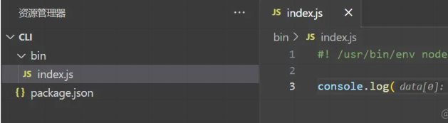
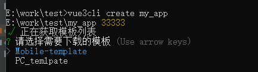
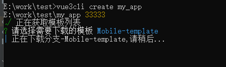
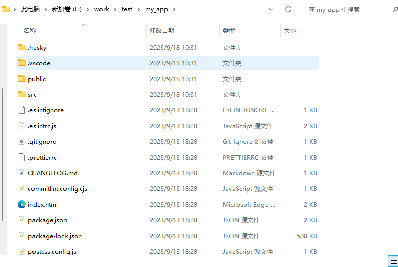

## 前言
> 为了响应快速开发，故做了一个拉取模板项目的建议脚手架，本文将详细介绍一下该脚手架的具体实现

## 什么是脚手架
顾名思义，就像搭房子的脚手架一样，前端工程也有脚手架，我们可以基于脚手架的基础上进行快速的开发项目。一些常用的框架都提供了与自身相关的脚手架，使用这些脚手架我们可以快速的创建出一个项目的基本结构，以及一些基建的封装。

## 实现一个脚手架
脚手架本质上是通过一些命令行命令来交互的，所以在此之前我们需要用到以下几个工具
- Commander 完整的node命令行解决方。当然也可以使用yargs，yargs功能更多一些。
- Chalk 能给shell命令行的文字添加样式，简单来说就是拿来画画的，可要可不要。
- fs-extra 操作文件的，比之node自带的fs，这个会更加强大与完善些。
- inquirer 在shell命令行中提供交互的库，具体效果看下文的演示。
- ora 在shell命令行中展示loading效果
- download-git-repo 下载git仓库。

### 步骤一：创建一个可执行文件
- 首先我们初始化一个项目，并在根目录创建一个bin目录，添加一个index.js文件，在文件内写上``#! /usr/bin/env node``，表示这是一个可执行文件
此时我们的目录结构如下



紧接着我们去``package.json``里配置以下指定脚本
```json
  "bin": {
    "vue3cli": "./bin/index.js"
  },
```
这样之后我们通过vue3cli就可以运行我们这个脚本，当然前提是我们安装了这个工具包。现阶段由于需要在本地测试，所以我们可以通过npm link 的方式先在本地安装。

### 步骤二：编写脚本
接下来我们去完善以下bin/index.js里的内容
```js
#! /usr/bin/env node

import {Command} from "commander";
import chalk from "chalk";
import path from 'path'

const program = new Command();

program
    .command('create <app-name>')  // 创建脚手架的命令
    .description('创建一个新项目') // 命令的描述
    .action((name,options,cmd)=>{
        console.log(name,options,cmd,'执行create命令')
    })

program.on('--help',()=>{
    console.log();
    console.log(`Run ${chalk.cyan('rippi <command> --help')} to show detail of this command`);
    console.log();
})

program.on('-v',()=>{
    console.log();
    console.log('1.0.0');
    console.log();
})


// 解析用户执行命令传入的参数
program.parse(process.argv);

```
这里就是配置一些交互命令，比如vue3cli create xxx就会进入到我们配置的第一个命令里面去。

把上面所需的依赖都安装好之后，本地npm link以下就可以在命令行工具里进行测试了。输入vue3cli create project就可以看到我们的打印

### 步骤三：完善核心代码，create。
create主要做的事情有以下几件。
- 获取到远端所有的分行，列出选项给使用者选择
- 拿到使用者的选择之后去远端拉取对应的分支
- 将拉下来的分支代码写入本地文件夹内

下面就围绕这几件事情展开开发工作。

```js
import downloadGitRepo from 'download-git-repo';
import {loading} from './utils.js'
import {getRepoList} from './request.js'
import chalk from 'chalk'
import inquirer from 'inquirer';
import util from 'util'
import ora from 'ora';


class Creator {
    constructor(projectName, targetDir) {
        this.name = projectName
        this.dir = targetDir
        // 将download-git-repo包装成promise
        this.downloadGitRepo =(url,path,branchName) => {
            return new Promise((resolve, reject) => {
                const spinner = ora(`正在下载分支-${branchName},请稍后...`);
                spinner.start();
                downloadGitRepo(url,path, { },(err)=>{
                    if(err){
                        spinner.fail('下载失败：'+ err);
                        reject(err)
                    }else{
                        spinner.succeed();
                        resolve(err)
                    }
                })
            })
        }
    }
    // 获取所有的分支
    fetchRepo = async () => {
        const branches = await loading(getRepoList, '正在获取模板列表');
        return branches;
    }
    // 下载分支
    download = async (branchName)=>{
        // 1 拼接下载路径
        const requestUrl = `hanhanbuku/vue3_template/#${branchName}`;
        // 2 把资源下载到某个路径上
        await this.downloadGitRepo(requestUrl, this.dir,branchName);
        console.log(chalk.green('done!'));
    }
    // 入口函数
    create = async ()=>{
        // 先拉去所有分支
        const branches = await this.fetchRepo()
        // 这里会在shell命令行弹出选择项，选项为choices中的内容
        const { curBranch } = await inquirer.prompt([
            {
                name: 'curBranch',
                type: 'list',
                // 提示信息
                message: '请选择需要下载的模板',
                // 选项
                choices: branches
                    .filter((branch) => branch.name !== 'main')
                    .map((branch) => ({
                        name: branch.name,
                        value: branch.name,
                    })),
            },
        ]);
        this.download(curBranch)
    }
}

export default Creator

```
```js
// utils.js

import ora from 'ora';

export const loading = async (fn, msg, ...args) => {
    // 计数器，失败自动重试最大次数为3，超过3次就直接返回失败
    let counter = 0;
    const run = async () => {
        const spinner = ora(msg);
        spinner.start();
        try {
            const result = await fn(...args);
            spinner.succeed();
            return result;
        } catch (error) {
            spinner.fail('出现了一些问题，正在尝试重新获取...');
            if (++counter < 3) {
                return run();
            } else {
                return Promise.reject();
            }
        }
    };
    return run();
};

```
```js
// request.js

import axios from 'axios'

axios.interceptors.response.use((res)=>{
    return res.data
})

/**
 * 获取远端模板
 * @returns {Promise<axios.AxiosResponse<any>>}
 */
export const getRepoList = ()=>{
    return axios.get('https://api.github.com/repos/hanhanbuku/vue3_template/branches')
}

```
注意两个点，获取github仓库分支的接口路径如下
```js
https://api.github.com/repos/你的用户名/仓库名称/branches
```
download-git-repo下载代码的参数是
```js
/**
 * url: github用户名/仓库名称/#分支名
 * path：代码下载路径，最终被下载到哪个路径里
 */
                downloadGitRepo(url,path, { },(err)=>{
                    if(err){
                        spinner.fail('下载失败：'+ err);
                        reject(err)
                    }else{
                        spinner.succeed();
                        resolve(err)
                    }
                })
```
接下来在bin/index里实例化以下create
```js
#! /usr/bin/env node

import {Command} from "commander";
import chalk from "chalk";
import Creator from "../lib/creator.js";
import path from 'path'

const program = new Command();

program
    .command('create <app-name>')  // 创建脚手架的命令
    .description('创建一个新项目') // 命令的描述
    .action((name,options,cmd)=>{
        // console.log(name,options,cmd,'执行create命令')
        // 获取工作目录
        const cwd = process.cwd();
        // 目标目录也就是要创建的目录
        const targetDir = path.join(cwd, name);
        // 初始化下载器
        const creator = new Creator(name, targetDir);
        creator.create()
    })

program.on('--help',()=>{
    console.log();
    console.log(`Run ${chalk.cyan('rippi <command> --help')} to show detail of this command`);
    console.log();
})

program.on('-v',()=>{
    console.log();
    console.log('1.0.0');
    console.log();
})


// 解析用户执行命令传入的参数
program.parse(process.argv);

```
然后在进行测试，效果如下







## 结语
以上就是一个简单的脚手架工具，后续将他发布到npm上就可以方便使用了。这里没有将模板项目放在脚手架项目里是为了方便后续的扩展模板不需要去动脚手架。只需要在模板项目新加分支就行了
