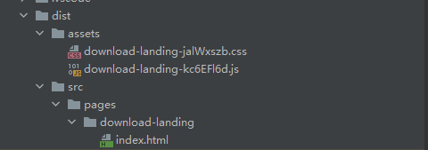

## 前言
> ``SPA``和``MPA``是当下最常见的``Web``应用程序架构，他们分别的应用场景也有所不同。例如``B端``应用大多数都会采用``SPA``架构，而``C端``应用一般都会采用``MPA``架构。现有的热门的构建工具大多数默认创建的``SPA``架构的应用，本文将介绍一下如何通过``vite``构建一个多页面应用。

## 什么是SPA和MPA？
首先介绍一下到底什么是``SPA``，什么是``MPA``？
- ``SPA``：全称为``Single-Page Application``，翻译过来就是``单页面应用程序``。所谓单页面应用程序就是所有的``HTML、CSS和JavaScript``都会在初始加载时被下载到浏览器，然后通过``AJAX``或``WebSocket``等技术与服务器进行数据交互，从而实现动态加载内容而无需重新加载整个页面。也就是说，``html``至始至终都只有一个，框架通过自己实现的前端路由来控制每个页面的切换。这种架构的程序通过牺牲一点初始化加载时间来换取更丝滑的交互，以及减轻服务器的压力，给用户更好的体验。


- ``MPA``：全称为``Multi-Page Application``，翻译过来就是``多页面应用程序``。这种架构就像字面意思一样，每个页面都是一个独立的``html``，切换页面需要像服务器重新请求这个页面所有的资源，在交互上体验会不太好。但是他的优点就是渲染``速度快``，因为每个页面只需要加载自己的内容就行了。所以速度会比``SPA``架构的程序``快``上很多，当然服务器的压力也会逐渐``增大``。

两种架构各有利有弊，他们的使用场景也分别不同。

更多的本文就不过多赘述了，下面来介绍文章主要内容，如何通过``vite``构建一个多页面应用程序。

## 需求场景分析
在日常开发过程中，会遇到很多临时的页面，如活动营销，工具页等。诸如此类的页面将他写入一个``SPA``的系统中肯定是不合适的，因为他们使用频率并不多，并且互相没有任何关联，各自有各自的作用。但如果把每一个页面都写成一个项目的话，又会出现很多重复劳动，例如项目的架构是相同的，一些通用的工具也是相同的，这些页面只是在业务场景上没有关联，但是从开发角度来讲，就可以把他们糅合进同一个项目中。所以这里就需要将他们构建成多页面应用了。

## 开始
首先搭建一个``vite``项目
```shell
pnpm create vite
```
选择自己喜好的框架，配置等，搭建一个基本的``SPA``项目。

然后删除``src``目录下所有内容，这些我们都用不到，我们只需要这么一个壳子就可以了，真正的项目我们将他写入``src/pages``目录下。

在``src``下新建``pages``目录，并``cd``进入其中，再次运行上述脚本新建一个项目，并删除里面一些不需要的东西。

此时我们的文件目录大概长如下样子


用红线划掉的先不用在意，子项目里只需要存在他自己的组件和入口文件以及他的``html``就行了。像一些构建相关的配置，项目规范的一些东西他都不需要要，直接公用父级的就可以。

重点来了！

## vite.config.ts
先来看看``vite`` 文档提供的构建多页面应用的配置


文档中提供的目录结构在我看来是不太合理的，子项目一多难以管理。建议这里还是参照我上面提供的文件目录结构，这里我们主要看一下他的构建配置。

可以看到这里配置也非常简单，只需要再``rollup``的构建配置的``input``属性上加入每个子页面的名称，以及他们对应的``html``文件就可以了。

所以此时我们的构建配置应该这样写
```ts
export default defineConfig({
  build: {
    outDir: path.resolve(__dirname, 'dist'),
    rollupOptions: {
      input: {
          download_landing:path.resolve(__dirname, `src/pages/download-landing/index.html`)
      },
    },
  },
  resolve: {
    alias: {
      '@': path.resolve(__dirname, 'src'),
    },
  },
  server: {
    port: 5175,
  },
  plugins: [
    vue(),
  ],
})

```
在配置上其实就是将原来的``单入口``改为了``多入口``，那么如果我们有很多子项目，每次都要手动的去新增入口配置显然是不合理的。所以这里需要写一个脚本来动态的获取所有子项目并生成多入口的配置
```ts

const generatePagesConfig = ()=>{
  const pagesDir = path.resolve(__dirname, 'src/pages')
  const subdirectories = fs.readdirSync(pagesDir, { withFileTypes: true })
    .filter(dir => dir.isDirectory())
    .map(dir => dir.name)

  return subdirectories.reduce((pagesConfig, directory) => {
    pagesConfig[directory] = path.resolve(__dirname, `src/pages/${directory}/index.html`)
    return pagesConfig
  }, {})
}
```
在此方法中我们读取了``src/pages``目录下所有子目录的名字，并将这些目录一一生成入口配置，然后返回。此时我们的配置就可以直接调用这个方法来动态获取所有子项目啦
```ts
export default defineConfig({
  build: {
    outDir: path.resolve(__dirname, 'dist'),
    rollupOptions: {
      input: generatePagesConfig(),
    },
  },
  resolve: {
    alias: {
      '@': path.resolve(__dirname, 'src'),
    },
  },
  server: {
    port: 5175,
  },
  plugins: [
    vue(),
  ],
})
```
写到这里，其实我们的多页面应用就已经搭建完成了。但是他还有一些不足的地方我们还需再改进一下。

## 产物的目录层级嵌套太深
先来看看通过上述配置构建出来的产物是什么样的





可以看到，连``src/pages``目录都生成出来了，这显然嵌套的有点太深了，不太好。我们需要改进一下，将``css``和``js``分离到自己的目录里
```ts
  build: {
    outDir: path.resolve(__dirname, 'dist'),
    rollupOptions: {
      input: generatePagesConfig(),
      output: {
        assetFileNames: '[ext]/[name]-[hash].[ext]', // 静态文件输出的文件夹名称
        chunkFileNames: 'js/[name]-[hash].js',  // chunk包输出的文件夹名称
        entryFileNames: 'js/[name]-[hash].js',  // 入口文件输出的文件夹名称
      },
    },
  },
```
然后再修改一下``root``，来剔除多余的文件层级
```ts
  root: './src/pages/',
```

现在，配置文件内容如下
```ts
export default defineConfig({
  root: './src/pages/',
  build: {
    outDir: path.resolve(__dirname, 'dist'),
    rollupOptions: {
      input: generatePagesConfig(),
      output: {
        assetFileNames: '[ext]/[name]-[hash].[ext]', // 静态文件输出的文件夹名称
        chunkFileNames: 'js/[name]-[hash].js',  // chunk包输出的文件夹名称
        entryFileNames: 'js/[name]-[hash].js',  // 入口文件输出的文件夹名称
      },
    },
  },
  resolve: {
    alias: {
      '@': path.resolve(__dirname, 'src'),
    },
  },
  server: {
    port: 5175,
  },
  plugins: [
    vue(),
  ],
})

```
运行一下``build``，再来看看效果吧！


怎么样，结构是不是一下就清晰了。

被我们这一波魔改之后，运行``dev``你会发现，根目录没有默认的``html``文件了，我们需要指定路劲才能访问到项目。这合理吗？不合理！怎么办，那就改！

深思熟虑一波，我们可以提供一个导航页，来罗列出所有的子项目，然后你点哪个就进入到哪个子项目中咯。

那通过什么实现呢？插件！插件！插件！

学了那么久``vite``，``plugin``都学烂了，这不，就可以用上啦。

```ts
// 开发环境生成所有子项目的入口
const previewHtmlPlugin: () => Plugin = ()=>{
  const pagesDir = path.resolve(__dirname, 'src/pages')
  const subdirectories = fs.readdirSync(pagesDir, { withFileTypes: true })
    .filter(dir => dir.isDirectory())
    .map(dir => dir.name)
  let p = ''

  subdirectories.forEach(d=>{
    p += `<div style="padding: 20px"><a href="/${d}/" >${d}</a></div>`
  })

  return {
    name: 'preview-html-plugin',
    enforce: 'post',
    configureServer({ middlewares }) {
      middlewares.use((req, res, next) => {
        // 拦截/路径
        if (req.url === '/') {
          const html = `
              <!DOCTYPE html>
              <html>
                <head>
                  <title>Custom HTML</title>
                </head>
                <body>
                ${p}
                </body>
              </html>
            `
          res.setHeader('Content-Type', 'text/html')
          res.end(html)
        } else {
          next()
        }
      })
    },
  }
}
```

再剖析这个插件之前，先回顾一下，``vite``是怎么再开发环境下构建项目的？首先依赖``预构建``，然后``拦截``浏览器的请求，然后在编译出浏览器想要的东西返回给浏览器，那这一切是什么东西做的？对！就是``中间件``，我们要实现的这个插件也是通过中间件去拦截``/``路径，原本``vite``是返回根目录的``html``嘛，这里项目被魔改了，根目录没有``html``，那我们造一个给他不就是了。

所以这个插件其实就做了一件事，拦截``/``路径的请求，然后生成一个临时的``html``返回给浏览器，这个临时的``html``里有所有的子项目的导航，点击哪个就会跳转到哪个子项目中。

好了，一个好用的``vite``构建``MPA``的例子到这就差不多完工了。下面再提一下我遇到的特殊场景和解决办法。

## Nginx配置

由于这个项目是国外的服务器，国内访问有点慢，所以最终决定不把他部署再服务器上，而是部署在``oss``上。至于加速什么的，交给阿里云呗，关我什么事嘿嘿。

我们要做的就是将某一个路径的请求全部代理到``oss``上，并且动态的获取子页面路径

```text
server {
    listen 80;
    server_name example.com;

    location ~ /multi/(.*)$ {
        set $target $1;
        
        proxy_pass http://ossurl/$target;
    }

    # 其他 location 配置...
}
```
这里我们拦截``/multi``路径，并且将他后面的内容都作为变量填充的``oss``路径后面。以此来实现一个``location``块代理所有的子项目，这样就不需要每新增一个子项目就去新增一个``nginx``配置啦。

## 自动上传oss脚本
下面再贴一个把本地构建结果上传到oss上的脚本，这样后续只需要再build后执行一下这个脚本就能完成自动化部署啦
```js
// 设置OSS连接信息
var accessKeyId = '<Your-Access-Key-ID>';
var accessKeySecret = '<Your-Access-Key-Secret>';
var bucketName = '<Your-Bucket-Name>';
var endpoint = '<Your-OSS-Endpoint>';

// 创建OSS实例
var ossClient = new OSS({
  accessKeyId: accessKeyId,
  accessKeySecret: accessKeySecret,
  bucket: bucketName,
  region: endpoint.split('.')[0]
});

// 递归遍历本地文件夹及其下文件和子文件夹，并逐个上传
function uploadFolder(localFolderPath, ossFolderPath) {
  var fs = require('fs');
  var path = require('path');

  // 上传当前文件夹内的所有文件和子文件夹
  fs.readdirSync(localFolderPath).forEach(file => {
    var localFilePath = path.join(localFolderPath, file);  // 本地文件路径
    var ossFilePath = ossFolderPath + '/' + file;  // OSS对象路径

    // 判断是否为文件夹
    if (fs.lstatSync(localFilePath).isDirectory()) {
      // 如果是文件夹，则递归上传
      uploadFolder(localFilePath, ossFilePath);
    } else {
      // 如果是文件，则上传至OSS，并设置相应的headers
      var headers = {
        'x-oss-object-acl': 'public-read'  // 可选，设置文件的访问权限为公共读
      };

      ossClient.put(ossFilePath, localFilePath, { headers: headers })
        .then(result => {
          console.log('上传成功：' + result.name);
        })
        .catch(err => {
          console.error('上传失败：' + err);
        });
    }
  });
}

var localFolderPath = '<Path-To-Local-Folder>';  // 本地文件夹路径
var ossFolderPath = '<OSS-Folder-Path>';  // OSS目标文件夹路径

uploadFolder(localFolderPath, ossFolderPath);

```
## 总结
>这里主要我想总结一下为什么这个应用场景要用``多页面``而不是``monorepo``架构。首先``monorepo``架构主要是一个仓库管理多个项目用的，每个项目会有自己一些``个性化``的配置，而这里的场景我们本质上还是打算将这些页面作为一个项目来开发，只不过是在构建上把他们构建成每一个``独立``的项目。对于开发过程而言，``pages``下其实就是一个个页面，完全可以不用把他当成是一个``独立``的项目，他们共用一份配置，共用一份依赖，共用一份工具，规范等等。把他构建成多页面是为了顺应一切从简，每个页面在应用上互相独立，不加载多余无用的资源。``monorepo``的理念显然和我们的不符，有些大材小用了，盲目的使用还会带来一些额外的开发负担，比如构建方面，部署方面等等。
