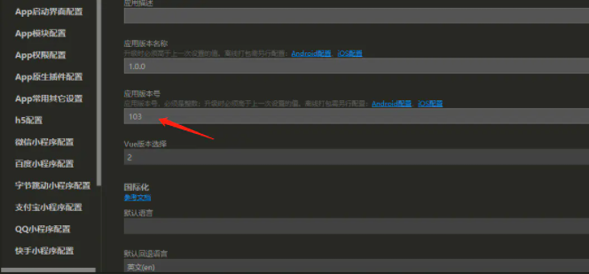

```js
onLaunch: function() {
            let appVersion = ''
            uni.getSystemInfo({
                success: function(e) {
                    appVersion = e.platform
                }
            })
            let that = this
            plus.runtime.getProperty(plus.runtime.appid, (wgtinfo) => {
                that.$http({
                    url: '/API_AUTH/AppInterface/getAppversion'
                }).then(res => {
                    if (parseInt(res.data.bbh) > parseInt(wgtinfo.versionCode)) {
                        uni.showModal({
                            title: "版本更新",
                            content: '检测到有新版本，是否更新', //更新描述
                            confirmText: '立即更新',
                            cancelText: '稍后进行',
                            success: (r) => {
                                if (r.confirm) {
                                    //如果是安卓直接更新下载
                                    if (appVersion === 'android') {
                                        uni.showLoading({
                                            title: '正在下载,请稍后'
                                        })
                                        uni.downloadFile({
                                            //下载地址
                                            url: encodeURI(res.data.webPath + res
                                                .data
                                                .bbdz),
                                            success: data => {
                                                uni.hideLoading()
                                                if (data.statusCode === 200) {
                                                    plus.runtime.install(data
                                                        .tempFilePath, {
                                                            force: false
                                                        },
                                                        function() {
                                                            plus.runtime
                                                                .restart();
                                                        });
                                                }
                                            },
                                            fail(err) {
                                                uni.showToast({
                                                    title: '下载失败，请重启APP。'
                                                })
                                            },
                                        })
                                        //如果是ios跳转到app store
                                    } else {
                                        //在App Store Connect中的App Store下的app信息，可找到appleId
                                        let appleId = plus.runtime.appid
                                        plus.runtime.launchApplication({
                                            action: `itms-apps://itunes.apple.com/cn/app/id${appleId}?mt=8`
                                        }, function(e) {
                                            uni.showToast({
                                                title: '打开应用商店失败'
                                            })
                                            console.log(
                                                '打开应用商店失败: ' +
                                                e.message);
                                        });
                                    }
                                } else if (res.cancel) {
                                    console.log('用户点击取消');
                                }
                            }
                        })
                    }
                })
            })
            console.log('App Launch')
        },
```


这个版本号就是wgtinfo.versionCode拿到的版本号，记得每次更新之后都更改。要不然就没法做到热更新。

原理很简单，就是获取当前app的版本号，然后每次进app的时候都调一个接口比对当前app版本号和线上最新版本号是否一致，如果线上最新版本号大于当前版本号则下载最新的apk然后自动安装。
