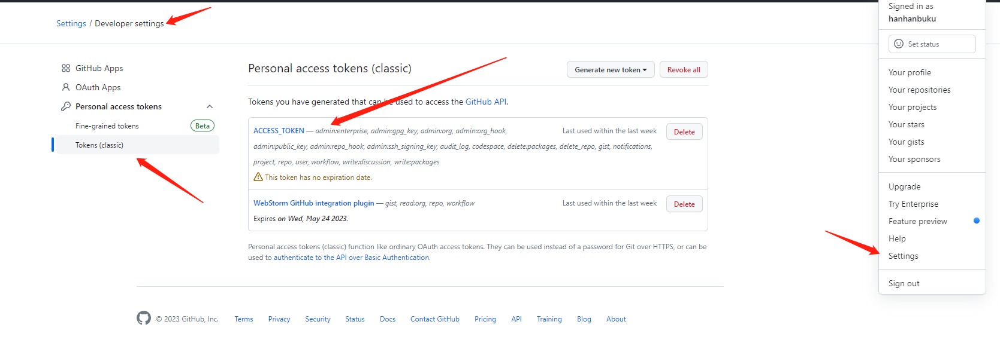
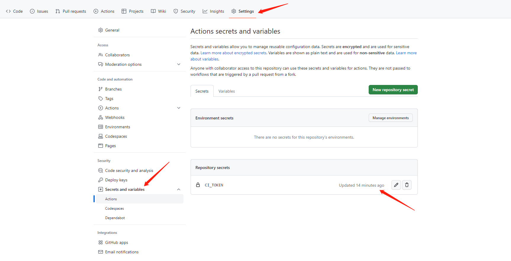

之前在做博客的ci处理的时候，一直卡在github账号登录不上去，后面发现github action已不支持使用账号密码登录，推荐使用Secrets码验证账户。
```shell
git remote add origin https://${user_name}:${{secrets.CI_TOKEN}}@${remote_addr}
```
CI_TOKEN是你自己在Secrets里取得名字，他的值是一个Tokens,具体设置方案如下

在这里生成一个token记住勾选所有权限


在这里将之前生成的token的值复制粘贴到此处。这样就可以顺利的使用gitHub Action构建项目了

下面来回答一下标题的问题
出现这种情况是因为 GitHub Actions 试图将修改的操作提交到仓库，但是被拒绝！！！！
因为之前第一次创建的那个token是30天的，所以我初步怀疑是不是因为token过期导致了没有权限，然后我重新生成了一个无期限的token，最终解决了此问题
