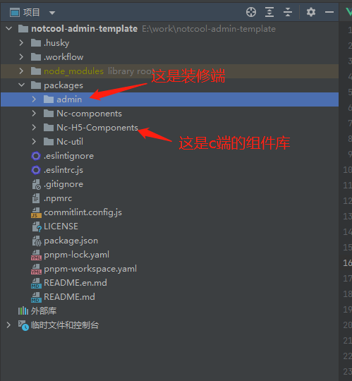
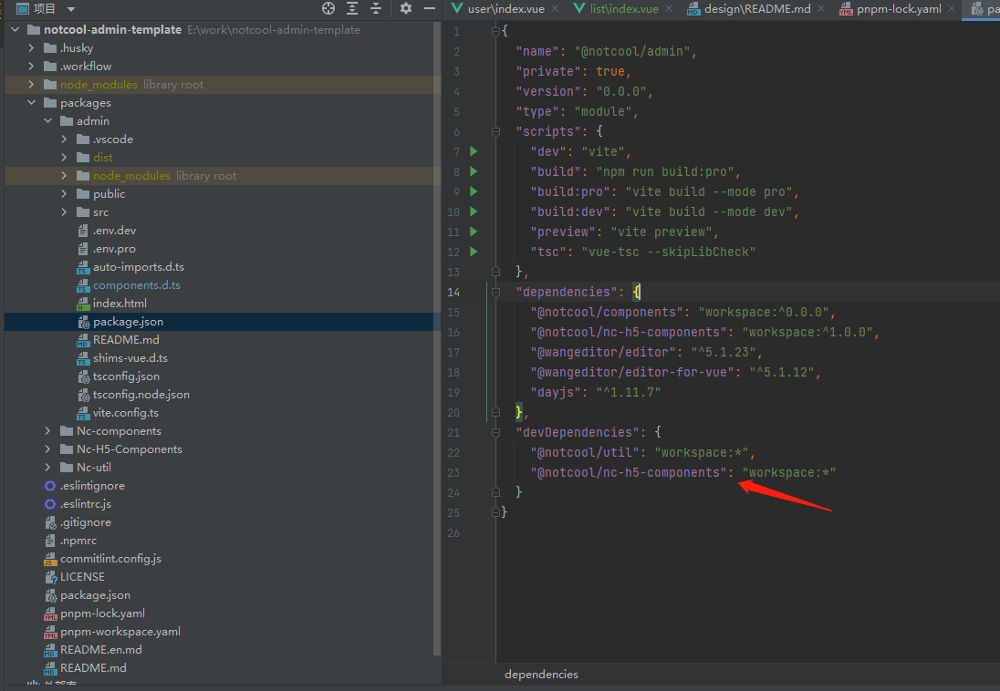
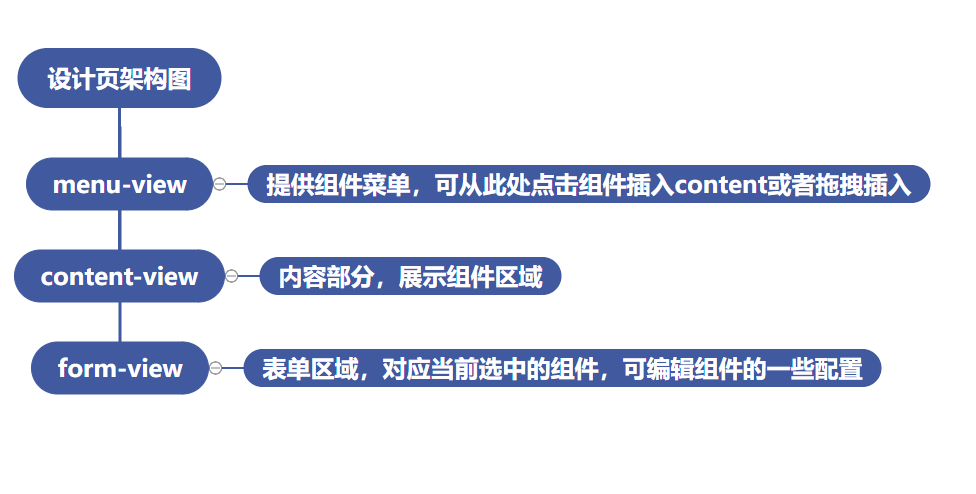
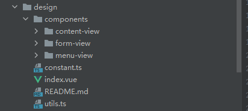
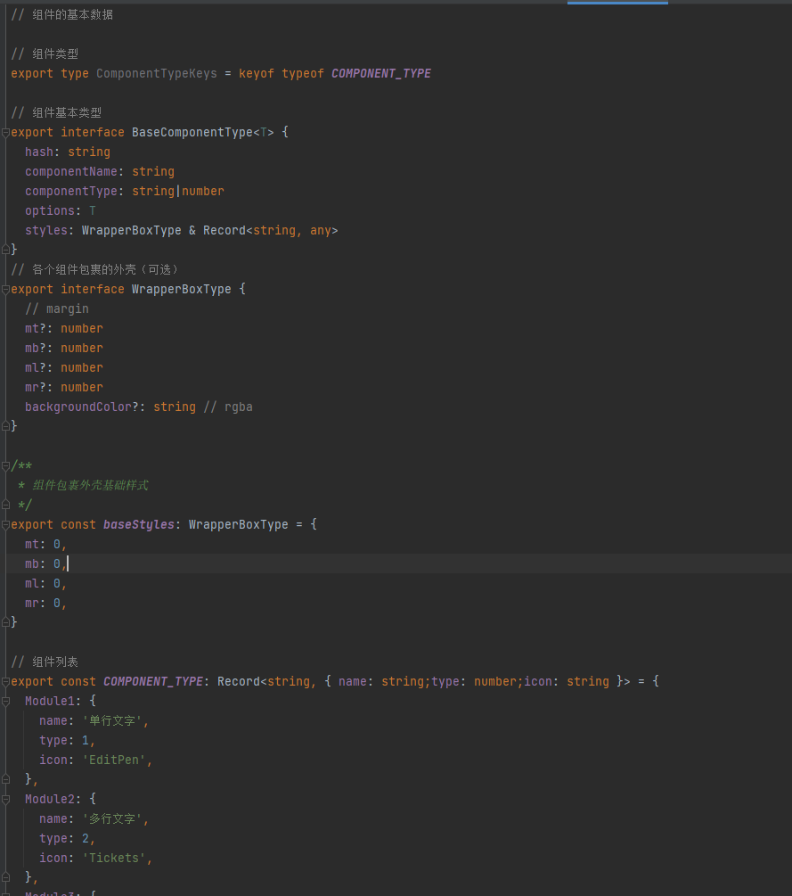
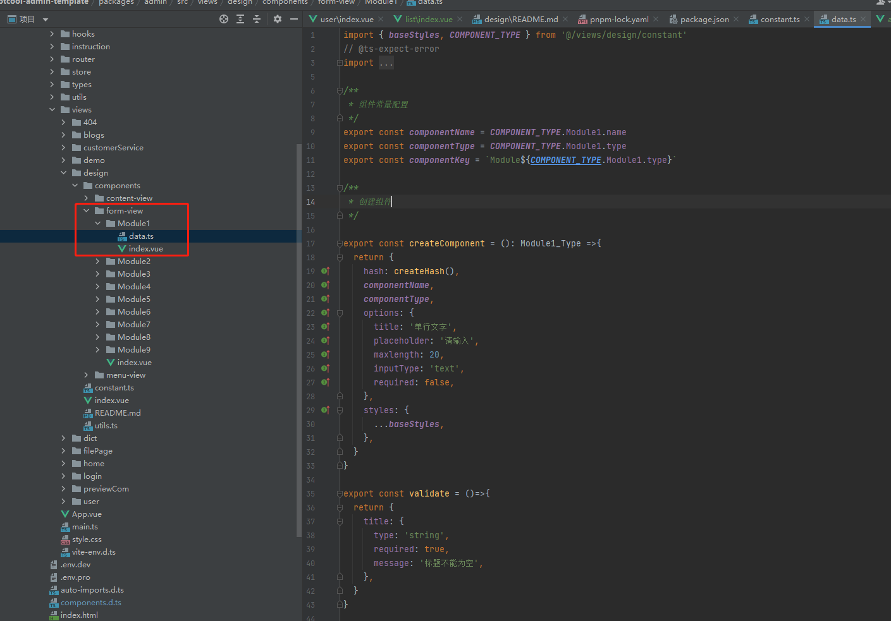
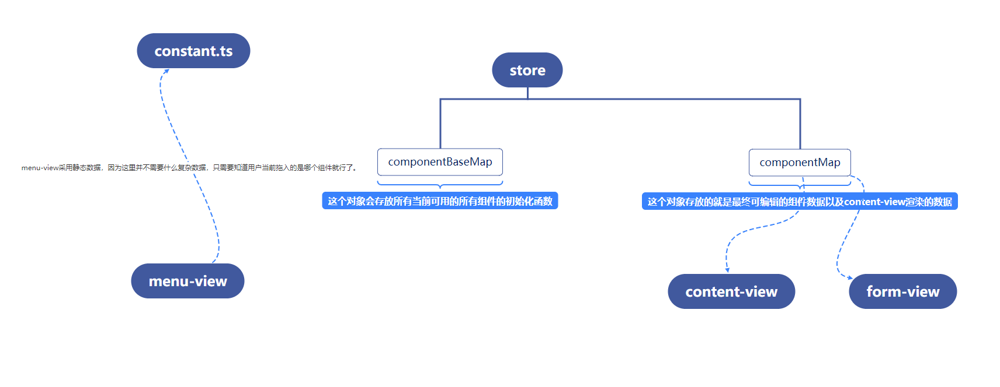

## 前言
自己写了一个低代码的页面，和市面上的功能一样，也是自行装修页面，然后生成一套描述数据。前端可根据这套数据渲染出用户自定义的页面。

## 低代码的本质
所谓的低代码其实就是开发人员提供好一系列的可配置的选项，用户可根据可视化界面去自行配置出一个diy页面。具体的实现就是用户diy完后会生成一个描述对象，描述了当前页面所有组件的各项属性。然后前端组件可根据这些属性去渲染不同的样式以及不同的功能。

## notCool design
首先项目整体通过```pnpm```+```monorepo```的方式去管理
### 为什么采用monorepo？
因为这里我的想法是admin端的预览页面直接和c端采用同一套组件。而不是c端一套组件，然后admin端的预览又去重新写一些不必要的组件样式。如果直接采用同一套组件库的话效果是非常好的，既可以真实的看到组件配置后的效果，又能节省很多代码。

其次因为pnpm对monorepo的天然支持，能让开发过程变得异常丝滑。
### 项目架构。
项目整体的目录大概如下



直接通过pnpm 在admin端安装组件库，免去了npm link的那种麻烦。对pnpm不是很熟的可以先自行了解一下pnpm。

### 设计页架构
设计页总共分为三大块


这是组件的划分。大概的目录如下



组件划分好了，下面将一下关于数据如何去管理，通俗一点就是需要去解决三个模块之间的通信了

### data的处理

首先我在constant里准备了一份静态数据，描述每个组件的基础信息。



一些公共样式以及组件的基本信息都会在这里写入。当然光有这些数据是远远不够的，我们的每个组件还需要一些更详细的信息。例如自身的配置属性以及样式属性。

因为这些数据和每个组件的form是息息相关的，所以我将这一部分内容放在了每个组件的from目录下。



每个form都会有自己的data.ts，这里面存放了组件的创建函数（说白了就是创建一个组件的初始化对象，用于描述这个组件，而我们的页面其实就是一个个的组件描述对象组合起来的数组。c端遍历这个数组去渲染每个组件），每个form还会有自己的表单验证规则，以及一些类型啥的数据。总之这个文件就是存放每个组件自己的东西的。

接下来就是怎么把这些数据和我们的三大模块串联起来了。这里需要用到store，为了方便组件之间的通信。

整体的设计思路如下


总结一下就是在页面初始化的时候会去获取当前所有可用组件的createComponent函数，然后将其存入到store中的componentBaseMap对象中。
当用户在menu-view中拖入了一个组件后，获取到当前被拖入的组件的key，然后再componentBaseMap中找到对应的初始化函数，将组件的数据初始化后存入store中的componentMap对象中。
content-view中引入了所有的c端组件，并且渲染在componentMap中存在的组件。这个时候需要有一个标识，也就是当前选中组件的key（这个当前选中指的是在content-view中选中的组件），有了这个key之后就可以在form-view里渲染对应的组件的配置表单

然后表单里去修改了配置的同时将数据更新到store中，这样就打通了整个流程。

### 如何生成componentBaseMap的数据
每个模块所需要的数据以及数据的流向都已经描述过了，下面讲一下componentBaseMap的数据如何生成
这里采用了动态注册全局组件的方式，同样也可以获取每个组件的data里的数据。
```ts
import { COMPONENT_TYPE } from '@/views/design/constant'
import { App } from 'vue'
/**
 * 获取form-view下所有的组件名称以及初始化方法
 */
export const getComponentsData = ()=>{
  // 这里采用同步动态引入，异步的话需要写promise比较麻烦
  const Modules = import.meta.glob('../design/components/form-view/**/data.(ts)', { eager: true })
  return Modules
}

/**
 * 动态引入组件
 */
export const getComponents = ()=>{
  const Modules = import.meta.glob('../design/components/form-view/**/index.vue')
  return Modules
}

interface base{
  componentKey: string
  componentType: string
  createComponent: () => Record<string, any>
}
export type Module = base&Record<string, any>

/**
 * 获取初始化组件表单的能力，插入store
 */
export const defineStoreComponentsBase = ()=>{
  const baseComponents: Record<string, Module> = {}
  const Modules = getComponentsData()
  for (const key in Modules) {
    if (Modules[key] && Object.prototype.toString.call(Modules[key]) === '[object Module]') {
      baseComponents[(Modules[key] as Module).componentKey] = {
        ...(Modules[key] as Module),
      }
    }
  }
  return baseComponents
}
/**
 * 收集所有的组件的key
 */
export const getAllComponentKeys = ()=>{
  const ModulesData = getComponentsData()
  const keys = []
  for (const key in ModulesData) {
    keys.push((ModulesData[key] as Module).componentKey)
  }
  return keys
}
/**
 * 动态注册form-view下所有的组件
 * @param app
 */
export const asyncRegisterComponent = (app: App)=>{
  const Modules = getComponents()
  const keys = getAllComponentKeys()
  for (const path in Modules) {
    Modules[path]().then((mod: any) => {
      keys.forEach(key=>{
        if (path.indexOf(key) !== -1) {
          if (mod?.default) {
            app.component(key, mod.default)
          }
        }
      })
    })
  }
}
/**
 * 根据type获取组件名称
 */

export const getComponent = (componentType: number)=>{
  return Object.keys(COMPONENT_TYPE).find(key=>key === `Module${componentType}`)
}

```

至此，整个design页面的设计思路就已经结束了，其中在交互上还有很多细节，这里就不细说了。
想了解的可以自行上git上看代码[NotCool](https://gitee.com/wangyuhan123/notcool-admin-template)

## 结语
整体的实现下来其实不是很难， 但是其中的设计思想非常重要。只有好好的规划才不会把代码写成一团，尤其是在实现这种比较大型的功能时，每个模块的划分都必须仔细严谨。通过这一次试手，让我对pnpm以及monorepo有了更深的认识，以及面对monorepo项目时流水线该如何配置。总得来说还是一次非常不错的开发体验
