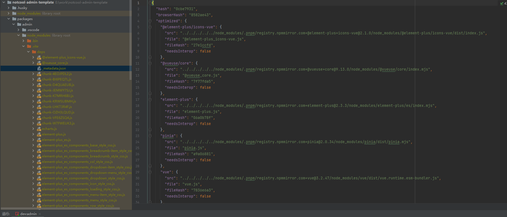

  
## Vite和Webpack的区别

vite作为当下最火的前端构建工具，快是他最趁手的武器。那么同样作为构建工具界的常青树的webpack和vite究竟有啥区别呢？

- webpack在启动时会先构建出整个项目模块的依赖图，然后根据依赖图把所有的代码都构建一遍。最终生成一个bundle，并且每次代码有改动，他都会重新构建所有的东西。这样依赖项目一旦大了就会非常影响速度
- 而vite则是在启动服务器后，通过中间件拦截请求，然后对请求的文件做一系列的编译之后返回。也就是说vite并不会再启动时去构建所有资源，而是在你用到哪个，他就构建哪个。真正意义上做到了按需加载。并且不会受项目大小影响

## 前置知识

在学习vite之前，有必要先掌握一些前置知识

### ESM

其实就是js自身的模块化方案，而现在大部分浏览器已经支持esm了，也就是可以在script标签的type属性给上module，就可以使用import导入导出模块了。

### Esbuild

Vite在开发环境时底层使用Esbuild实现对.``ts、jsx、.``js代码文件的转化，所以先看下什么是es-build。

```Esbuild```是一个```JavaScript```  Bundler 打包和压缩工具（由Go编写，一般的构建工具都是有JS编写， 所以在cpu密集场景下，go的性能会比js要更好），它提供了与Webpack、Rollup等工具相似的资源打包能力。可以将JavaScript 和TypeScript代码打包分发在网页上运行。但其打包速度却是其他工具的10～100倍。

目前他支持以下的功能：
- 加载器
- 压缩
- 打包
- ``Tree shaking``
- ``Source map``生成
  esbuild总共提供了四个函数：transform、build、buildSync、Service。有兴趣的可以移步官方文档了解。

### Rollup
在生产环境下，vite使用Rollup来进行资源的打包

``Rollup``是基于``ESM``的``JavaScript``打包工具。相比于其他打包工具如``Webpack``，他总是能打出``更小``、``更快``的包。因为 ``Rollup`` 基于`` ESM 模块``，比 ``Webpack`` 和 ``Browserify ``使用的`` CommonJS模块机制``更高效。``Rollup``的亮点在于同一个地方，``一次性``加载。能针对源码进行`` Tree Shaking``(去除那些已被定义但没被使用的代码)，以及 ``Scope Hoisting`` 以减小输出文件大小提升运行性能。

Rollup分为build（构建）阶段和output generate（输出生成）阶段。主要过程如下：

- 获取入口文件的内容，包装成module，生成抽象语法树
- 对入口文件抽象语法树进行依赖解析
- 生成最终代码
- 写入目标文件

## 核心原理

当一个script标签类型为module时
```js
  <script type="module" src="/src/main.js"></script>

```
浏览器会发起一个http请求，去请求这个src的链路
```js
// main.js
import { createApp } from 'vue'
import App from './App.vue'
createApp(App).mount('#app')

```
当请求到了main文件之后又会去解析这个文件里的import，这些import又会引发http请求，去加载对应的资源

vite的核心原理其实就是利用了浏览器现在已经支持esm，遇到import会去发起http请求。然后他在node 服务层起了一个拦截器来拦截这些请求，返回对应的处理好的资源。所以他全程都不会提前打包资源，而是真正的按需加载。这也就是为什么他比webpack快这么多的原因

## 依赖预构建
依赖预构建是vite在构建过程中至关重要的一环，上文说了，vite其实是利用了浏览器遇到import语法会发起http请求下载对应的资源来做到飞速的打包，那我们试想一下这样做难道真的就全是好处没有一点坏处吗？
当然不是，下面就一起来看看vite利用依赖的预构建都解决了哪些问题吧
- 兼容不同模块化的代码
   - 我们在日常开发中会下载非常非常多的依赖包，而这些依赖包通常都会采用五花八门的模块化方案，webpack为什么要采用AST来解析js代码呢？其中有一个原因就是为了抹平模块化的差异，他会将js代码通过AST树来转换成一个浏览器能识别的代码。
      而vite为了达到这种效果，所以会采用依赖预构建的方式来去抹平差异
- 路径重写
   - 浏览器只能识别绝对路径和相对路径的引入，并不支持包名的引入，而我们在日常开发中引入依赖基本上都是通过包名的方式去引入。那vite为了解决这个问题，在依赖预构建的时候同时也会生成一个json的依赖路径映射文件。用来重写包名引入
- 尽可能的集成依赖文件，减少网络请求
   - 在我们安装的依赖包里，可能也会依赖着别的包，这种深层次的嵌套如果不去处理就会造成在浏览器上发起非常非常多的请求。这是特别消耗性能的，同时这也就是为什么浏览器不支持包名的方式引入，因为他不知道你这个包到底依赖了多少东西，所以他
      干脆就不兼容，不去做这种吃力不讨好的事情。而vite在预构建阶段会尽可能的将一个包以及他的依赖的内容都构建成一个文件，这样可以有效的减少网络请求
## 实现一个简易的vite
下面让我们跟随一个小栗子来深入的看一看vite到底是怎么做的

### 首先启动一个node服务器
```js
const http = require('http')
const connect = require('connect');

const middlewares = connect(); //connect中间件，主要做拦截器的作用

const createServer = async ()=> {
    // 依赖预构建
    await optimizeDeps();
    http.createServer(middlewares).listen(3000, () => {
        console.log('simple-vite-dev-server start at localhost: 3000!');
    });
};
// 拦截返回index html
middlewares.use(indexHtmlMiddleware);
// 处理 js 和 vue 请求的中间件
middlewares.use(transformMiddleware);
createServer();
```

这样一个简单的node服务器就启动了。接下来我们要做的就是预构建我们的依赖。那为什么要预构建依赖呢？对此vite官方是这样解释的
- 兼容 CommonJS 和 AMD 模块的依赖
- 减少模块间依赖引用导致过多的请求次数

预构建依赖，那当然是需要拿到所有的依赖，然后通过esbuild来构建啦。细心的同学可能会发现，每当我们启动好项目之后，node_modules目录下都会出现一个.vite目录以及一个_metadata.json的文件。.vite目录下其实就是存放所有被预构建之后的依赖文件的地方，而那个json文件就是资源路劲的映射文件件。下面看一张图感受一下



下面来着手写一下代码
```js
const fs = require('fs');
const path = require('path');
const esbuild = require('esbuild');
// 因为我们的 vite 目录和测试的 src 目录在同一层，因此加了个../
const cacheDir = path.join(__dirname, '../', 'node_modules/.vite');
module.exports = {
    optimizeDeps: async () => {
        if (fs.existsSync(cacheDir)) return false;
        fs.mkdirSync(cacheDir, {recursive: true});
        // 在分析依赖的时候 这里为简单实现就没按照源码使用 esbuild 插件去分析
        // 而是直接简单粗暴的读取了上级 package.json 的 dependencies 字段
        const deps = Object.keys(require('../package.json').dependencies);
        // 关于 esbuild 的参数可参考官方文档
        const result = await esbuild.build({
            entryPoints: deps,
            bundle: true,
            format: 'esm',
            logLevel: 'error',
            splitting: true,
            sourcemap: true,
            outdir: cacheDir,
            treeShaking: true,
            metafile: true,
            define: {'process.env.NODE_ENV': "\"development\""}
        });
        const outputs = Object.keys(result.metafile.outputs);
        const data = {};
        deps.forEach((dep) => {
            data[dep] = '/' + outputs.find(output => output.endsWith(`${dep}.js`));
        });
        const dataPath = path.join(cacheDir, '_metadata.json');
        fs.writeFileSync(dataPath, JSON.stringify(data, null, 2));
    }
}

```
完成到这里，其实就只剩下拦截请求了。只要把拦截到的请求做一个相对应的处理。我们的minivite就完成了

首先我们拦截一下/，返回我们的index.html
```js
//当访问:3000/的时候读取根目录的html并且返回
const indexHtmlMiddleware = (req, res, next) => {
    if (req.url === '/') {
        const htmlPath = path.join(__dirname, '../index.html');
        const htmlContent = fs.readFileSync(htmlPath, 'utf-8');
        res.setHeader('Content-Type', 'text/html');
        res.statusCode = 200;
        return res.end(htmlContent);
    }
    next();
};

```
其次是js文件和vue文件。
```js
//处理js和.vue文件
const transformMiddleware = async (req, res, next) => {
    // 因为预构建我们配置生成了 map 文件所以同样要处理下 map 文件
    if (req.url.endsWith('.js') || req.url.endsWith('.map')) {
        const jsPath = path.join(__dirname, '../', req.url);
        const code = fs.readFileSync(jsPath, 'utf-8');
        res.setHeader('Content-Type', 'application/javascript');
        res.statusCode = 200;
        // map 文件不需要分析 import 语句
        const transformCode = req.url.endsWith('.map') ? code : await importAnalysis(code);
        return res.end(transformCode);
    }
    //处理.vue文件
    if (req.url.indexOf('.vue')!==-1) {
        const vuePath = path.join(__dirname, '../', req.url.split('?')[0]);
        // 拿到 vue 文件中的内容
        const vueContent =  fs.readFileSync(vuePath, 'utf-8');
        // 通过@vue/compiler-sfc 将 vue 中的内容解析成 AST
        const vueParseContet = compileSFC.parse(vueContent);
        // 得到 vue 文件中 script 内的 code
        const scriptContent = vueParseContet.descriptor.script.content;
        const replaceScript = scriptContent.replace('export default ', 'const __script = ');
        // 得到 vue 文件中 template 内的内容
        const tpl = vueParseContet.descriptor.template.content;
        // 通过@vue/compiler-dom 将其解析成 render 函数
        const tplCode = compileDom.compile(tpl, { mode: 'module' }).code;
        const tplCodeReplace = tplCode.replace('export function render(_ctx, _cache)', '__script.render=(_ctx, _cache)=>');
        // 最后不要忘了 script 内的 code 还要再一次进行 import 语句分析替换
        const code = `
                ${await importAnalysis(replaceScript)}
                ${tplCodeReplace}
                export default __script;
        `;
        res.setHeader('Content-Type', 'application/javascript');
        res.statusCode = 200;
        return res.end(await importAnalysis(code));
    }
    next();
};
```

```js
//分析import语句，将依赖包引入路劲替换成构建包路劲
const importAnalysis = async (code) => {
    // es-module-lexer 的 init 必须在 parse 前 Resolve
    await init;
    // 通过 es-module-lexer 分析源 code 中所有的 import 语句
    const [imports] = parse(code);
    // 如果没有 import 语句我们直接返回源 code
    if (!imports || !imports.length) return code;
    // 定义依赖映射的对象
    const metaData = require(path.join(cacheDir, '_metadata.json'));
    // magic-string vite2 源码中使用到的一个工具 主要适用于将源代码中的某些轻微修改或者替换
    let transformCode = new MagicString(code);
    imports.forEach((importer) => {
        // n： 表示模块的名称 如 vue
        // s: 模块名称在导入语句中的起始位置
        // e: 模块名称在导入语句中的结束位置
        const { n, s, e } = importer;
        // 得到模块对应预构建后的真实路径  如
        const replacePath = metaData[n] || n;
        // 将模块名称替换成真实路径如/node_modules/.vite
        transformCode = transformCode.overwrite(s, e, replacePath);
    });
    return transformCode.toString();
};
```
## 热更新
HMR是开发过程中必不可少的一个功能，其实和webpack一样，vite的热更新也离不开websocket。vite往import.meta上挂载了一个hot对象，具体的热更新方法其实就是通过这个hot
对象身上的一些方法来实现的。
大致分为以下几步：
### 前置
- 服务器启动时创建websocket示例，同时通过chokidir监听文件是否更改
- 把热更新相关的代码注入html里面（这一点和webpack是一样的）
- 执行客户端热更新代码：创建websocket示例去连接服务，创建一些存储数据的变量（存一些文件路径和回调函数，方便更新的时候查找和使用），并且注册一系列的监听事件
- 当请求的文件中有import.meta.hot.accept时，向该文件注入回调函数（更新用）
### 更新
- 监听到文件更新
- 如果时配置文件之类的，则直接重启服务器，否则通过websocket通知客户端
- 根据模块路径向上查找，找到所有依赖此模块的模块。
- 客户端接收到此消息后，通过import重新请求变更过后的模块，并且载url上挂上import和时间戳

## 总结
下面来总结一下vite的原理：
::: tip
vite主要是借助了浏览器支持esm的特性，从而可以做到按需编译，按需加载。无需和webpack一样要打包所有内荣。这也是他速度快的第一大原因。
vite冷启动一个服务器，然后对浏览器的请求做拦截，从而去编译文件，最终返回给浏览器。而webpack则是统一处理好后再一起返回给浏览器，所以随着项目
的变大，速度也就会变慢。vite对于依赖这一块有着一个依赖预处理的方式，主要是为了抹平各种依赖包采用不同的模块化方案，以及缓存下这些模块，并且将嵌套过深的模块尽可能的集成处理。
这样做也会对速度有一个大大的提升。同时预编译还会存下依赖包和编译后的资源路径。方便重写我们代码中直接用包名引入依赖的方式（浏览器只支持绝对路径和相对路径import资源）。在热更新这一块vite的做法和webpack差不多，也是通过websocket实现的，
vite会往import.meta上挂在一个hot对象，这个对象上就包含了所有的热更新所需的方法。通过chokidir去监听文件的变更，然后把变更了的文件的内容以及所有依赖他的模块的路径都告知客户端，客户端去重新import这个更改过后的文件，同时在url上会拼上时间戳，防止缓存。
:::
