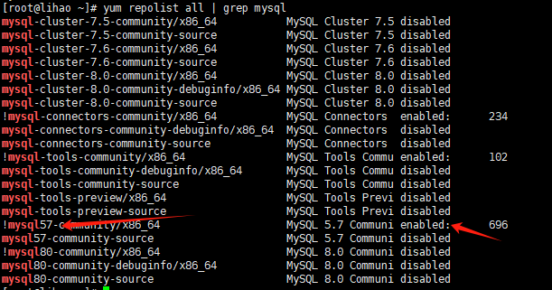
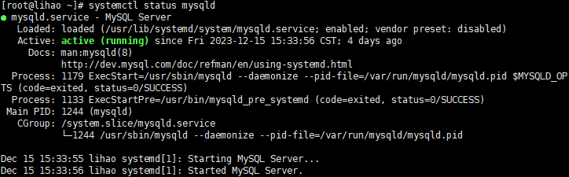
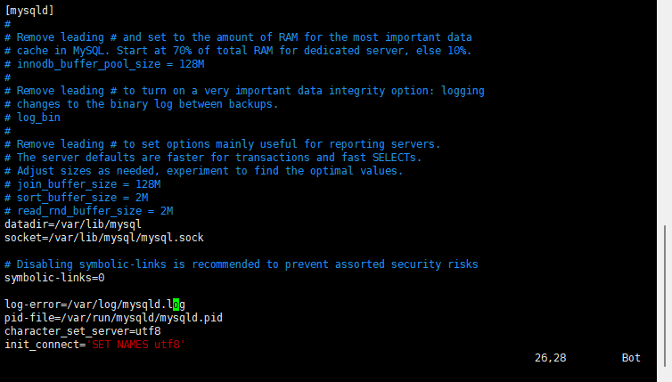
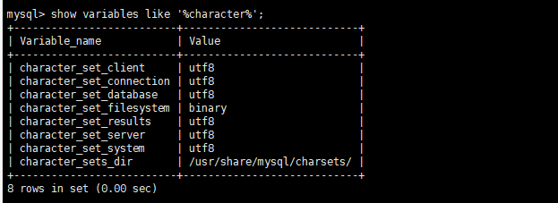
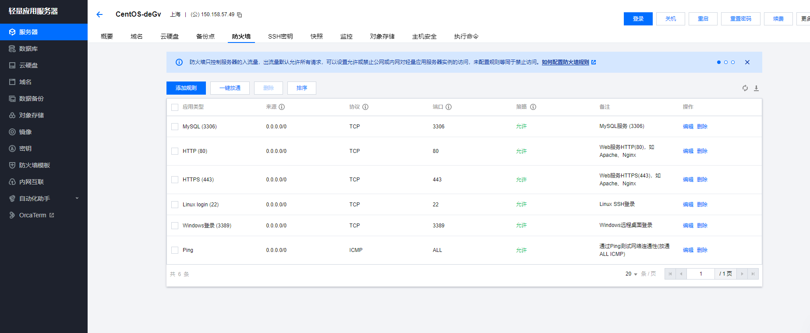

## 前言
> 最近在学习nest，设计到数据库的安装。考虑到后期服务器上也需要安装，所以干脆本地就不装了，直接在服务器上安装然后本地通过Navicat链接，下面详细记录一下在服务器上安装mysql的步骤以及一些坑

## 准备工作

首先添加一下mysql yum源
```shell
rpm -ivh http://dev.mysql.com/get/mysql57-community-release-el7-8.noarch.rpm
```
默认启用的是最新版本，如果要启用旧版本需要去手动启用一下，如果使用最新版可以跳过这一步

```shell
sudo yum-config-manager --disable mysql80-community
sudo yum-config-manager --enable mysql57-community
```
执行上述两行代码就是关闭80版本开启57版本，执行完可以查看一下状态
```shell
yum repolist all | grep mysql
```

可以看到8.0版本已经禁用，5.7版本已经开启

安装mysql
```shell
yum install -y mysql-server
```

开启mysql服务
```shell
开启服务
systemctl start mysqld

查看状态
systemctl status mysqld

```


到这一步数据库就算安装完成了，下面还需要进行修改密码和开启防火墙才能让外面访问到

mysql服务第一次启动的时候，会默认创建一个“超管账户”——‘root’@‘localhost’——就是本地使用root账号登录。
这个账号的默认密码会存在日志里。通过以下命令取出。

```shell
sudo grep 'temporary password' /var/log/mysqld.log

```
获取到这个密码之后，通过这个密码登录mysql，然后去修改密码
```shell
登录

mysql -uroot -p
```

```shell
修改密码

mysql> ALTER USER 'root'@'localhost' IDENTIFIED BY '你的新密码';
```
你的密码需要至少一个大写，一个小写，一个数字，一个特殊字符，长度至少8位，这是mysql官方的校验，注意一下

接下来需要创建远程访问用户
```shell
建用户
create user 'root'@'%' identified with mysql_native_password by '你的密码';
赋权限
grant all privileges on *.* to 'root'@'%' with grant option;
刷新用户权限
flush privileges;

```
超管账号那个root@localhost用户只能本地登录，这里创建的用户把超管后面的localhost换成了%，就是可以从任意地址访问的一个用户。

开启防火墙的3306端口

服务器一般是要开防火墙的。所以上面虽然创建了可以远程登录的用户，但是远程想要进来，还需要让防火墙知道怎样的访问允许进来。
mysql服务默认启动在3306端口，所以需要防火墙开启3306端口。

linux的防火墙常见的有两个，个是firewalld，另一个是iptables。

这里我的机器使用的是firewalld

```shell
没开启的话先开启服务
systemctl start firewalld
查看状态
systemctl status firewalld 

```
```shell
开启3306端口
firewall-cmd --zone=public --add-port=3306/tcp --permanent 
重新载入
firewall-cmd --reload

```
顺利的话你会看到输出success

如果使用的是另外一个防火墙，请自行搜索一下如何开启3306端口。

接下来设置一下mysql的默认编码为utf-8

```shell
使用vim修改my.cnf文件（纯小白建议先熟悉一下vim操作）
vim /etc/my.cnf

```
添加如下配置
```shell
character_set_server=utf8
init_connect='SET NAMES utf8'

```


这里提一嘴vim的基本操作：
按下i进入编辑模式，这个时候你可以去插入和删除内容。再次按下i会退出编辑模式。
输入:号会进入命令模式，这里你可以输入命令保存vim文件。
编辑好之后:wq即可保存并退出。

重启一下mysql
```shell
systemctl restart mysqld
```
然后查看是否生效
```shell
先登录mysql，再执行
mysql> show variables like '%character%';

```


到这里 服务器上的操作就全部结束了，接下来需要去云服务器上开启3306端口。



我这里使用的是腾讯云，直接去防火墙里添加一个规则，选择mysql的就行了。

一切操作结束之后，就可以在本地通过Navicat连接服务器上的数据库啦。

下面提一嘴我在操作过程中遇到的问题，之前服务器上没有开启防火墙，然后开启了之后因为没有开放http（80端口）和https（443端口）。所以导致之前部署的网站访问不了了，下面还需要开放一下这两个端口。
- 检查当前的防火墙规则：
```shell

sudo firewall-cmd --list-all
```
- 如果没有 http 和 https 服务，则需要添加它们：
```shell
sudo firewall-cmd --add-service=http --permanent
sudo firewall-cmd --add-service=https --permanent
```
- 更新防火墙规则：
```shell
sudo firewall-cmd --reload
```
ok，到这里所有的操作就都已经做完了。

## 参考文献
[Linux安装MySQL（使用yum）](https://blog.csdn.net/qq_38907313/article/details/123574181)
