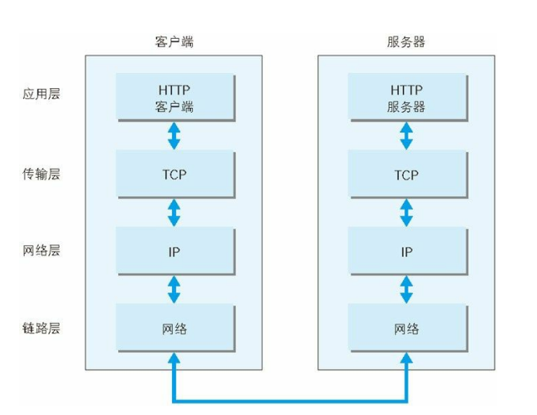

## 前言
>本文是阅读图解http这本书所记的阅读笔记

## 网络基础 TCP/IP
通常我们使用的网络都是建立在TCP/IP协议的基础上的，网络传输的过程中协议是至关重要的一部，由他来规定如何传输，传输给谁，传输过程中的规范等等。而HTTP协议就是这一大堆协议中的一种。

协议有很多很多种他们各司其职，为什么会出现这么多种协议呢？

这是因为在协议族里有一个非常重要的概念---``分层``。分层的概念可以类比为我们将代码模块化，每个模块只负责自己的东西，把这些模块合在一起就可以完成一个更大的功能点。在协议族群中同样是这样，
分层过后的协议每一层只负责自己干的事，耦合度低。可用性可扩展性高，下面就来具体介绍一下网络协议大概分为哪几层吧！

- 应用层
  - 应用层决定了向用户提供应用服务时通信的活动。 
  - TCP/IP 协议族内预存了各类通用的应用服务。比如，FTP（File
    Transfer Protocol，文件传输协议）和 DNS（Domain Name System，域
    名系统）服务就是其中两类。
    HTTP 协议也处于该层。
- 传输层
  - 顾名思义，传输层对于上层应用层而言则是提供数据传输的，在传输层有两个性质不同的协议：TCP和UDP
  - TCP：更稳定的传输，简历过程需要经历三次握手四次挥手，每次传输都得重新建立。过程比较耗费资源，适合用在对数据稳定性要求高的场景，如日常开发中的接口请求
  - UDP：传输过程较TCP而言更为简单，但传输过程不稳定，会出现丢失数据的可能。适合用在对实时性要求高，但对数据的稳定性可以放宽要求的场景，比如打电话，直播等场景中。
- 网络层
  - 网络层用来处理网络上流动的数据包，该层规定了通过怎样的路径将数据传输到对方计算机 
- 数据链路层
  - 用来处理链接网络的硬件部分，包括控制操作系统，硬件设备的驱动，NIC（网络适配器，既网卡），以及光纤等物理可见部分，硬件上的范畴都在数据链路层的作用范围内 

下面来看一下通信传输的流程

当我们在利用这些协议族在通信的时候通常会以发送端从应用层往下走，接收端从链路层往上走。
::: tip 小结

本小节主要讲述了网络协议的分层，应用层、传输层、网络层、数据链路层。每一个层分别的作用是
1. 应用层：确定本次网络连接是要干什么，比如dns解析，传输文件，传输数据等等。http协议就属于这一层
2. 传输层：确定以什么协议去传输数据，有TCP协议，UDP协议
3. 网络层：确定本次数据传输通过什么路劲传输
4. 数据链路层：处理硬件部分

数据传输的过程采用发送方从应用层往下走，接收方从数据链路层往上走
:::

