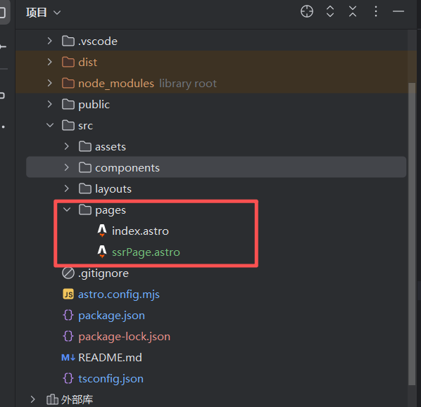
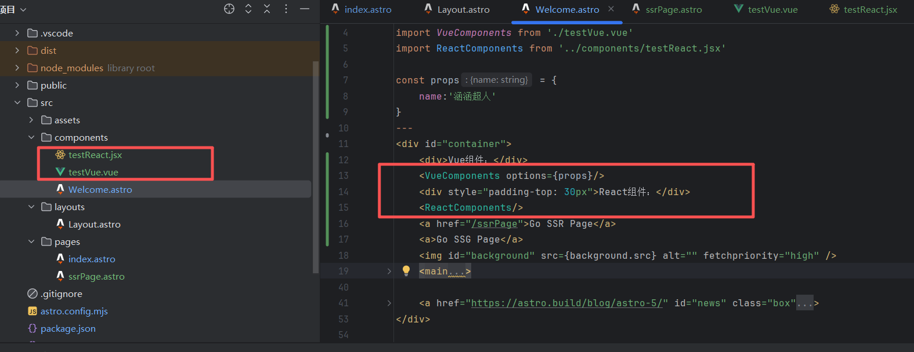
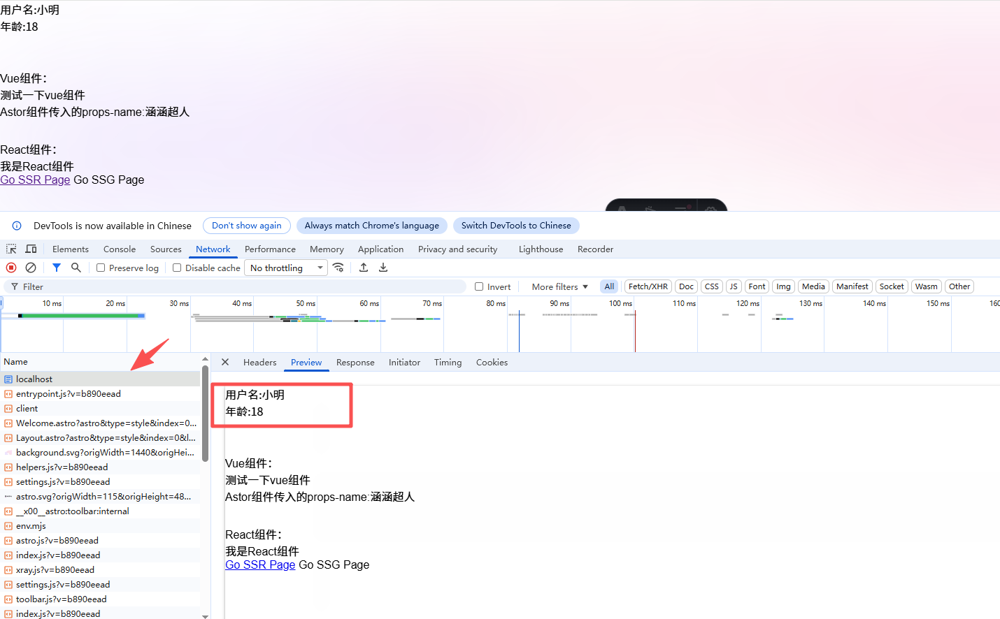

## 前言
> 在大前端的发展历程中，为适应各使用场景逐渐衍生出了许许多多的工程化方案，框架，渲染模式等一些列概念。``SPA``,``MPA``,``SSG``,``SSR``,``CSR``等等一系列的专业名词数不胜数，本文将给大家带来一个全新的框架，让大家在技术选型的时候多一个选择。

## 应用架构概念介绍
首先从应用架构模式来说，我们需要了解的是``SPA``,``MPA``。

下面我将罗列一下他们各自的概念以及优缺点

- SPA：``Single Page Application``，单页面应用
  - 这是一种只加载一个``html``页面，通过``js``动态更新页面内容的``web``应用架构，用户在操作时不会触发整页的刷新，而是通过``ajax``或者``fetch api``于服务器通信，异步加载数据并更新``dom``
  - 优点：
    - 交互体验好
    - 减少服务器压力
    - 前端路由优化
    - 开发体验好
  - 缺点：
    - 天然``seo``不友好
    - 首屏加载慢
    - ``js``文件体积大
    - 开发体验虽然好，但复杂度较高
- MPA：``Multi-Page Application``，多页面应用
  - 这是传统``web``架构，每次用户请求新页面时，浏览器都会向服务器请求一个新的``html``页面，服务端处理逻辑并返回完整的``html``代码，简单来说就是会有多个``html``文件，每个文件之间是独立的
  - 优点：
    - 首屏加载快
    - ``seo``良好
    - 开发门槛低，会三大件就行
  - 缺点：
    - 页面切换慢，每次都要请求新的``html``
    - 服务器开销大
    - 前后端耦合度高
    - 开发效率低

## 渲染模式

上面介绍完了应用架构，接下来就带大家了解了解前端的三大渲染模式

- **CSR(客户端渲染)**
  - 顾名思义，就是把渲染的工作放在客户端去做，``SPA``架构下大多数都是采用的``CSR``的渲染模式，服务器返回一个只有基础容器的``html``，和``js``文件，由这个``js``文件在客户端完成渲染
  - 优点：
    - 页面切换流畅
    - 前后端完全分离
    - 服务器压力小
    - 开发效率高
  - 缺点
    - 首屏加载慢
    - ``seo``不友好
    - 内容依赖``js``
  - 技术栈代表：
    - ``Vue/React/Angular``等
    - ``WebPack/Vit``e等
- **SSR(服务端渲染)**
  - 浏览器请求``url``，``nodejs``在服务器上执行前端代码，调用后端``api``，然后渲染出完整的``html``字符串返回给客户端，对于客户端来说拿到的就是一个完整的``html``页面
  - 优点：
    - 首屏加载快
    - 支持``seo``
    - 低端设备友好
  - 缺点：
    - 服务器压力大，需要实时渲染
    - 开发复杂度高
    - 需要服务器上长期运行一个``nodejs``服务
  - 技术栈代表：
    - ``Next/Nuxt ``
- **SSG(静态站点生成)**
  - 在构建时就生成所有完整的``html``，最终部署到服务器上的时纯静态的``html/css/js``
  - 优点：
    - 极致的性能（回归原始）
    - 顶级安全性（无服务器运行时）
    - 完美的``seo``支持
    - 服务器成本低，可以托管在任意地方
  - 缺点：
    - 大部分都是静态内容，不适合高度动态的内容
    - 实时数据依然需要客户端补充
  - 技术栈代表：
    - ``Nuxt/VitePress/Vite-SSG ``

### 三种渲染模式对比
| 特性     | CSR       |SSR|SSG|
|--------|-----------|---|---|
| 渲染地点   | 	客户端 🌐   |	服务器端 ☁️|	构建时 ⚙️|
| 首屏速度   | 	慢 ⏳	     |快 🚀|	极快 ⚡|
| SEO 友好 | 	一般 ⚠️    | 	优秀 ✅   | 	优秀 ✅   |
| 开发复杂度  | 	简单 😊    |	复杂 😅|	中等 😐|
| 服务器负载  | 	低 😌     | 	高 😓   | 	极低 🥳  |
| 实时数据   | 	优秀 ✅     |	优秀 ✅|	差 ❌|
| 适用场景   | 	后台系统/应用类 | 	内容网站/电商 | 	博客/文档/宣传页 |
| 技术成本   | 	低 💰     |	高 💰💰|	极低 🆓|
| 安全系数   | 	中 🛡️    | 	中 🛡️    | 	高 🛡️🛡️🛡️ |

有了这些基础知识，接下来就可以隆重介绍我们的主人公``Astro``了。首先引用一段[官网](https://docs.astro.build/zh-cn/concepts/why-astro/)的介绍

## Astro
::: tip

``Astro`` 是最适合构建像博客、营销网站、电子商务网站这样的以内容驱动的网站的 ``Web`` 框架。``Astro`` 以开创了一种新的前端架构而闻名，与其他框架相比它减少了 ``JavaScript`` 的开销和复杂性。如果你需要一个加载速度快、具有良好 ``SEO`` 的网站，那么 ``Astro`` 就是你的选择。

:::

这是一个集多功能于一体的``web``框架，他的亮点如下

- 群岛：一种基于组件的针对内容驱动的网站进行优化的 ``Web`` 架构。
- UI 无关：支持 ``React``、``Preact``、``Svelte``、``Vue``、``Solid``、``HTMX``、``Web`` 组件等等。
- 服务器优先：将沉重的渲染移出访问者的设备。
- 默认无 JS：让客户端更少的执行 ``JS`` ，以提升网站速度。
- 内容集合：为你的 ``Markdown`` 内容，提供组织、校验并保证 ``TypeScript`` 类型安全。
- 可定制：``Partytown``、``MDX`` 和数百个集成可供选择。

通过上面这些简介我们就可以了解到这是一个实现``SSR``或者``SSG``的极佳框架，他允许你使用任意的``ui``框架，并且同时支持``SSR``和``SSG``混用，你的项目里可以``A``文件使用``vue``，``B``文件使用``react``，甚至一个文件里可以同时存在多个框架的组件。接下来就带大家从0到1体验一下这个框架！

## 创建第一个Astro项目

这里官方推荐使用``Node``版本``v18.20.8`` 或 ``v20.3.0``、``v22.0.0`` 或更高版本。（``v19`` 和 ``v21 ``均不支持。）

```shell
# 使用 pnpm 创建一个新项目
pnpm create astro@latest

# 使用 npm 创建一个新项目
npm create astro@latest

# 使用 yarn 创建一个新项目
yarn create astro
```
这里我用的是``pnpm``，安装好依赖之后，你就可以通过``dev``运行项目啦
```shell
# 安装依赖
pnpm i
# 运行项目
pnpm dev
```

``astro``采用约定式路由，也就是说``src``下必须有一个``pages``目录,这个目录下的文件就是你的网页路径



如上图所示，最终会构建出``index.html``和``ssrPage.html``这两个文件。

``astro``默认就是以``SSG``模式去构建。

进入``.astro``后缀的文件内，里面的结构如下


```js
---
        astro的相关变量以及组件的导入需要写在这里，如创建变量，导入文件，导入组件等
---
        
这里是写模板的地方，可以写原生html标签，可以渲染vue组件，react组件等等      

```

可以看到整体的语法上来说 还是相对很自由的。

想要用对应的``ui``框架需要安装对应的继承，这里用``vue``和``react``来做个示例
```shell
pnpm add @astrojs/vue

pnpm add @astrojs/react

```
如果在启动`` Astro ``时看到 Cannot find package 'react'（或类似）的警告，你需要安装`` react`` 和 ``react-dom``：
```shell
pnpm add react react-dom @types/react @types/react-dom
```
``vue``同理
```shell
pnpm add vue
```
接下来需要在``astro.config.*``文件中添加这两个继承

```js
// @ts-check
import { defineConfig } from 'astro/config';
import vue from '@astrojs/vue';
import react from '@astrojs/react';

// https://astro.build/config
export default defineConfig({
    integrations:[
        vue(),
        react()
    ]
});

```
下面我们来创建一下这两个组件
```jsx
// testReact.jsx
const App = ()=>{
  return (
          <>
            <div>我是React组件</div>
          </>
  )
}
export default App
```
```vue
// testVue.vue

<template>
  <div>
    测试一下vue组件
  </div>
  <div>
    Astor组件传入的props-name:{{options.name}}
  </div>
</template>
<script>
  export default {
    props:{
      options:{
        type:Object,
        default:()=>({})
      }
    },
    data(){
      return{
        name:'123123'
      }
    },
    methods:{

    }
  }
</script>
<style scoped>

</style>
```
接下来我们在``index.astro``中引入这两个组件：




可以在页面上看到


可以看到 页面上已经渲染出了这两个组件，并且还可以接受``astro``组件的传值。

像大多数约定式路由一样，``astro``也支持动态约定路由
```js
// src/pages/dogs/[dog].astro
---
export function getStaticPaths() {
  return [
    { params: { dog: "clifford" }},
    { params: { dog: "rover" }},
    { params: { dog: "spot" }},
  ];
}
const { dog } = Astro.params;
---

<div>Good dog, {dog}!</div>
```
这将生成三个页面： ``/dogs/clifford``、``/dogs/rover`` 和 ``/dogs/spot`` ，每个页面显示相应的狗名。

还有更复杂得嵌套路由可以自行前往官网查看

这里需要提一嘴，默认情况下``astro``会构建出文件夹``/index.html``得结构，如果想去除这一层级直接打包出``html``文件可以再配置文件中这样写
```js
// @ts-check

import mdx from '@astrojs/mdx';
import sitemap from '@astrojs/sitemap';
import { defineConfig } from 'astro/config';

// https://astro.build/config
export default defineConfig({
  // site: 'https://example.com',
  // 使用相对路径以便直接在浏览器打开HTML文件
  integrations: [mdx(), sitemap()],
  build: {
    // 将页面构建为单独的HTML文件，而不是放在文件夹中
    format: 'file',
  },
});

```
### ssr能力

``astro``支持``ssr``和``ssg``混用，即：可以某些页面使用``ssr``渲染，某些页面使用``ssg``渲染。

框架默认采用``SSG``，我们可以通过配置来修改
```js
import { defineConfig } from 'astro/config';

export default defineConfig({
  output: 'static'// static|server
})
```
如果想修改某个页面得渲染模式可以在``page``文件中这样写
```js
---
export const prerender = false  

---
```
**prerender**
- 默认值： 静态模式下为 true（默认）；配置 output: 'server' 后为 false

像``Next``，``Nuxt``这类``SSR``框架都提供了服务端钩子客户端钩子等一系列工具函数，在``astro``中如何在服务器上调用接口呢？

这里需要引入一个新的名词---服务器端点

所谓的服务器端点我们可以理解为他是一个我们自己写的后端服务，我们在调用，或者访问它的时候 它可以像正常的接口一样返回``Response``实例。它的定义方法也和写接口很类似：

在pages目录下的任意以``.js``或``.ts``结尾的文件都可以被作为服务器端点，而服务器端点需要暴露出以``http``请求方式为名的函数，例如下面这个例子
```js
//src/pages/api/hello.ts

import type { APIRoute } from 'astro'

export const GET: APIRoute = () => {
  return new Response(
          JSON.stringify({
            greeting: 'Hello',
          }),
  )
}
// export const POST
// export const DELETE
// export const PUT
```
在这个文件中我们暴露了一个``GET``方法，文件名为``hello.ts``。客户端就可以通过发送``get``请求或者直接调用这个``GET``方法访问到这个端点。

在这个端点中 我们可以自定义响应体，比如返回一个标准的``response``实例，亦或者直接返回``json``数据

这里提到了``response``实例就顺带介绍一下

**Response实例**
总共有以下属性
- body: ReadableStream,    // 响应体流
- bodyUsed: false,         // 是否已读取
- headers: Headers {},     // 响应头
- ok: true,                // 请求是否成功
- redirected: false,       // 是否被重定向
- status: 200,             // 状态码
- statusText: "OK",        // 状态文本
- type: "basic",           // 响应类型
- url: "https://..."       // 请求 URL

而这里我们需要特别关注的是``body``，和前端打交道最多的就是响应体啦，我们需要在这里面读取各种各样的数据。但是这个对象是没法直接用的，还需要调用一些特定的方法去读取数据

比如：
- .json()    → 解析为 JSON
- .text()    → 读取为文本
- .blob()    → 读取为 Blob
- .arrayBuffer() → 读取为 ArrayBuffer
- .formData() → 读取为 FormData

在日常开发过程中一些请求库都帮我做了这件事，所以可以直接在``.then``里拿到响应体。但是在``astro``里我们就需要自行处理一下了


下面我们调用一下这个端点

```js
// src/pages/index.astro
---
import { GET } from './api/hello.ts'

let response = await GET(Astro)
const data = await response.json()
---

<h1>{data.greeting} world!</h1>
```

接下来演示一下真实的调用服务端接口，这里我起了一个``nodejs``服务并且写了一个接口
```js
const express = require('express');
const app = express();
const port = process.env.PORT || 3000;
const {doc} = require('./data')
app.listen(port, () => {
  console.log(`express服务已启动，端口号： ${port}`);
  console.log('\x1b[36m%s\x1b[0m', `👉 点击这里访问: http://localhost:${port}/getReqText`); // 青色显示
  console.log('\x1b[32m%s\x1b[0m', `🌐 或者访问: http://127.0.0.1:${port}/getReqText`); // 绿色显示
})
app.get('/',(req,res)=>{
  res.send('<!DOCTYPE html>\n' +
          '<html lang="zh-CN">\n' +
          '<head>\n' +
          '    <meta charset="UTF-8">\n' +
          '    <meta name="viewport" content="width=device-width, initial-scale=1.0">\n' +
          '    <title>无脚小鸟</title></head>' +
          '<body>' +
          '<div>express服务，3000端口</div>' +
          '</body>' +
          '</html>')
})

app.post('/getUserInfo',(req,res)=>{
  console.log(req.headers,'请求头')
  res.status(200).json({
    status_code:1,
    data:{
      name:'小明',
      age:'18',
      sex:1
    }
  })
})

```
接下来在``astro``项目中写一个服务器端点调用一下这个接口
```js
// 返回一个GET函数，这个函数里可以调用服务端接口
export async function GET({params,request}){
    console.log('GET', params,request)

    const res = await fetch('http://localhost:3000/getUserInfo',{
        method: 'POST',
        headers: {
            'Authorization': `Bearer ab87qwd78cq87we`,
        },
    })

    const data = await res.json()

    console.log(data,'接口响应')

    return new Response(JSON.stringify(data), {
        status: 200,
        headers: {
            'Content-Type': 'application/json'
        }
    });
}
```
调用端点
```js
---
import Welcome from '../components/Welcome.astro';
import Layout from '../layouts/Layout.astro';
import {GET as commonApi} from './Api/common'

const res = await commonApi({
	params:{
		name:'Welcome',
		Astro
	},
	request:{
		method:'POST',
	}
})
const users = await res.json();
console.log(users,123123123)

---

<Layout>
	{
		users.data.map((user,index)=>{
			return(
				<div style="padding-bottom: 50px" key={index}>
					<div>用户名:{user.name}</div>
					<div>年龄:{user.age}</div>
				</div>
			)
		})
	}
	<Welcome />
</Layout>

```

运行项目后就可以看到一系列打印了

服务端成功接受到请求，并打印了一下请求头，可以看到调用时传入的``Authorization``字段也是成功拿到了


服务器端点这边也是成功拿到响应，并打印出来了（由于这一步动作是在服务器执行的 所以浏览器看不到，等调用完毕后浏览器拿到的已经是完整的``html了``）


浏览器上可以看到 响应的``html``里已经有我们服务器端点返回的数据了，这就完成了一次``ssr``渲染




在任何``astro``页面上，都可以去调用这个端点暴露的``get``方法。``Astro``还提供了丰富的全局对象，如``Request``，``Responses``，等来处理请求需要的一些配置，我们可以在这里``获取/配置``请求头响应头等等一些列操作。

由于涉及到的内容太多，大家可以自行前往官网查阅，整体来说 这是一个非常灵活，易上手的``SSG/SSR``框架。很值得一式！


