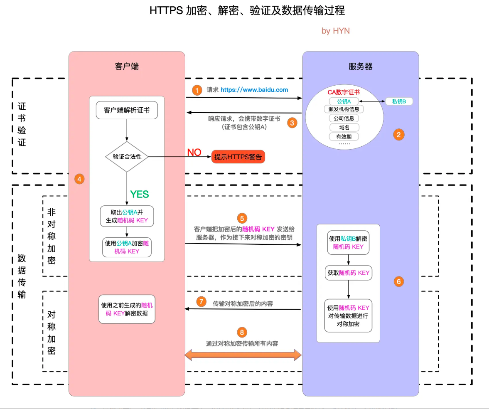

## HTML、CSS
> 这里收录一些html、css的经典面试题

### 1.盒模型
::: tip 答案

盒模型是css3中提出的对于元素大小描述的概念：概念中指出把每一个元素都比喻成一个盒子，他们有各自的宽高。
css3中盒模型分为两种：标准盒模型、怪异盒模型

盒模型一共由四个部分组成：margin、padding、border、content。两种盒模型的区别如下：

- 标准盒模型：
  -  在dom结构中实际占用 = width + padding + border + margin
  -  实际宽度 = width + padding + border
- 怪异盒模型：
  -  在dom结构中实际占用 = width + margin
  -  实际宽度 = width

修改盒模型可以通过box-sizing来实现：
- box-sizing: content-box表示标准盒模型
- box-sizing: border-box表示 IE 盒模型

:::

### 2.响应式布局

- 使用css媒体查询：根据不同的屏幕尺寸写不同的样式
- flex弹性盒子
- 流媒体布局：使用百分比来设置宽高
- 采用css相对单位

### 3.说一说flexible的实现原理
::: tip 答案

flexible是淘宝移动端的响应式适配方案，通过动态计算根元素的字体大小+使用rem作为css尺寸单位来实现适配不同分辨率的屏幕。
- 动态计算根元素的字体大小
  - 根据设备的dpr（设备像素比）值来计算html根元素的字体大小，公式：html的字体大小=基准字体大小×缩放比例，基准字体大小是一个预先设定的值，它对应于基准dpr（通常是1）时的字体大小。缩放比例是当前dpr与基准dpr的比值。
- px转rem
  - rem = px / 根元素字体大小 

:::


## JS
> 这里收录一些js的经典面试题，涉及到js的方方面面

### 1.for循环
```js
for(var i = 1;i<=5;i++){
    setTimeout(()=>{
        console.log(i)
    },0)
}
//输出 6,6,6,6,6

for(let i = 1;i<=5;i++){
    setTimeout(()=>{
        console.log(i)
    },0)
}
//输出 1,2,3,4,5
```
上面这两段代码 为什么``var``会输出``5个6`` 换成``let``后就能正确输出``1，2，3，4，5``呢？

``var``声明的变量会提升，因此代码中的``i``会被提升为``全局``变量，作用域不止在``for``循环中。根据事件循环机制，
定时器会在``for``循环全部执行完毕之后再执行，当``for``循环执行完成后，由于都是对同一个``i``去自增，所以这时定时器
中访问的``i``就是自增``5``次后的``i``。所以会连续输出``5个6``。

而在``let``不存在变量提升，所以每次迭代都会执行一遍``let i = 1`` ，并且``for``循环会记住上一次迭代的值并将他赋值给``i``
这样每次迭代执行的定时器都会访问到一个新的``i``，并且这个``i``的值还是上一次迭代后的结果。所以可以正确的输出``1,2,3,4,5``

如果不使用``let`` 还有没有别的办法呢？

其实这里主要考验的就是作用域和事件循环机制，为什么``var``不行？因为``var``声明的``i``作用域是全局的，导致定时器最后访问的都是同一个``i``。
而我们其实只要保证定时器每次访问的``i``是一个独立的变量一个作用域为定时器内的就行了。

```js
for(var i = 1;i<=5;i++){
    (function (j){
        setTimeout(()=>{
            console.log(j)
        },0)
    }) (i)
}
```
这里我们用一个``自执行函数``，将每次迭代后的``i``作为参数传进去，这样函数体内接受到的形参就是一个独立的值（根据函数参数是值传递的原理）。
定时器也每次也就会访问到只属于这个自执行函数作用域内的``i``了。

### 2.数组map方法和reduce方法的区别

::: tip 答案

- 相同点
  - 都可以用来遍历可迭代对象
  - 都接受一个callback函数，并且数据里的每个元素都会去执行一遍这个callbac
  - 对稀疏数组的处理逻辑一致，都会跳过空槽
  - 都不改变原数组，返回新值（注意如果修改原数组中引用类型数据的值则会影响到原数组，但这不是这两个api造成的）
- 不同点
  - callback的入参不同：map接受三个参数（当前遍历项，当前遍历项的索引，原数组）。reduce接收（上一次调用callback的结果，当前遍历项）等4个参数
  - map的callback支持可以指定this的值，reduce不行

:::

### 3.说一说new的过程中发生了什么
::: tip 答

js的new关键字通常用来创建一个新的对象，他的后边一般会跟一个class或者一个构造函数，在构造函数中会先创建一个对象，然后讲这个对象的显示原型指向构造函数的隐式原型
最后在return这个对象。这样以来所有通过这个构造函数创建的对象都会共享同一个原型

:::

### 4.Proxy与Object.defineProperty的用法和传参区别
二者都是用来拦截对象操作的

详解：
- Object.defineProperty
  - Object.defineProperty(obj, prop, descriptor); 
  - 参数：
    - obj：要在其上定义属性的对象。
    - prop：要定义或修改的属性的名称。
    - descriptor：属性描述符，可以包含以下属性：
      - value：属性的值。
      - writable：属性是否可写。
      - enumerable：属性是否可枚举。
      - configurable：属性是否可配置。
      - get：获取属性值的函数。
      - set：设置属性值的函数。
  - 示例：
    ```js
      const obj = {};
      Object.defineProperty(obj, 'prop', {
      value: 'value',
      writable: true,
      enumerable: true,
      configurable: true
      });
    ```
- Proxy
  - new Proxy(target, handler);
  - 参数：
    - target：要创建代理的目标对象。
    - handler：一个对象，其属性是当执行一个操作时定义代理的行为的函数。
  - 示例
    ```js
    const target = { prop: 'value' };
    const proxy = new Proxy(target, {
    get(target, prop) {
    console.log(`Property ${prop} has been read.`);
    return Reflect.get(target, prop);
    },
    set(target, prop, value) {
    console.log(`Property ${prop} set to ${value}.`);
    return Reflect.set(target, prop, value);
    }
    });
    ``` 
区别：
- Object.defineProperty主要用于拦截对象或定义对象的某个属性
- Proxy用于创建一个对象的代理可以拦截自定义对象上的操作，并且可以映射到原对象上

### 5.Proxy为何要结合Reflect使用
::: tip 答

Reflect提供了一组静态方法，这些方法和Proxy的陷阱方法都相对应，通常在Proxy中我们需要执行一些自定义逻辑然后继续执行对象的默认行为，这时候Reflect刚好提供了这些操作默认对象的方法，来确保对象的行为与没有被拦截是一致。
他们俩配合使用可以保持代码纯净

:::

### 6.说一说js的六中继承模式

1.原型链继承

  通过将一个对象的原型设置为另一个对象来实现继承。
```js
function Parent() {}
function Child() {}
Child.prototype = new Parent();
```
2.构造函数继承

使用父类的构造函数来增强子类实例，等同于复制父类的实例属性给子类（不包括方法）。
```js
function Parent(name) {
  this.name = name;
}
function Child(name) {
  Parent.call(this, name); // 调用 Parent 构造函数
}
```
3.组合继承（原型链 + 构造函数）

结合原型链和构造函数的优点，既能保证原型方法的复用，又能避免构造函数的重复调用。
```js
function Parent(name) {
  this.name = name;
}
Parent.prototype.sayName = function() {
  console.log(this.name);
};

function Child(name) {
  Parent.call(this, name); // 继承 Parent
}
Child.prototype = new Parent(); // 继承 Parent 原型方法
Child.prototype.constructor = Child; // 修复 Child 原型的 constructor 指向
```

4.原型式继承

创建一个对象来作为其他对象的原型。
```js
var parent = {
  name: "parent",
  sayName: function() {
    console.log(this.name);
  }
};

var child1 = Object.create(parent);
child1.name = "child1";
```
5.寄生式继承

创建一个函数，创建一个对象，通过函数的返回值来增强对象。
```js
function createAnother(original) {
  var clone = Object.create(original); // 创建一个新对象
  clone.sayHi = function() { // 以某种方式来增强这个对象
    console.log("hi");
  };
  return clone; // 返回这个对象
}
```
6.寄生组合式继承

通过组合寄生式继承和组合继承的优点，来实现更完美的继承方案。
```js
function inheritPrototype(childObject, parentObject) {
  var prototype = Object.create(parentObject.prototype); // 创建对象
  prototype.constructor = childObject; // 增强对象
  childObject.prototype = prototype; // 指定对象的原型
}

function Parent(name) {
  this.name = name;
}
Parent.prototype.sayName = function() {
  console.log(this.name);
};

function Child(name, age) {
  Parent.call(this, name); // 继承属性
  this.age = age;
}
inheritPrototype(Child, Parent); // 继承方法
Child.prototype.sayAge = function() {
  console.log(this.age);
};
```

## Vue
> 这里收录一些vue的面试题，包括vue2和vue3

### 1.vue3 为什么需要用reflect配合proxy使用
::: tip 答案

``Reflect``是一个内置的全局对象，它提供了拦截 ``JavaScript`` 操作的方法。``Reflect`` 对象的方法与 ``Proxy`` 处理的陷阱（``trap``）一一对应。使用`` Reflect ``的主要原因是为了保持与普通对象操作的一致性。
``Reflect``确保了即使在 ``Proxy`` 拦截了某些操作的情况下，对象的默认行为也能被保持，同时提供了一种避免代码重复和确保兼容性的方法。

:::
### 2.watch和computed是否可以异步，为什么？
::: tip 答案

``watch``支持异步，``computed``不支持异步：``watch``的回调支持异步是因为他的触发之后就已经脱离了依赖项，在检测到依赖项变化后会触发回调函数，此时回调函数即使是异步也不会影响到什么。而``computed``不支持异步是因为其内部存在的缓存机制，如果回调是异步的话那么缓存机制就无法拿到最新的值，会永远返回缓存的旧值。

:::
### 3.vue2.x 和 vuex3.x 渲染器的 diff 算法分别说一下？
::: tip 答案

简单来说，``diff``算法有以下过程

- 同级比较，再比较子节点
- 先判断一方有子节点一方没有子节点的情况(如果新的``children``没有子节点，将旧的子节点移除)
- 比较都有子节点的情况(核心``diff``)
- 递归比较子节点

正常``Diff``两个树的时间复杂度是``O(n^3)``，但实际情况下我们很少会进行跨层级的移动``DOM``，所以``Vue``将``Diff``进行了优化，从``O(n^3) -> O(n)``，只有当新旧``children``都为多个子节点时才需要用核心的``Diff``算法进行同层级比较。

``Vue2``的核心``Diff``算法采用了双端比较的算法，同时从新旧``children``的两端开始进行比较，借助``key``值找到可复用的节点，再进行相关操作。相比``React``的``Diff``算法，同样情况下可以减少移动节点次数，减少不必要的性能损耗，更加的优雅。

``Vue3.x``借鉴了 ``ivi``算法和 ``inferno``算法

在创建``VNode``时就确定其类型，以及在``mount/patch``的过程中采用位运算来判断一个``VNode``的类型，在这个基础之上再配合核心的``Diff``算法，使得性能上较``Vue2.x``有了提升。(实际的实现可以结合``Vue3.x``源码看。)
该算法中还运用了动态规划的思想求解``最长递增子序列``。

:::
### 4.keep-alive的原理
::: tip 答案

keep-alive可以实现组件的缓存，当组件切换时不会对当前组件进行卸载
其内部主要采用了缓存淘汰策略来实现

:::
### 5.nextTick的作用是什么？实现原理？
::: tip 答案

nextTick会在dom更新结束之后执行回调，主要是利用了宏任务微任务的执行顺序不同来实现的，根据当前环境支持成都不同以降级的方式采用以下几个api
- Promise
- MutationObserver
- setImmediate
- 如果以上都不行则采用setTimeout


:::

### 6.vue2和vue3的响应式原理
::: tip 答

- vue2:
  - 在我们new一个vue的时候，vue会首先进行一次代理data中的属性，从而使我们可以直接通过this来访问data的属性。然后vue会进行属性的递归遍历，一一进行拦截也就是Observe这个类的作用。这其中会有一个Dep类来收集依赖，并且负责派发更新，然后有一个watcher负责提供依赖，并且负责更新视图。 vue不会为每一个属性都生成一个watcher，而是在这个watcher被使用到了模板中才会去实例化watcher，然后保存在Dep的静态属性target上，这样在模板编译的时候会访问这个属性，从而使dep收集到这个属性对应的watcher。然后当属性的值发生变化的时候通过dep去派发更新，调用watcher的update方法，update又会调用实例化watcher的时候 保存下来的更新模板的callback，从而更新视图 
- vue3:
  - Vue3的响应式主要是通过proxy去代理对象，然后拦截get和set等一系列操作。在响应式系统的内部维护了一个WeakMap结构的依赖对象用于存放所有的响应式key和其对应的依赖（这里其实就对标的是Vue2的Dep实例）。而产生依赖则是通过Effect这个函数去创建依赖，这里其实对应的就是Vue2里的Watcher观察者。然后在get和set的拦截操作里去收集和触发依赖。学习响应式主要搞清楚在整个系统中有哪些角色，以及每个角色是干嘛的包括他们之间是如何串联起来的。搞明白了这些，就会学的非常轻松了。换句大白话概述一下vue的响应式：编译模板的时候生成更新函数也就是大家口中所说的依赖。然后在拦截到get的时候把当前生成的依赖保存起来，接着在set的时候去调用他们就行了。 

:::

### 7.vue中如何只让一个对象的第一层为响应式?
::: tip 答

vue3中可以使用reactive和toRefs两个api配合达到目的
```vue
const obj = reactive({
  nest:{
    a:1,
    b:2
  }
})
const {nest} = toRefs(obj)

```
这样nest的a和b属性就会失去响应式，因为toRefs只会将第一层转为响应式

vue2中可以通过Object.freeze来冻结属性

:::

### 8.vue如何做到监听数组的push等操作方法，缺陷原因
::: tip 答

由于Object.defineProperty()拦截数组太过消耗性能，所以vue2中对7中可以修改元数据的数组api进行了重写

:::


## React
> 这里收录一些react的面试题

## 工程化
> 这里收录一些工程化的面试题

### 1.webpack中file-loader和url-loader的区别

二者都是用于处理文件，url-loader时file-loader的封装
- file-loader: 不对文件进行处理只用于复制文件，将文件复制到目标路径下
- url-loader：可以将小文件转成base64格式

### 2.webpack和vite的区别
``webpack``和``vite``都是现代工程化构建工具，二者出于不同的设计理念。主要区别在于开发环境

开发环境：``webpack``本质上是一个模块打包器，他把项目中的所有模块都打包成一个或者多个``bundle``，在处理大项目时由于``webpack``需要构建完所有模块才能产出构建产物，所以通常来说速度会很慢，而``vite``
采用浏览器支持``esmodule``导入的特性，在开发阶段只对依赖进行与构建（产出每个依赖和他的路径的映射表）。在浏览器需遇到``import``语句的时候会去发起请求，``vite``这时动态的去构建被请求的文件 并且响应给浏览器由此完成整个链路。
也就是说``vite``并不需要在项目启动时就构建完所有的文件 而是浏览器用到了哪个他才去构建哪个，这也就是为什么``vite``开发环境速度飞快的原因。

生产环境：``vite``生产环境和``webpack``大同小异，也是需要构建所有的产物，值得注意的时``vite``在生产环境采用的时``rollup``，而开发环境采用的时``esbuild``去构建

### 3.vite衍生问题：esbuild和rollup的区别
``esbuild``由``GO``编写，速度由于``rollup``，并且他对跨平台的支持和多语言的支持更加良好，使用起来简单。``rollup``是一个专注``es``模块的打包器，它使用``es``语法来打包代码，他的摇树优化非常优秀，打包速度也很快并且支持输出不同格式的模块代码如``ESM``,``CommonJS``,``UMD``。
``vite``在开发环境选择``esbuild``是为了快速相应浏览器的请求，而生产阶段用``rollup``则是更好的支持构建。

## 计算机网络
> 这里收录一些计算机网络的面试

### HTTPS为什么是安全的，他和HTTP有什么区别

::: tip 答案


:::


## 浏览器
>浏览器相关面试题


### 1.什么是强缓存和协商缓存

浏览器缓存是提升用户体验和减轻服务器压力的重要手段，这其中包括``强缓存``和``协商缓存``两种：
- 强缓存：``强缓存``是通过``Expires``和``Cache-Control``来实现的，当浏览器请求一个资源的时候会先判断是否命中``强缓存``，是则直接使用本地缓存的内容
  - ``Expires``： 这是``http1.0``的头部，用来指定资源到期时间，浏览器会根据这个时间判断是否需要更新资源
  - ``Cache-Control``： 这事``http1.1``新增的头部，由于``Expires``不够灵活，所以新增了这个头部，来提供更灵活的配置：如``max-age：3600``（表示资源能够被缓存多久），``no-cache``（标识不缓存资源）。``Cache-Control``的优先级高于``Expires``


- 协商缓存：当``强缓存``没有命中时，浏览器会使用``协商缓存``，这个时候就需要跟服务器进行交互了。服务器在响应式会带上``Last-Modified``或``ETag``这两个头部信息。
  - ``Last-Modified / If-Modified-Since``： ``Last-Modified``表示资源最后一次修改的时间``If-Modified-Since``表示上次请求时的``最后修改时间``，也就是服务器返回的``Last-Modified``。由此让服务器判断是否更新了资源。
  - ``ETag / If-None-Match``：``ETag``表示资源的``唯一标识``，浏览器再次请求时会携带``If-None-Match``，``If-None-Match``就是上次请求时服务器返回的资源的``ETag``，通过这种方式让服务器判断是否需要更新资源。

::: tip 总结

强缓存主要通过``Expires(资源到期时间)``和``Cache-Control(内涵很多字段并且可设置不缓存)``来实现，这两个字段都由``服务器返回``，``浏览器自行判断``。此时浏览器和服务器``不进行``资源交换。协商缓存通过``Last-Modified / If-Modified-Since``和``ETag / If-None-Match``这两对来和服务器进行交互，简单来说就是服务器返回一个字段给浏览器，浏览器下次请求时携带上这个字段，由服务器来判断是否需要更新资源，如不需要服务器会相应``304（Not Modified）``状态码，如需要则返回新的资源。

:::

### 2.cookie和session
这两个都是用来跟踪验证用户信息的手段
- cookie：
  - 由服务端生成，通过http协议发送给客户端，客户端存储后在每次请求时携带上
  - 大小受限，一般不超过4kb
  - 可以跨页面访问
- session：
  - 由服务器生成，存储与服务器。每个用户都会被分配一个唯一的Session ID，该ID通过Cookie或URL重写的方式发送给客户端浏览器，并在后续的请求中携带。
  - 可以存储更多数据
  - 可以跨页面访问

关闭浏览器后 两者会有何变化
- 会话级cookie（没设置过期时间）会被销毁
- 持久级cookie（设置了过期时间）不会被销毁
- session会被销毁，由于session是由浏览器当前窗口记录sessionID来何服务器交互的所以即使没有关闭当前窗口 新开一个窗口 session也会失效

### 3.cookie是否可以跨域名使用

::: tip 答案

是可以的，但是需要配置domain主域名的形式来实现，不同的域名必须归属于同一主域名下才可以实现cookie的跨域名访问

:::

### 4.cdn为什么不会受同源策略影响

::: tip 答案

浏览器的同源策略限制了网络请求必须相同协议，相同ip，相同的端口。但是cdn通常会何当前域名不同源，他没有受影响主要是
因为cdn一般通过script标签或者img标签或者link标签加载。通过标签的src属性发送的请求不会受同源策略影响，jsonp解决跨域问题也是利用了这个原理

:::


## 计算机网络
> 这里收录一些计算机网络的面试题

### 1.http和https有什么区别？

::: tip 答

http和https都是数据传输协议，他们的主要区别如下：
- 安全性
  - http传输采取明文的方式容易被篡改，窃听。它不提供数据加密、身份验证和数据完整性验证
  - https在http的基础上新增了SSL/TSL协议，提供了数据加密、身份验证和数据完整性验证。同时也验证了服务器身份，防止第三方攻击
- 端口
  - http默认80端口
  - https默认443端口
- 性能
  - http性能优于https，因为它不需要加密解密操作
  - https由于新增了数据加密解密的操作所以会多一点细微的性能开销
- 证书
  - http不需要证书
  - https需要一个受信任机构（CA）签发的SSL/TSL证书，来验证服务器是否安全
:::

### 2.说一说https的请求过程中发生了什么

::: tip 答

1.客户端请求https网址，然后连接到server的443端口（https默认443端口）

2.采用https协议的服务器上必须有一套数字CA证书并且证书会带有一个公钥和一个私钥，私钥由服务端自己保存，不可泄露。

3.响应请求的时候服务器会把证书以及证书携带的公钥一起传输给客户端

4.客户端校验证书是否合法，不合法浏览器会给出警告。如果合法则取出公钥，并生成一个随机码KEY并且使用公钥加密这个KEY

5.客户端把加密后的随机码KEY传输给服务器，服务器使用私钥解密这个KEY，并用这个解密出来的随机码KEY对数据进行对称加密然后响应数据给客户端

6.客户端使用随机码KEY对数据进行解密

整个过程中可以分为三大步骤：
- 1.校验证书是否合法
- 2.证书合法的情况下进行通过非对称加密的方式生成了一个随机码KEY
- 3.服务器，客户端双方在后续的数据传输过程中通过这个随机码KEY以对称加密的形式传输数据

这里附上一个详细的步骤图



:::

### 3.说一说http1.x,http2的区别

::: tip 答

http1.0缺陷:
- 线程阻塞，同一时间同一域名的请求有数量限制，超出数量的会被阻塞
- 只保持短连接：每次请求都要重新简历tpc连接（即三次握手）这样非常消耗性能

http1.1改进：
- 持久链接，tcp链接默认不关闭，可以被多次使用
- 管道机制：在同一个tcp链接里客户端可以发送多个请求
- 分块传输：即服务端每产生一块数据就传输一块给客户端，采用流模式代替缓存模式

http1.1缺陷：
- 管道机制虽然可以在同一个tcp链接里发送多个请求，但请求依然是按次序进行的，后面的请求必须等待前面的请求相应完毕才能执行。这就造成了对头堵塞的问题

http2.0改进：
- 采用二进制协议传输
- 完全多路复用：解决了http1.1的对头阻塞问题
- 报头压缩：http协议是没有状态的，这就导致每次传输都必须携带上所有信息，造成很多头字段重复传输。http2引入报头压缩的概念，头信息使用gzip或compress压缩后再发送
并且客户端和服务端头信息表，所有字段都会存入这个表，后续的请求只需要传输索引就可以了
- 服务器推送：http2之前只支持客户端主动请求服务器，http2新增了服务器可以主动向客户端推送资源，具有代表性的就是sse协议

:::

## 项目题
> 这里收录一些工作中遇到的问题

### 1.你项目中有写到低代码生成，可以说说拖拽的实现吗？
::: tip 答
首先画布分为左侧（菜单栏）中间（渲染区域）右侧（组件表单）。拖拽是发生在将左侧菜单栏中某一个菜单拖入中间渲染区域，然后会自动生成对应的组件。

项目中的拖拽主要是用到dragstart和drop事件，首先给可拖拽的组件设置draggable属性和dragstart事件，拖拽的时候会触发dragstart事件，这个时候会去设置一个组件的信息到参数中。
```vue
<div @dragstart="handleDragStart" class="component-list">
    <div v-for="(item, index) in componentList" :key="index" class="list" draggable :data-index="index">
        <i :class="item.icon"></i>
        <span>{{ item.label }}</span>
    </div>
</div>

handleDragStart(e) {
  e.dataTransfer.setData('index', e.target.dataset.index)
}
```
然后鼠标拖到可放置区域的时候会触发放置区域dom的drop事件，我们就可以拿到对应的组件信息
```vue
<div class="content" @drop="handleDrop" @dragover="handleDragOver" @click="deselectCurComponent">
    <Editor />
</div>

handleDrop(e) {
  e.preventDefault()
  e.stopPropagation()
  const component = deepCopy(componentList[e.dataTransfer.getData('index')])
  this.$store.commit('addComponent', component)
}
```
这个时候就可以去操作渲染对应的组件了。

:::

### 2.你的组件库如何接收外界传入的参数呢？
::: tip 答

组件库接受参数的方式一共两种，第一种是通过props。第二种是通过provide和inject。组件库内部暴露了一个方法出来供使用方传入参数，该方法会将这个参数通过inject注册到全局。然后每个组件都可以通过provide将这些参数注入并加以使用。

:::
### 3.你说你的组件库的点击事件是由使用方统一注入的，说说你是如何设计的
::: tip 答

该组件库是一个业务组件库，每个组件都是业务组件并非通用组件，所以在编辑页面的时候就可以去为每个组件设置他的点击事件以及参数例如：
- 轮播图组件：
  - 可以给每个轮播图设置他自己的点击事件，并且设置他的参数值
  - 比如这里我给其中一个轮播图设置linkType=shop linkType表示点击事件的类型
  - 然后再设置linkTarget = 1 linkTarget表示点击事件的参数

这两个值会被保存到组件的配置信息中。

在c端使用的时候我们通过接口拿到当前页面配置的组件列表，然后将这些配置信息传入组件。并且c端维护了一份点击事件的map映射。承接上文的轮播图组件：
c端维护这样一个对象：
```js
const linkMap = {
    shop(linkTarget){
        // 这里拿到linkTarget 然后执行相应的跳转操作
    },
  ...
}
```
c端将这个map对象通过组件库暴露的方法传给组件库，组件库会通过provide和inject将这份数据注册。

然后组件库里其实一开始就写好了点击事件的，比如轮播图组件里的点击事件如下：

```vue
<mySwiper>
  <swiperItem v-for="(item,index) in config" :key="index" @click="hanldeClickSwiper(item)"></swiperItem>
</mySwiper>

<script>

export default{
  props:{
    config:{
      type:Object,
      default:()=>({}) // config就是上文中我们保存的linkType和linkTarget
    }
  },
  methods:{
    hanldeClickSwiper(item){
      //getLinkMap 是一个全局函数 里面的内容就是获取provide的值
      // 这里拿到的linkMap就是c端维护的那个表了
      const {linkMap} = getLinkMap()
      linkMap[item.linkType](item.linkTarget)
    }
  }
}
</script>

```
整体的思路就是这样，c端维护一份点击事件表 传给组件库 组件库支持可配置的点击事件 触发点击事件的时候会去调用c段维护的那个点击事件表里对应的函数
:::


