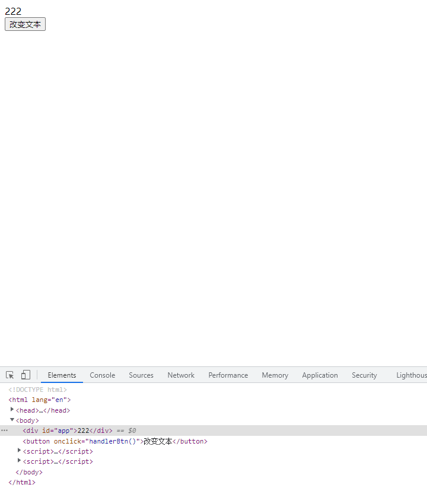
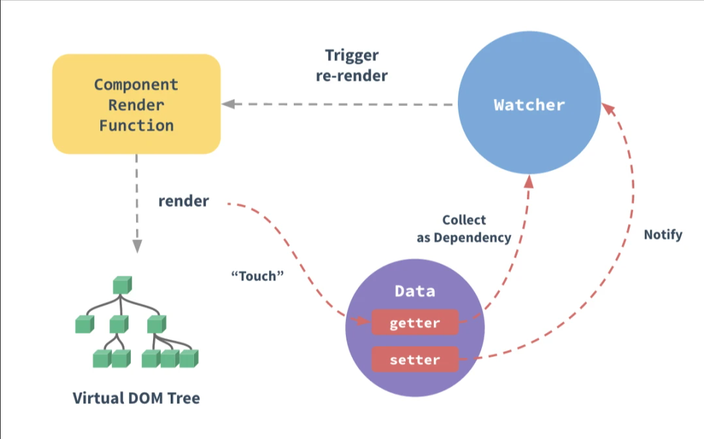
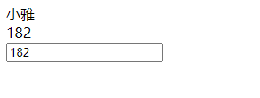

## 前言

>vue2的响应式原理已经是老生常谈的一个面试题了，本文将通过手写一个简易的vue，带你一步步深入了解vue2的响应式到底是如何实现的。
>阅读本文之前请先熟知Api```Object.defineProperty```,以及js的```观察者模式和发布订阅模式```。


## Object.defineProperty的小示例
```js
    const data = {
        text:'1111'
    }
    let vms = {}
    //拦截对vms对象的text属性的访问
    Object.defineProperty(vms,'text',{
        get(){
            //当访问vms.text的时候返回data.text
            return data.text
        },
        set(value){
            if(data.text!==value){
                //给vms.text赋值，实际是去给data.text赋值，然后再同事修改一下html的内容。
                data.text = value
                document.getElementById('app').innerText = data.text
            }
        }
    })
    function handlerBtn(){
        vms.text = '222'
    }
```


## 观察者模式

观察者模式可以食用这篇文章[手撕观察者模式和发布订阅模式](/pages/3435db/)

## 开始

先从最简单的开始，实现一个class，可以获取```$el```,以及代理data（**ps:也就是去实现通过this.xxx就可以访问到this.data.xxx**）
```js
    class Vue {
        constructor(options = {}) {
            //将传入的options保存在vue身上
            this.$options = options
            //获取el，也就是挂在节点
            this.$el = options.$el ? document.querySelector(options.$el) : options.$el
            //保存data
            this.$data = options.data
            //将data代理至Vue，让我们可以通过this.xxx去访问
            this.proxyData()
        }

        //代理被访问的属性
        proxyData() {
            Object.keys(this.$data).forEach(key => {
                //开始数据劫持，传入this
                Object.defineProperty(this, key, {
                    //设置可以枚举
                    enumerable: true,
                    //设置可配置
                    configurable: true,
                    //拦截访问
                    get() {
                        return this.$data[key]
                    },
                    //拦截赋值
                    set(value) {
                        if (this.$data[key] !== value) {
                            //设置新值
                            this.$data[key] = value
                        }
                    }
                })
            })
        }
    }
```
::: tip
通过上述代码，我们已经实现了一个简单的可获取dom，也可以直接访问data属性的vue了。怎么样，是不是很简单，下面我们加大一点难度。来熟悉一下vue的响应式逻辑
:::



到这里，我们的观察者模式就要排上用场了，这里会出现两个新的角色 分别是```Dep```和```watcher```
前者负责收集依赖，后者负责触发更新视图。

## 依赖收集
```js
    /* Dep */
    class Dep {
        constructor() {
            //存储观察者
            this.subList = []
        }

        //添加监听者
        addSub(sub) {
            //先判断观察者存不存在，以及观察者身上有没有更新的方法
            if (sub && sub.update)
                this.subList.push(sub)
        }

        //发布消息，通知监听者。
        notfiy() {
            this.subList.forEach(sub => {
                sub.update()
            })
        }
    }
```
## 观察者

```js
    /* Watcher */
    class Watcher {
        constructor(vm, key, cb) {
            //vm是vue的实例
            this.vm = vm
            //key就是当前触发实例化watcher的那个属性
            this.key = key
            //保存回调函数，也就是更新视图的方法
            this.cb = cb
            //将自身保存在Dep的静态属性target上，供dep收集
            Dep.target = this
            //保存一下key的值，目的是为了触发这个属性的get，从而收集依赖
            this.oldVal = vm[key]
            //因为上一步已经触发了get收集了依赖，所以这里清空Dep.target,防止循环引用。
            Dep.target = null
        }

        update() {
            if(this.vm[this.key]===this.oldVal) return
            this.cb(this.vm[this.key])
        }
    }
```
::: tip
上面是一个完整的观察者例子，看到这是不是有点懵，为什么要保存这么多参数。别着急，接着往下看，现在你只需要记住观察者需要有一个update的方法就行了，其他的暂时不需要关心
:::

写到这里，观察者模式也写好了。下面是不是该考虑该怎么把这个模式桥接进我们的vue里面了。

还记得我们在写vue这个类的时候进行了一次数据的代理吗？其实这一步并不是在处理响应式，响应式的代码我们还没开始写呢
下面就开始着手去拦截属性吧

## Observe
```js
    /* Observe */

    class Observe {
        constructor(data) {
            //遍历data，为每个属性都添加依赖收集策略
            this.walk(data)
        }
        walk(data){
            //判断data是否为空和是否不是对象
            if(!data ||typeof data !=='object') return
            //遍历data
            Object.keys(data).forEach(d=>{
                // 调用响应式函数
                this.defineReactive(data,d,data[d])
            })
        }
        defineReactive(data,key,value){
            //在这里再调用一次walk，传入value，相当于递归调用walk，给嵌套属性添加响应式，如果传入的不是对象则会直接return
            this.walk(value)
            //保存一下this
            let that = this
            //开始劫持属性
            Object.defineProperty(data,key,{
                // 设置可枚举
                enumerable: true,
                // 设置可配置
                configurable: true,
                // 获取值
                get() {
                    return value
                },
                //设置值
                set(newValue){
                    if(newValue!==value){
                        //将新的值赋值给value
                        value = newValue
                        //如果新的值是引用类型的话，同时给新的值也添加上响应式
                        that.walk(value)
                    }
                }
            })
        }
    }
```
Observe类就是用来拦截我们的data上每一个属性的类了。他会对data做层层的递归拦截，具体可以看一看walk函数。

接下来让我们把之前写好的观察者模式的两个兄弟接入到Observe里吧

```js
    /* Observe */

    class Observe {
        ...
        defineReactive(data,key,value){
            ...
            //为当前这个属性创建一个依赖收集器
            const dep = new Dep()
            //开始劫持属性
            Object.defineProperty(data,key,{
                // 设置可枚举
                enumerable: true,
                // 设置可配置
                configurable: true,
                // 获取值
                get() {
                    //收集依赖
                    Dep.target&&dep.addSub(Dep.target)
                    return value
                },
                //设置值
                set(newValue){
                    if(newValue!==value){
                        //将新的值赋值给value
                        value = newValue
                        //如果新的值是引用类型的话，同时给新的值也添加上响应式
                        that.walk(value)
                        //派发通知，触发依赖更新视图
                        dep.notfiy()
                    }
                }
            })
        }
    }
```
现在一个可以运作的响应式类 ```miniVue```就基本完成啦，我们还差最后一步，编译模板

## compiler
```js
/* compiler */

    class Compiler {
        // vm 指 Vue 实例
        constructor(vm) {
            // 拿到 vm
            this.vm = vm
            // 拿到 el
            this.el = vm.$el
            // 编译模板
            this.compile(this.el)
        }
        // 编译模板
        compile(el) {
            // 获取子节点 如果使用 forEach遍历就把伪数组转为真的数组
            let childNodes = [...el.childNodes]
            childNodes.forEach((node) => {
                // 根据不同的节点类型进行编译
                // 文本类型的节点
                if (this.isTextNode(node)) {
                    // 编译文本节点
                    this.compileText(node)
                } else if (this.isElementNode(node)) {
                    //元素节点
                    this.compileElement(node)
                }
                // 判断是否还存在子节点考虑递归
                if (node.childNodes && node.childNodes.length) {
                    // 继续递归编译模板
                    this.compile(node)
                }
            })
        }
        // 编译文本节点(简单的实现)
        compileText(node) {
            // 核心思想利用把正则表达式把{{}}去掉找到里面的变量
            // 再去Vue找这个变量赋值给node.textContent
            let reg = /\{\{(.+?)\}\}/
            // 获取节点的文本内容
            let val = node.textContent
            // 判断是否有 {{}}
            if (reg.test(val)) {
                // 获取分组一  也就是 {{}} 里面的内容 去除前后空格
                let key = RegExp.$1.trim()
                // 进行替换再赋值给node
                node.textContent = val.replace(reg, this.vm[key])
                // 创建观察者
                new Watcher(this.vm, key, newValue => {
                    node.textContent = newValue
                })
            }
        }
        // 编译元素节点这里只处理指令
        compileElement(node) {
            // 获取到元素节点上面的所有属性进行遍历
            ![...node.attributes].forEach((attr) => {
                // 获取属性名
                let attrName = attr.name
                // 判断是否是 v- 开头的指令
                if (this.isDirective(attrName)) {
                    // 除去 v- 方便操作
                    attrName = attrName.substr(2)
                    // 获取 指令的值就是  v-text = "msg"  中msg
                    // msg 作为 key 去Vue 找这个变量
                    let key = attr.value
                    // 指令操作 执行指令方法
                    // vue指令很多为了避免大量个 if判断这里就写个 uapdate 方法
                    this.update(node, key, attrName)
                }
            })
        }
        // 添加指令方法 并且执行
        update(node, key, attrName) {
            // 比如添加 textUpdater 就是用来处理 v-text 方法
            // 我们应该就内置一个 textUpdater 方法进行调用
            // 加个后缀加什么无所谓但是要定义相应的方法
            let updateFn = this[attrName + 'Updater']
            // 如果存在这个内置方法 就可以调用了
            updateFn && updateFn.call(this,{node, key, value:this.vm[key]})
        }
        // 提前写好 相应的指定方法比如这个 v-text
        // 使用的时候 和 Vue 的一样
        textUpdater(node, key, value) {
            node.textContent = value
            // 创建观察者2
            new Watcher(this.vm, key, (newValue) => {
                node.textContent = newValue
            })
        }

        // v-model
        modelUpdater({node, key, value}) {
            node.value = value
            // 创建观察者
            new Watcher(this.vm, key, (newValue) => {
                node.value = newValue
            })
            let that = this
            // 这里实现双向绑定 监听input 事件修改 data中的属性
            node.addEventListener('input', ()=> {
                that.vm[key] = node.value
            })
        }

        // 判断元素的属性是否是 vue 指令
        isDirective(attr) {
            return attr.startsWith('v-')
        }
        // 判断是否是元素节点
        isElementNode(node) {
            return node.nodeType === 1
        }
        // 判断是否是 文本 节点
        isTextNode(node) {
            return node.nodeType === 3
        }
    }
```

上面是一个简陋版的模板编译。现在把所有的步骤都加入Vue里头，一起看看成果吧

```js
 class Vue {
        constructor(options = {}) {
            //将传入的options保存在vue身上
            this.$options = options
            //获取el，也就是挂在节点
            this.$el = options.$el ? document.querySelector(options.$el) : options.$el
            //保存data
            this.$data = options.data
            //将data代理至Vue，让我们可以通过this.xxx去访问
            this.proxyData()
            //完成依赖收集
            new Observe(this.$data)
            // 编译模板
            new Compiler(this)
        }

        //代理被访问的属性
        proxyData() {
           ...
        }
    }

const vm = new Vue({
    $el: '#app',
    data: {
        name: '小鸡',
        age: '18',
        user:{
            name:'小明',
            age:'66'
        }
    }
})
```
```html
    <div id="app">
        <div>{{name}}</div>
        <div>{{age}}</div>
        <input v-model="age">
        <div v-text="age"></div>
    </div>
```


输入框变化，模板也是会跟着变化，这里就不掩饰了。完整代码如下
```js
 class Vue {
        constructor(options = {}) {
            //将传入的options保存在vue身上
            this.$options = options
            //获取el，也就是挂在节点
            this.$el = options.$el ? document.querySelector(options.$el) : options.$el
            //保存data
            this.$data = options.data
            //将data代理至Vue，让我们可以通过this.xxx去访问
            this.proxyData()
            //完成依赖收集
            new Observe(this.$data)
            // 编译模板
            new Compiler(this)
        }

        //代理被访问的属性
        proxyData() {
            Object.keys(this.$data).forEach(key => {
                //开始数据劫持，
                Object.defineProperty(this, key, {
                    //设置可以枚举
                    enumerable: true,
                    //设置可配置
                    configurable: true,
                    //拦截访问
                    get() {
                        return this.$data[key]
                    },
                    //拦截赋值
                    set(value) {
                        if (this.$data[key] !== value) {
                            //设置新值
                            this.$data[key] = value
                        }
                    }
                })
            })
        }
    }
    /* Observe */

    class Observe {
        constructor(data) {
            //遍历data，为每个属性都添加依赖收集策略
            this.walk(data)
        }
        walk(data){
            //判断data是否为空和是否不是对象
            if(!data ||typeof data !=='object') return
            //遍历data
            Object.keys(data).forEach(d=>{
                // 调用响应式函数
                this.defineReactive(data,d,data[d])
            })
        }
        defineReactive(data,key,value){
            //在这里再调用一次walk，传入value，相当于递归调用walk，给嵌套属性添加响应式，如果传入的不是对象则会直接return
            this.walk(value)
            //保存一下this
            let that = this
            //为当前这个属性创建一个依赖收集器
            const dep = new Dep()
            //开始劫持属性
            Object.defineProperty(data,key,{
                // 设置可枚举
                enumerable: true,
                // 设置可配置
                configurable: true,
                // 获取值
                get() {
                    //收集依赖
                    Dep.target&&dep.addSub(Dep.target)
                    return value
                },
                //设置值
                set(newValue){
                    if(newValue!==value){
                        //将新的值赋值给value
                        value = newValue
                        //如果新的值是引用类型的话，同时给新的值也添加上响应式
                        that.walk(value)
                        //派发通知，触发依赖更新视图
                        dep.notfiy()
                    }
                }
            })
        }
    }
    /* Dep */
    class Dep {
        constructor() {
            //存储观察者
            this.subList = []
        }

        //添加监听者
        addSub(sub) {
            if (sub && sub.update)
                this.subList.push(sub)
        }

        //发布消息，通知监听者。
        notfiy() {
            this.subList.forEach(sub => {
                sub.update()
            })
        }
    }

    /* Watcher */
    class Watcher {
        constructor(vm, key, cb) {
            //vm是vue的实例
            this.vm = vm
            //key就是当前触发实例化watcher的那个属性
            this.key = key
            //保存回调函数，也就是更新视图的方法
            this.cb = cb
            //将自身保存在Dep的静态属性target上，供dep收集
            Dep.target = this
            //保存一下key的值，目的是为了触发这个属性的get，从而收集依赖
            this.oldVal = vm[key]
            //因为上一步已经触发了get收集了依赖，所以这里清空Dep.target,防止循环引用。
            Dep.target = null
        }

        update() {
            if(this.vm[this.key]===this.oldVal) return
            this.cb(this.vm[this.key])
        }
    }

    /* compiler */

    class Compiler {
        // vm 指 Vue 实例
        constructor(vm) {
            // 拿到 vm
            this.vm = vm
            // 拿到 el
            this.el = vm.$el
            // 编译模板
            this.compile(this.el)
        }
        // 编译模板
        compile(el) {
            // 获取子节点 如果使用 forEach遍历就把伪数组转为真的数组
            let childNodes = [...el.childNodes]
            childNodes.forEach((node) => {
                // 根据不同的节点类型进行编译
                // 文本类型的节点
                if (this.isTextNode(node)) {
                    // 编译文本节点
                    this.compileText(node)
                } else if (this.isElementNode(node)) {
                    //元素节点
                    this.compileElement(node)
                }
                // 判断是否还存在子节点考虑递归
                if (node.childNodes && node.childNodes.length) {
                    // 继续递归编译模板
                    this.compile(node)
                }
            })
        }
        // 编译文本节点(简单的实现)
        compileText(node) {
            // 核心思想利用把正则表达式把{{}}去掉找到里面的变量
            // 再去Vue找这个变量赋值给node.textContent
            let reg = /\{\{(.+?)\}\}/
            // 获取节点的文本内容
            let val = node.textContent
            // 判断是否有 {{}}
            if (reg.test(val)) {
                // 获取分组一  也就是 {{}} 里面的内容 去除前后空格
                let key = RegExp.$1.trim()
                // 进行替换再赋值给node
                node.textContent = val.replace(reg, this.vm[key])
                // 创建观察者
                new Watcher(this.vm, key, newValue => {
                    node.textContent = newValue
                })
            }
        }
        // 编译元素节点这里只处理指令
        compileElement(node) {
            // 获取到元素节点上面的所有属性进行遍历
            ![...node.attributes].forEach((attr) => {
                // 获取属性名
                let attrName = attr.name
                // 判断是否是 v- 开头的指令
                if (this.isDirective(attrName)) {
                    // 除去 v- 方便操作
                    attrName = attrName.substr(2)
                    // 获取 指令的值就是  v-text = "msg"  中msg
                    // msg 作为 key 去Vue 找这个变量
                    let key = attr.value
                    // 指令操作 执行指令方法
                    // vue指令很多为了避免大量个 if判断这里就写个 uapdate 方法
                    this.update(node, key, attrName)
                }
            })
        }
        // 添加指令方法 并且执行
        update(node, key, attrName) {
            // 比如添加 textUpdater 就是用来处理 v-text 方法
            // 我们应该就内置一个 textUpdater 方法进行调用
            // 加个后缀加什么无所谓但是要定义相应的方法
            let updateFn = this[attrName + 'Updater']
            // 如果存在这个内置方法 就可以调用了
            updateFn && updateFn.call(this,{node, key, value:this.vm[key]})
        }
        // 提前写好 相应的指定方法比如这个 v-text
        // 使用的时候 和 Vue 的一样
        textUpdater(node, key, value) {
            node.textContent = value
            // 创建观察者2
            new Watcher(this.vm, key, (newValue) => {
                node.textContent = newValue
            })
        }

        // v-model
        modelUpdater({node, key, value}) {
            node.value = value
            // 创建观察者
            new Watcher(this.vm, key, (newValue) => {
                node.value = newValue
            })
            let that = this
            // 这里实现双向绑定 监听input 事件修改 data中的属性
            node.addEventListener('input', ()=> {
                that.vm[key] = node.value
            })
        }

        // 判断元素的属性是否是 vue 指令
        isDirective(attr) {
            return attr.startsWith('v-')
        }
        // 判断是否是元素节点
        isElementNode(node) {
            return node.nodeType === 1
        }
        // 判断是否是 文本 节点
        isTextNode(node) {
            return node.nodeType === 3
        }
    }


    const vm = new Vue({
        $el: '#app',
        data: {
            name: '小鸡',
            age: '18',
            user:{
                name:'小明',
                age:'66'
            }
        }
    })
```
## 解惑
- **提问**：为什么在收集依赖的时候要addSub Dep这个类身上的静态属性target，而在watcher实例化的时候又把watcher保存在Dep的target属性上。为什么不直接addSub一个watcher的实例，反而要这么麻烦的去做呢？

- **答**：试想一下，我们的watcher是做什么用的，是不是需要他来更新模板？那如果直接new一个watcher添加到依赖里的话，这个watcher该干些啥呢？他该怎么去更新模板呢？之所以要这么做，是因为我们实例化watcher其实只发生在模板编译的时候，这个时候我们能确切的知道模板中使用的哪些属性，并且可以将于这个属性对应的watcher实例化出来，再传入对应的更新函数，也就是上文watcher里的cb。这样才能
真的做到watcher是有用的，他被收集起来才是有意义的。而在watcher的构造函数里也会在赋值完Dep.target的时候访问一次data里的属性，从而触发get，进而收集依赖。然后又会将Dep.target置为null，这样的设计是不是非常的巧妙

- **提问**：为什么再拦截属性的时候要传入value，在get和set中也是使用这个value，而不是直接使用data[key]呢？
```js
 defineReactive(data,key,value){
        //为什么要传入一个value？
            Object.defineProperty(data,key,{
                get() {
                    //为什么这里不直接使用data[key]呢？
                    return value
                },
                set(newValue){
                    if(newValue!==value){
                        value = newValue
                    }
                }
            })
        }
```
- **答**：如果在get和set的时候直接使用data[key]的话，我们是不是也在访问这个属性？这样就会再次触发get，从而陷入死循环导致爆栈。所以vue在这里做了一个非常巧妙的设计，通过传入当前的data[key]的值，也就是代码中的value这个参数，然后再get和set中闭包引用这个value。完美的避免了这个问题

## 总结
::: tip
在我们new一个vue的时候，vue会首先进行一次代理**data**中的属性，从而使我们可以直接通过**this**来访问**data**的属性。然后**vue**会进行属性的递归遍历，一一进行拦截也就是**Observe**这个类的作用。这其中会有一个**Dep**类来收集依赖，并且负责派发更新，然后有一个**watcher**负责提供依赖，并且负责更新视图。
**vue**不会为每一个属性都生成一个**watcher**，而是在这个**watcher**被使用到了模板中才会去实例化**watcher**，然后保存在**Dep**的静态属性**target**上，这样在模板编译的时候会访问这个属性，从而使**dep**收集到这个属性对应的**watcher**。然后当属性的值发生变化的时候通过**dep**去派发更新，调用**watcher**的**update**方法，**update**又会调用实例化**watcher**的时候
保存下来的更新模板的**callback**，从而更新视图。这就是**vue的响应式原理**
:::


