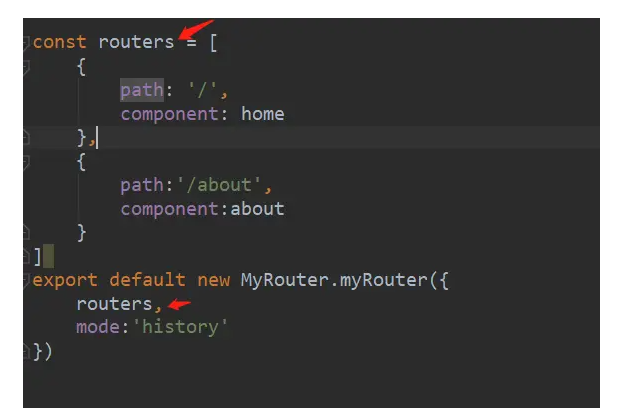

## 前言
>要实现一个```vue-router```，首先就要清楚```vue-router```是一个vue的插件，而vue注册插件是有一套自己的流程的。

## vue.use
首先要认识```vue.use```这个函数。在vue官方插件的使用过程中我们会发现，诸如```vue-router```，```vuex```之类的插件都调用了一次```use```函数。

那```vue.use```到底干了什么事情呢。
先来看看```vue.use```的源码

```js
 Vue.use = function (plugin: Function | Object) {
  // plugin 插件一般来说是一个实例对象
    const installedPlugins = (this._installedPlugins || (this._installedPlugins = [])) // 创建一个数组，用来存储已经安装的插件，避免重复安装
    if (installedPlugins.indexOf(plugin) > -1) { // 此处进行判断，如果已经安装，直接返回
      return this
    }
    // additional parameters
    const args = toArray(arguments, 1)
    args.unshift(this) // 将this也就是Vue添加的数组中的最前边
    if (typeof plugin.install === 'function') { // 执行插件的 install 方法，将Vue拿到插件中
      plugin.install.apply(plugin, args)
    } else if (typeof plugin === 'function') {
      plugin.apply(null, args)
    }
    installedPlugins.push(plugin) // 将安装好的插件放入数组中保存起来
    return this
  }
```

## myRouter
根据上面源码的简单阅读我们可以了解到，这个函数接受一个参数```plugin```，也就是我们传入的```插件```。他的类型是一个```函数```或者一个```对象```。

在第一行里他去获取了```vue```原型对象上的```installedPlugins``` 属性，这个应该就是存储当前vue实例```注册的插件```的```数组```。然后他又判断了一次当前传入的这个插件是否存在于这个数组中，如果存在则直接retuen```（这也就是为什么vue的插件重复注册只生效一次的原因。）```

下面的代码就是去调用这个插件了，如果传入的是一个```函数```，则```直接调用```。如果传入的是```对象```则调用这个```对象的install```方法。最后将插件```push```进数组。

以上就是```vue.use```的源码了。知道了这些我们就可以开始去写我们自己的插件了。

在使用官方提供的```router```插件的过程中我可以知道，```vue-router```这个文件暴露出来的肯定是一个```对象```，所以肯定是有一个```install函数```，以及一个名为```router的构造函数或者类```。

这样我们插件的基本轮廓就出来了

```js
let Vue

class myRouter {
    
}
//vue在调用install的时候会传入一个vue构造函数，方便我们调用vue的各种api
const install = function (_vue) {
      Vue = _vue
}

export default {
    myRouter,
    install
}

```
## 路由表文件
其次创建一个```router.js```存放路由表以及其他一些对插件的操作。
```js
import vue from 'vue'
import MyRouter from '../myRouter'
import home from '../components/home'
import about from '../components/about'

vue.use(MyRouter)

const routers = [
    {
        path: '/',
        component: home
    },
    {
        path:'/about',
        component:about
    }
]
export default new MyRouter.myRouter({
    routers,
})

```
## 引入并挂在router
然后在```main.js```里引入这个```router.js```，将构造出来的```router```对象传入vue的```options```里。

```js
import Vue from 'vue'
import App from './App.vue'
import router from './router/index'

Vue.config.productionTip = false

new Vue({
  router,
  render: h => h(App),
}).$mount('#app')

```
## install

接着去写我们的插件，在使用过程中可以发现，在任何组件中我们都可以通过```$router```这个对象拿到router的内容。这一步肯定是要放到```install```函数里去做的。这一步很简单，直接将构造出来的```router```对象挂载到vue```构造函数```的```原型对象```上就行了。但是有一个问题，我们在插件中如何拿到构建出来的router这个对象呢。

仔细回想一下，官方有提示过，插件的对象必须传入跟实例的配置对象中才能通过this拿到。

```js
new Vue({
  router,//也就是这一步
  render: h => h(App),
}).$mount('#app')
```

知道了这个就可以去找办法了。什么东西能在跟实例初始化的时候被调用呢。

vue提供了一个```api```叫做```mixin```，相信大家都不陌生。```vue.mixin```--全局混入器。这个api会在每个组件初始化的时候都执行一次。那有了它我们就可以轻松的拿到传入的router并且挂载到vue原型对象上了。
```js
const install = function (_vue) {
    Vue = _vue
    /**
     * 将用户传入的router挂载到组件实例上，但是此处我们是拿不到用户传入的router的。
     * 而全局混入器就能帮助我们拿到每个组件实例，因为他会在每个组件实例化的时候被执行。
     * 我们的跟组件同样也会触发mixin，而routers是在跟组建的配置项传入的，所以就可以拿到了。
     */
    Vue.mixin({
        beforeCreate() {
            //可以选择给每个组件都挂载一个，也可以选择直接挂载到vue构造函数的原型对象上

            //这里为挂载到每个组件上
            // if (this.$options && this.$options.router) {
            //     this.$router = this.$options.router
            // } else {
            //     this.$router = this.$parent && this.$parent.$router
            // }
            //这里为挂载到构造函数的原型对象上，$options就是new vuew时传入的对象
            if (this.$options && this.$options.router) {
                Vue.prototype.$router = this.$options.router
            }
        },
    })
}
```
到这一步未知，就已经完成了一个插件的基本内容。
## router-link router-view
接下来继续去分析，```vue-router```的两个关键组件```router-link router-view```。
第一个会被渲染成a标签，点击渲染指定的组件。第二个就是一个视图容器，渲染对应的组件

```js
const install = function (_vue) {
    Vue = _vue
    /**
     * 将用户传入的router挂载到组件实例上，但是此处我们是拿不到用户传入的router的。
     * 而全局混入器就能帮助我们拿到每个组件实例，因为他会在每个组件实例化的时候被执行。
     * 我们的跟组件同样也会触发mixin，而routers是在跟组建的配置项传入的，所以就可以拿到了。
     */
    Vue.mixin({
        beforeCreate() {
            //可以选择给每个组件都挂载一个，也可以选择直接挂载到vue构造函数的原型对象上

            //这里为挂载到每个组件上
            // if (this.$options && this.$options.router) {
            //     this.$router = this.$options.router
            // } else {
            //     this.$router = this.$parent && this.$parent.$router
            // }
            //这里为挂载到构造函数的原型对象上
            if (this.$options && this.$options.router) {
                Vue.prototype.$router = this.$options.router
            }
        },
    })
    // Vue.property.$router = _vue.$options.router

    //注册全局组件 router-link  router-view
    //Vue.component函数创建一个组件，第一个参数为组件名称，第二个参数为组件的配置项。注意render函数必须return。
    Vue.component('router-link', {
        props: {
            to: {
                type: String,
                require: true//表示必传
            }
        },
        render(createElement) {
            /**
             * createElement函数也就是h函数，用于创建dom。第一个参数为创建的dom名称，即标签名
             * 第二个参数为一个配置项
             */
            return createElement('a', {
                attrs: {
                    href:this.to,
                },
            }, this.$slots.default[0].text)
        }
    })
    Vue.component('router-view', {
        render(createElement) {
            return createElement('div',{},'我是router-view')
        }
    })
}
```

这样两个组件就创建好了。

现在我们去实现```myRouter```这个类。

```js
class myRouter {
    constructor(options = {}) {
        // this.current = '/'  //当前路由  ，非响应式
        Vue.util.defineReactive(this, 'current', '/')
        this.routers = options.routers //传入的路由表
        this.query = {}//初始化query参数
        this.params = {}//初始化params参数
        this.mode = options.mode || 'hash' //路由模式
        this.init()//初始化函数
    }

    init() {
        if (this.mode === 'hash') {
            //监听网页初始化，给current附上初值,因为拿到的哈希时带#号的，而用户传入的路由表是不带#号的，所以要去掉#号
            window.addEventListener('load', () => {
                location.hash = '/'
                this.current = location.hash.slice(1)
            })
            //添加哈希路由监听函数
            window.addEventListener('hashchange', () => {
                this.current = location.hash.slice(1)
            })
        } else {
            console.log(123123)
            //网页初始化的时候给current初值为'/'
            window.addEventListener('load', () => {
                this.current = '/'
            })
            //添加history路由的监听函数
            window.addEventListener('popstate', (e) => {
                this.current = location.pathname
            })
        }
    }
    //
    // push(url) {
    //     location.hash = url
    // }
}
```
类里面需要创建一个```current```属性，表示为当前```url```。后续我们就需要通过这个属性去渲染指定的组件。

```mode```表示路由模式，前端的路由模式分为hash和history两种。这个后面再细说。
在```constructor```构造器中可以拿到用户传入的路由表。
也就是这个玩意儿



现在有了当前路由，也有了路由表，是不是就可以在```router-view```里去渲染和当前路由对应的组件了。
所以要改写一下```router-view```组件
```js
    Vue.component('router-view', {
        render(createElement) {
            // current必须是响应式的才会在发生变化的时候触发render函数
            let current = this.$router.current //获取当前路由
            let routers = this.$router.routers
           //拿到当前路由去路由表里查找对应的组件然后渲染
            let component = routers.find(d => d.path === current)
            return createElement(component.component)
        }
    })
```

上面在创建```current```的时候用到了```Vue.util.defineReactive```这个api。因为只有```current```时响应式的才会在他改变的时候去触发```router-view```的```render```函数，去重新渲染视图。

至此我们的```vue-router```基本上就已经做完了，能实现基本的功能了。
init函数就是根据当前路由模式去监听相应的路由事件。在网页初始化的时候给一个默认值。
## 了解前端路由
接下来了解一下前端路由hash模式和history模式的区别。

### hash路由
在浏览器输入一个url的时候会向服务器发送一个http请求，请求新的内容。这样做会有种种弊端。
所以衍生出了前端路由。前端路由就是只js监听当前路由的变化然后去执行某些指定的操作。
而要做到这一点首先必不可少的就是当url发生变化了不能刷新浏览器。hash路由就完美的做到了这一点。

hash路由其实指的就是hash值（#后面的内容）。这一块内容发生变化是不会出发浏览器的更新操作的。通过这一点前端就可以做到修改路由执行js，和服务器无关联了。

hash模式下，需要用到的api有```location.hash，hashchange```。前者是直接修改当前哈希值，也就是我们的url值。后者则是在哈希值发生变化的时候触发

我们通过赋值相应的hash值，就可以做到修改浏览器地址栏的路由，通过将修改过后的值赋给current，就可以触发router-view的render函数，渲染新的组件。这就是vue-router的核心原理。

hash路由非常的好用且易懂，但是有一个缺点，那就是路由上会带#号，这样的路由看上去非常的不美观。所以后来又衍生出了```history```模式。
### history路由
history模式：利用了 HTML5 History Interface 中新增的 ```pushState()``` 和 ```replaceState()``` 方法。（需要特定浏览器支持）
这两个方法应用于浏览器的历史记录栈，在当前已有的 ```back()、forward()、go()``` 方法的基础之上，这两个方法提供了```对历史记录进行修改```的功能。当这两个方法执行修改时，只能改变当前地址栏的 ```URL```，但浏览器```不会```向后端发送请求，也不会触发```popstate```事件的执行

因此可以说，hash 模式和 history 模式都属于浏览器自身的特性，Vue-Router 只是利用了这两个特性（通过调用浏览器提供的接口）来实现前端路由。

通过```pushState```和```replaceState```修改url并不会触发```popstate```监听的执行，同时也不会触发网页的重载。只要做到了这一点我们就可以顺理成章和hash类似的前端路由了。

在使用```hsah```的时候我们可以直接给```location.hash```赋值，但是在```history```模式下我们必须使用```pushState```和```replaceState```来修改当前的```url```。

```pushState（）```方法，接收三个参数

```a state object, a title (which is currentlyignored), and (optionally) a URL```

```state```对象保存的是被```pushState```页面的信息的一个```拷贝```，也就是说以后你要用到的信息，都可以放到这个对象中。

```url```是可选的，负责改变浏览器的地址栏中显示的```url```,如果没有指定```url```，你点击前进后退按钮页面还是会变化，只是浏览器的地址栏上显示的url会一直保持不变。

```replaceState（）```方法，与```pushState```方法相同，主要用于改变当前```历史记录```中记录的当前页面的```state对象```和```url信息```。

```onpopstate```事件,每次点击浏览器的前进和后退按钮，就会触发```window```的```Onpopstate事件```。

最后使用```history.state````获取当前所在页面的```state```对象，也就是在上面```pushState```中保存的。

```pushState、replaceState``` 的区别
```pushState()```可以创建历史，可以配合```popstate事件```，而```replaceState()```则是替换掉当前的```URL```，不会产生历史。
### router-link
由此我们的```router-link```就不能像上面那样写了，为了兼容两种模式，我们得组织a标签的自动跳转，从而自己去修改url的值。
```js
Vue.component('router-link', {
        data() {
            return {
                name: 'router-link'
            }
        },
        props: {
            to: {
                type: String,
                require: true//表示必传
            }
        },
        methods:{
          pushUrl(e){
              if (this.$router.mode == 'hash') {
                  location.hash = this.to
              } else {
                  history.pushState(null, '', this.to)
                  this.$router.current = this.to
              }
              e.preventDefault()
          }
        },
        render(createElement) {
            /**
             * createElement函数也就是h函数，用于创建dom。第一个参数为创建的dom名称，即标签名
             * 第二个参数为一个配置项
             */
            return createElement('a', {
                attrs: {
                    href:this.to,
                },
                on:{
                    click:this.pushUrl
                }
            }, this.$slots.default[0].text)
        }
    })

```
如果为```hash模式```，直接给```location.hash赋值```，这样就会触发```hashchange函数```，从而给```current赋值```，这样就即修改了url又重新```渲染```了视图。

如果为```history模式```，则需要通过```history.pushState```函数```添加```一个```路由历史```，并且手动将```current``` 的值```修改```。因为```pushState```是```不会```触发```popstate```的监听的。只有浏览器的```前进后退```才```会```触发。我们添加了历史之后同时也兼容了浏览器的前进后退动作。因为我们将所到之处的路由都添加进了路由栈里。

## 总结
最后总结一下：

vue-router的实现是利用了浏览器的```hash```和```history```两种路由模式。
hash就是url#号后面的值，通过```location.hash```可以直接修改，通过```hashchange```方法可以监听到他的变化。
history模式下路由是正常的路由不带#号，他提供了```pushState```和```replaceState```两个api去修改url的值并且不会触发```网页重载```，不会向服务器发送请求。但是这两个方法不会触发```popstate```函数。而浏览器的前进后退可以触发。所以这种模式有一个弊端，刷新网页之后，浏览器会像服务器请求资源，而我们push进去的路由是由前端自定义的，可能在服务器上并不存在这个资源目录。所以会出现```404```。这个时候就需要后端通过```nginx配置```重定向到首页了。

vue-router就是通过监听路由的变化，然后拿到当前路由值去路由表里找到对应的组件最后渲染到router-view中。
最后附上完整的自己写的vue-router源码

```js
let Vue

class myRouter {
    constructor(options = {}) {
        // this.current = '/'  //当前路由  ，非响应式
        Vue.util.defineReactive(this, 'current', '/')
        this.routers = options.routers //传入的路由表
        this.query = {}//初始化query参数
        this.params = {}//初始化params参数
        this.mode = options.mode || 'hash' //路由模式
        this.init()//初始化函数
    }

    init() {
        if (this.mode === 'hash') {
            //监听网页初始化，给current附上初值,因为拿到的哈希时带#号的，而用户传入的路由表是不带#号的，所以要去掉#号
            window.addEventListener('load', () => {
                location.hash = '/'
                this.current = location.hash.slice(1)
            })
            //添加哈希路由监听函数
            window.addEventListener('hashchange', () => {
                this.current = location.hash.slice(1)
            })
        } else {
            console.log(123123)
            //网页初始化的时候给current初值为'/'
            window.addEventListener('load', () => {
                this.current = '/'
            })
            //添加history路由的监听函数
            window.addEventListener('popstate', (e) => {
                this.current = location.pathname
            })
        }
    }
    //
    // push(url) {
    //     location.hash = url
    // }
}

const install = function (_vue) {
    Vue = _vue
    /**
     * 将用户传入的router挂载到组件实例上，但是此处我们是拿不到用户传入的router的。
     * 而全局混入器就能帮助我们拿到每个组件实例，因为他会在每个组件实例化的时候被执行。
     * 我们的跟组件同样也会触发mixin，而routers是在跟组建的配置项传入的，所以就可以拿到了。
     */
    Vue.mixin({
        beforeCreate() {
            //可以选择给每个组件都挂载一个，也可以选择直接挂载到vue构造函数的原型对象上

            //这里为挂载到每个组件上
            // if (this.$options && this.$options.router) {
            //     this.$router = this.$options.router
            // } else {
            //     this.$router = this.$parent && this.$parent.$router
            // }

            //这里为挂载到构造函数的原型对象上
            if (this.$options && this.$options.router) {
                Vue.prototype.$router = this.$options.router
            }
        },
    })
    // Vue.property.$router = _vue.$options.router

    //注册全局组件 router-link  router-view
    //Vue.component函数创建一个组件，第一个参数为组件名称，第二个参数为组件的配置项。注意render函数必须return。
    Vue.component('router-link', {
        data() {
            return {
                name: 'router-link'
            }
        },
        props: {
            to: {
                type: String,
                require: true//表示必传
            }
        },
        methods:{
          pushUrl(e){
              if (this.$router.mode == 'hash') {
                  location.hash = this.to
              } else {
                  history.pushState(null, '', this.to)
                  this.$router.current = this.to
              }
              e.preventDefault()
          }
        },
        render(createElement) {
            /**
             * createElement函数也就是h函数，用于创建dom。第一个参数为创建的dom名称，即标签名
             * 第二个参数为一个配置项
             */
            return createElement('a', {
                attrs: {
                    href:this.to,
                },
                on:{
                    click:this.pushUrl
                }
            }, this.$slots.default[0].text)
        }
    })
    Vue.component('router-view', {
        render(createElement) {
            // current必须是响应式的才会在发生变化的时候触发render函数
            let current = this.$router.current //获取当前路由
            let routers = this.$router.routers
            let component = routers.find(d => d.path === current)
            return createElement(component.component)
        }
    })
}

export default {
    myRouter,
    install
}

```
