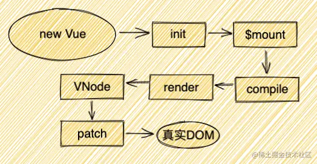

  ##keep-alive
>keep-alive是vue提供的一个缓存组件的组件，他可以使被缓存的组件不被卸载，而是保存在内存中，下次渲染直接从缓存中读取这个组件，在实际工作中可是一把利器。

##如何使用
```keep-alive```本质上是```vue```提供的一个组件，在使用上，只需要将被缓存的组件使用```keep-alive```包裹起来即可，同时```keep-alive```接收```三个props```
，分别是
- ```include```：可传字符串、正则表达式、数组，名称匹配成功的组件会被缓存
- ```exclude```：可传字符串、正则表达式、数组，名称匹配成功的组件不会被缓存
- ```max```：可传数字，限制缓存组件的最大数量
```js
// 动态组件
<keep-alive :include="allowList" :exclude="noAllowList" :max="amount"> 
    <component :is="currentComponent"></component> 
</keep-alive>

// 路由组件
<keep-alive :include="allowList" :exclude="noAllowList" :max="amount">
    <router-view></router-view>
</keep-alive>
```
## 源码
下面就一起从源码层面来深入学习一下```keep-alive```
### 组件基础部分
```js
// src/core/components/keep-alive.js

export default {
  name: 'keep-alive',
  abstract: true, // 判断此组件是否需要在渲染成真实DOM
  props: {
    include: patternTypes,
    exclude: patternTypes,
    max: [String, Number]
  },
  created() {
    this.cache = Object.create(null) // 创建对象来存储  缓存虚拟dom
    this.keys = [] // 创建数组来存储  缓存key
  },
  mounted() {
    // 实时监听include、exclude的变动
    this.$watch('include', val => {
      pruneCache(this, name => matches(val, name))
    })
    this.$watch('exclude', val => {
      pruneCache(this, name => !matches(val, name))
    })
  },
  destroyed() {
    for (const key in this.cache) { // 删除所有的缓存
      pruneCacheEntry(this.cache, key, this.keys)
    }
  },
  render() {
      // 下面讲
  }
}
```
### pruneCacheEntry
在组件的```destroyed```声明周期里可以看到，他遍历了```cache```，并逐一执行```pruneCacheEntry```函数，让我们来看看```pruneCacheEntry```函数里都做了些啥吧
```js
// src/core/components/keep-alive.js

function pruneCacheEntry (
  cache: VNodeCache,
  key: string,
  keys: Array<string>,
  current?: VNode
) {
  const cached = cache[key]
  if (cached && (!current || cached.tag !== current.tag)) {
    cached.componentInstance.$destroy() // 执行组件的destory钩子函数
  }
  cache[key] = null  // 设为null
  remove(keys, key) // 删除对应的元素
}
```
总结一下，主要干了以下几件事儿
- 执行每个组件的`````$destroy```声明周期
- 清空```cache```中对应的组件，并删除```kes```中对应的```key```

### render
下面来重点解析一下```render```函数，首先上源码
```js
// src/core/components/keep-alive.js

render() {
  const slot = this.$slots.default
  const vnode: VNode = getFirstComponentChild(slot) // 找到第一个子组件对象
  const componentOptions: ?VNodeComponentOptions = vnode && vnode.componentOptions
  if (componentOptions) { // 存在组件参数
    // check pattern
    const name: ?string = getComponentName(componentOptions) // 组件名
    const { include, exclude } = this
    if ( // 条件匹配
      // not included
      (include && (!name || !matches(include, name))) ||
      // excluded
      (exclude && name && matches(exclude, name))
    ) {
      return vnode
    }

    const { cache, keys } = this
    const key: ?string = vnode.key == null // 定义组件的缓存key
      // same constructor may get registered as different local components
      // so cid alone is not enough (#3269)
      ? componentOptions.Ctor.cid + (componentOptions.tag ? `::${componentOptions.tag}` : '')
      : vnode.key
    if (cache[key]) { // 已经缓存过该组件
      vnode.componentInstance = cache[key].componentInstance
      // make current key freshest
      remove(keys, key)
      keys.push(key) // 调整key排序
    } else {
      cache[key] = vnode // 缓存组件对象
      keys.push(key)
      // prune oldest entry
      if (this.max && keys.length > parseInt(this.max)) { // 超过缓存数限制，将第一个删除
        pruneCacheEntry(cache, keys[0], keys, this._vnode)
      }
    }

    vnode.data.keepAlive = true // 渲染和执行被包裹组件的钩子函数需要用到
  }
  return vnode || (slot && slot[0])
}
```
分析：
- 首先获取```默认插槽```中的内容以及第一个子组件的```vnode```
- 如果组件的配置项存在的话，则开始判断```include```和```exclude```存在与否以及子组件的名称是否在名单中，如果不存在则直接返回子组件的```vnode```，```不做缓存```处理
- 如果子组件```需要缓存```的话则开始进行缓存操作，生成组件```专属的key```，并判断是否已经```缓存过```该组件，如果缓存过则直接从缓存里取，并且调整组件在缓存中的顺序，将组件放置最后，也就是```LRU算法（缓存淘汰策略）```,
- 如果组件```没被缓存```过，则将他```进行缓存```，并且对```max```进行判断，```超出数量```则```删除```第一个被缓存的组件。
- 最后将组件的```KeepAlive```属性设置为```true```

### 渲染
先来大致解读一下一个vue组件的渲染
- ```render```函数会讲编译好的组件转成```vnode```
- ```patch```会根据拿到的```vnode```开始生成```真实dom```，而第二次```patch```则会用```新旧vnode```进行比对，```diff算法```也就是在这个时候触发的


### keep-alive自身渲染
在上文```keep-alive```的组件源码中有一个```abstract```属性，这个属性就是```vue```中区分```抽象组件```和```真实组件```的关键点，如果他的值为```true```，则表示这是一个```抽象组件```，```vue```则不会将他渲染成```真实dom```，并且组件的```实例链```上也不会出现这个抽象组件
```js
// src/core/instance/lifecycle.js

export function initLifecycle (vm: Component) {
  const options = vm.$options
  // 找到第一个非abstract的父组件实例
  let parent = options.parent
  if (parent && !options.abstract) {
    while (parent.$options.abstract && parent.$parent) {
      parent = parent.$parent
    }
    parent.$children.push(vm)
  }
  vm.$parent = parent
  // ...
}
```
### 包裹组件渲染
咱们再来说说被```keep-alive```包裹着的组件是如何使用缓存的吧。刚刚说了```VNode -> 真实DOM```是发生在```patch```的阶段，而其实这也是要细分的：```VNode -> 实例化 -> _update -> 真实DOM```，而组件使用缓存的判断就发生在实例化这个阶段，而这个阶段调用的是```createComponent```函数，那我们就来说说这个函数吧：
```js
// src/core/vdom/patch.js

function createComponent (vnode, insertedVnodeQueue, parentElm, refElm) {
  let i = vnode.data
  if (isDef(i)) {
    const isReactivated = isDef(vnode.componentInstance) && i.keepAlive
    if (isDef(i = i.hook) && isDef(i = i.init)) {
      i(vnode, false /* hydrating */)
    }

    if (isDef(vnode.componentInstance)) {
      initComponent(vnode, insertedVnodeQueue)
      insert(parentElm, vnode.elm, refElm) // 将缓存的DOM（vnode.elm）插入父元素中
      if (isTrue(isReactivated)) {
        reactivateComponent(vnode, insertedVnodeQueue, parentElm, refElm)
      }
      return true
    }
  }
}
```
- 在第一次加载被包裹组件时，因为```keep-alive```的```render```先于包裹组件加载之前执行，所以此时```vnode.componentInstance```的值是```undefined```，而```keepAlive```是```true```，则代码走到```i(vnode, false /* hydrating */)```就不往下走了

- 再次访问包裹组件时，```vnode.componentInstance```的值就是已经缓存的组件实例，那么会执行```insert(parentElm, vnode.elm, refElm)```逻辑，这样就直接把上一次的```DOM```插入到了```父元素```中。

## 总结
- ```keep-alive```组件用于缓存组件
- ```keep-alive```不会渲染成```真实dom```，并且被包裹的组件通过```$parent```也无法访问到```keep-alive```
- ```keep-alive```内部维护了一个```cache```对象用于保存被缓存的组件的实例，同时也维护了一个```keys```数组保存被缓存的组件的```key```。并且通过```LRU（缓存淘汰策略）```算法对缓存组件进行更新
- ```keep-alive```在```卸载的钩子```里会去```遍历cache```中的组件，逐一进行```卸载```
- ```LRU```算法会把最新被访问到的数据```提到数组尾部```，数组中的顺序始终保持为```最老```的数据在```头部```，```最新```被访问的数据在```尾部```。
