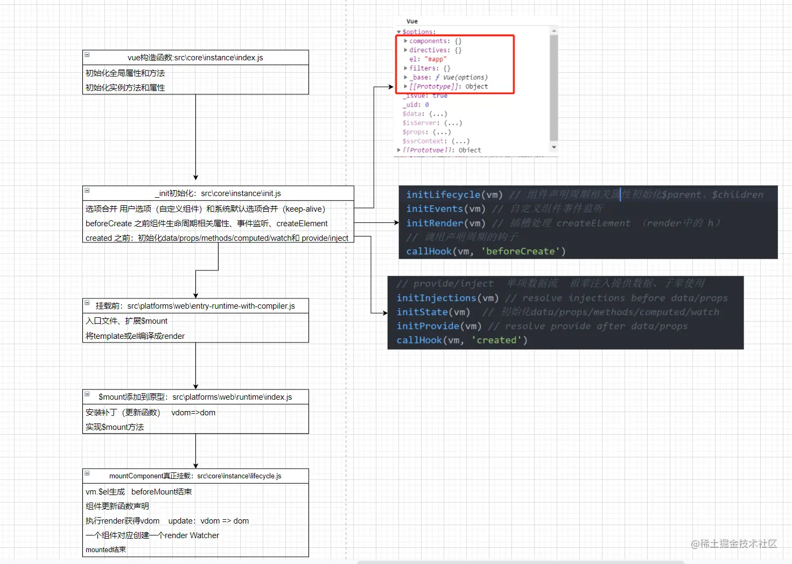

整体的工作流程如下  

## 总结
首先vue会合并用户传入的options，合并完毕之后就会开始进行一些列的初始化操作
```js
initLifecycle(vm) // 组件声明周期相关属性初始化$parent、$children
initEvents(vm) // 自定义组件事件监听
initRender(vm) // 插槽处理 createElement （render中的 h）
// 调用声明周期的钩子
callHook(vm, 'beforeCreate')
// provide/inject  单项数据流  祖辈注入提供数据、子辈使用
initInjections(vm) // resolve injections before data/props
initState(vm)  // 初始化data/props/methods/computed/watch
initProvide(vm) // resolve provide after data/props
callHook(vm, 'created')
```
合并完options之后会去创建组件的生命周期，监听组件的事件，处理插槽。随后调用beforeCreate钩子，接下来就是处理data props之类的数据了。处理完之后调用create钩子。这也就是为什么在create钩子里我们就可访问到data和props里的东西，因为他们的初始化在create之前进行

当执行了created之后就要开始进行render操作了，这个时候就会去获取template，生成render函数，在调用render函数获取到VNode，VNode在经理patch阶段转成真实dom，然后进行watcher的创建，最后完成挂载。


