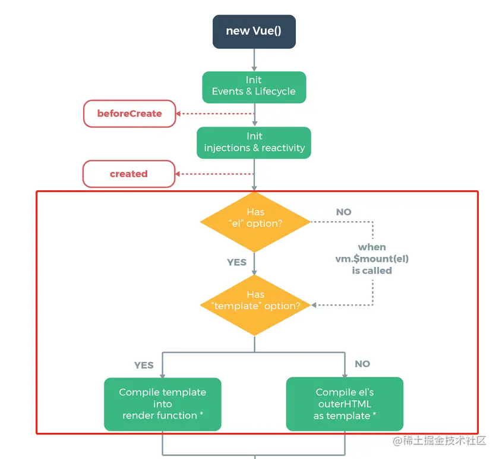
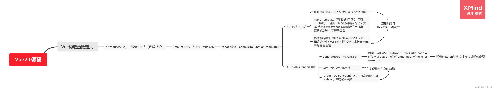

## 前言
>模板编译是vue中一个非常重要的概念，我们再template中写的html代码以及一些指令，渲染state，都是通过模板编译才变成浏览器能识别的东西的。这里头主要涉及到ast树以及大量的正则匹配



通过官网提供的生命周期流程图我们可以了解到，我们传入的```el```以及```template```最终都会被解析成```render```函数，同时也可以发现，当new一个vue实例的时候同时存在```el```属性和```$mount```函数的话，```el```属性的优先级是```高于$mount```的，并且同时存在```render```和```template```的时候```render```的优先级也是```高于template```的

下面开始进入正文
## 模板编译入口
```js
// src/init.js

import { initState } from "./state";
import { compileToFunctions } from "./compiler/index";
export function initMixin(Vue) {
  Vue.prototype._init = function (options) {
    const vm = this;
    // 这里的this代表调用_init方法的对象(实例对象)
    //  this.$options就是用户new Vue的时候传入的属性
    vm.$options = options;
    // 初始化状态
    initState(vm);

    // 如果有el属性 进行模板渲染
    if (vm.$options.el) {
      vm.$mount(vm.$options.el);
    }
  };

  // 这块代码在源码里面的位置其实是放在entry-runtime-with-compiler.js里面
  // 代表的是Vue源码里面包含了compile编译功能 这个和runtime-only版本需要区分开
  Vue.prototype.$mount = function (el) {
    const vm = this;
    const options = vm.$options;
    el = document.querySelector(el);

    // 如果不存在render属性
    if (!options.render) {
      // 如果存在template属性
      let template = options.template;

      if (!template && el) {
        // 如果不存在render和template 但是存在el属性 直接将模板赋值到el所在的外层html结构（就是el本身 并不是父元素）
        template = el.outerHTML;
      }

      // 最终需要把tempalte模板转化成render函数
      if (template) {
        const render = compileToFunctions(template);
        options.render = render;
      }
    }
  };
}
```
```init```函数主要是对一些传入的```配置项```做判断，然后去```初始化状态```，在```$mount```里对```template```进行一个解析，模板编译的核心就发生在```compileToFunctions```函数中

```js
// src/compiler/index.js

import { parse } from "./parse";
import { generate } from "./codegen";
export function compileToFunctions(template) {
  // 我们需要把html字符串变成render函数
  // 1.把html代码转成ast语法树  ast用来描述代码本身形成树结构 不仅可以描述html 也能描述css以及js语法
  // 很多库都运用到了ast 比如 webpack babel eslint等等
  let ast = parse(template);
  // 2.优化静态节点
  // 这个有兴趣的可以去看源码  不影响核心功能就不实现了
  //   if (options.optimize !== false) {
  //     optimize(ast, options);
  //   }

  // 3.通过ast 重新生成代码
  // 我们最后生成的代码需要和render函数一样
  // 类似_c('div',{id:"app"},_c('div',undefined,_v("hello"+_s(name)),_c('span',undefined,_v("world"))))
  // _c代表创建元素 _v代表创建文本 _s代表文Json.stringify--把对象解析成文本
  let code = generate(ast);
  //   使用with语法改变作用域为this  之后调用render函数可以使用call改变this 方便code里面的变量取值
  let renderFn = new Function(`with(this){return ${code}}`);
  return renderFn;
}
```
可以看到模板编译主要是经历了三个阶段
- 生成ast树——```parse```
- 静态节点优化——```optimize```
- 通过ast树生成render所需要的格式的代码——```generate```

下面来逐一解析一下这三个步骤
## 1.生成ast树
```js
// src/compiler/parse.js

// 以下为源码的正则  对正则表达式不清楚的同学可以参考小编之前写的文章(前端进阶高薪必看 - 正则篇);
const ncname = `[a-zA-Z_][\\-\\.0-9_a-zA-Z]*`; //匹配标签名 形如 abc-123
const qnameCapture = `((?:${ncname}\\:)?${ncname})`; //匹配特殊标签 形如 abc:234 前面的abc:可有可无
const startTagOpen = new RegExp(`^<${qnameCapture}`); // 匹配标签开始 形如 <abc-123 捕获里面的标签名
const startTagClose = /^\s*(\/?)>/; // 匹配标签结束  >
const endTag = new RegExp(`^<\\/${qnameCapture}[^>]*>`); // 匹配标签结尾 如 </abc-123> 捕获里面的标签名
const attribute = /^\s*([^\s"'<>\/=]+)(?:\s*(=)\s*(?:"([^"]*)"+|'([^']*)'+|([^\s"'=<>`]+)))?/; // 匹配属性  形如 id="app"

let root, currentParent; //代表根节点 和当前父节点
// 栈结构 来表示开始和结束标签
let stack = [];
// 标识元素和文本type
const ELEMENT_TYPE = 1;
const TEXT_TYPE = 3;
// 生成ast方法
function createASTElement(tagName, attrs) {
  return {
    tag: tagName,
    type: ELEMENT_TYPE,
    children: [],
    attrs,
    parent: null,
  };
}

// 对开始标签进行处理
function handleStartTag({ tagName, attrs }) {
  let element = createASTElement(tagName, attrs);
  if (!root) {
    root = element;
  }
  currentParent = element;
  stack.push(element);
}

// 对结束标签进行处理
function handleEndTag(tagName) {
  // 栈结构 []
  // 比如 <div><span></span></div> 当遇到第一个结束标签</span>时 会匹配到栈顶<span>元素对应的ast 并取出来
  let element = stack.pop();
  // 当前父元素就是栈顶的上一个元素 在这里就类似div
  currentParent = stack[stack.length - 1];
  // 建立parent和children关系
  if (currentParent) {
    element.parent = currentParent;
    currentParent.children.push(element);
  }
}

// 对文本进行处理
function handleChars(text) {
  // 去掉空格
  text = text.replace(/\s/g, "");
  if (text) {
    currentParent.children.push({
      type: TEXT_TYPE,
      text,
    });
  }
}

// 解析标签生成ast核心
export function parse(html) {
  while (html) {
    // 查找<
    let textEnd = html.indexOf("<");
    // 如果<在第一个 那么证明接下来就是一个标签 不管是开始还是结束标签
    if (textEnd === 0) {
      // 如果开始标签解析有结果
      const startTagMatch = parseStartTag();
      if (startTagMatch) {
        // 把解析好的标签名和属性解析生成ast
        handleStartTag(startTagMatch);
        continue;
      }

      // 匹配结束标签</
      const endTagMatch = html.match(endTag);
      if (endTagMatch) {
        advance(endTagMatch[0].length);
        handleEndTag(endTagMatch[1]);
        continue;
      }
    }

    let text;
    // 形如 hello<div></div>
    if (textEnd >= 0) {
      // 获取文本
      text = html.substring(0, textEnd);
    }
    if (text) {
      advance(text.length);
      handleChars(text);
    }
  }

  // 匹配开始标签
  function parseStartTag() {
    const start = html.match(startTagOpen);

    if (start) {
      const match = {
        tagName: start[1],
        attrs: [],
      };
      //匹配到了开始标签 就截取掉
      advance(start[0].length);

      // 开始匹配属性
      // end代表结束符号>  如果不是匹配到了结束标签
      // attr 表示匹配的属性
      let end, attr;
      while (
        !(end = html.match(startTagClose)) &&
        (attr = html.match(attribute))
      ) {
        advance(attr[0].length);
        attr = {
          name: attr[1],
          value: attr[3] || attr[4] || attr[5], //这里是因为正则捕获支持双引号 单引号 和无引号的属性值
        };
        match.attrs.push(attr);
      }
      if (end) {
        //   代表一个标签匹配到结束的>了 代表开始标签解析完毕
        advance(1);
        return match;
      }
    }
  }
  //截取html字符串 每次匹配到了就往前继续匹配
  function advance(n) {
    html = html.substring(n);
  }
  //   返回生成的ast
  return root;
}
```
这一阶段主要就是通过大量的```正则```去不断的截取```开始标签```和```结束标签```最终生成一颗能完整描述```html```片段的ast树

## 2.静态节点优化
>静态节点一旦首次渲染上了之后不管状态再怎么变化它都不会变了

```js
function isStatic (node: ASTNode): boolean {
  if (node.type === 2) { // 包含变量的动态文本节点
    return false
  }
  if (node.type === 3) { // 不包含变量的纯文本节点
    return true
  }
  return !!(node.pre || (
    !node.hasBindings && // no dynamic bindings
    !node.if && !node.for && // not v-if or v-for or v-else
    !isBuiltInTag(node.tag) && // not a built-in
    isPlatformReservedTag(node.tag) && // not a component
    !isDirectChildOfTemplateFor(node) &&
    Object.keys(node).every(isStaticKey)
  ))
}
```
什么属于静态节点
- 节点使用了```v-pre```指令 v-pre：跳过这个元素及其子元素的编译过程。可以用来显示原始标签。会加快编译
- 不能使用```动态绑定语法```，即标签上不能有```v-、@、```:开头的属性
- 不能使用```v-if、v-else、v-for```指令；
- 不能是内置组件，即标签名不能是```slot```和```component```；
- 标签名必须是平台```保留标签```，即```不能是组件```；
- 当前节点的父节点不能是带有````` v-for````` 的 ```template ```标签；
- 节点的所有属性的````` key````` 都必须是```静态节点```才有的 key，注：静态节点的key是有限的，它只能是```type,tag,attrsList,attrsMap,plain,parent,children,attrs```之一；

静态节点必须是父子均为静态节点，如果给父节点标记为静态而子节点是非静态的那父节点也会被标记成非静态

## 3.根据ast重新生成code
```js
// src/compiler/codegen.js

const defaultTagRE = /\{\{((?:.|\r?\n)+?)\}\}/g; //匹配花括号 {{  }} 捕获花括号里面的内容

function gen(node) {
  // 判断节点类型
  // 主要包含处理文本核心
  // 源码这块包含了复杂的处理  比如 v-once v-for v-if 自定义指令 slot等等  咱们这里只考虑普通文本和变量表达式{{}}的处理

  // 如果是元素类型
  if (node.type == 1) {
    //   递归创建
    return generate(node);
  } else {
    //   如果是文本节点
    let text = node.text;
    // 不存在花括号变量表达式
    if (!defaultTagRE.test(text)) {
      return `_v(${JSON.stringify(text)})`;
    }
    // 正则是全局模式 每次需要重置正则的lastIndex属性  不然会引发匹配bug
    let lastIndex = (defaultTagRE.lastIndex = 0);
    let tokens = [];
    let match, index;

    while ((match = defaultTagRE.exec(text))) {
      // index代表匹配到的位置
      index = match.index;
      if (index > lastIndex) {
        //   匹配到的{{位置  在tokens里面放入普通文本
        tokens.push(JSON.stringify(text.slice(lastIndex, index)));
      }
      //   放入捕获到的变量内容
      tokens.push(`_s(${match[1].trim()})`);
      //   匹配指针后移
      lastIndex = index + match[0].length;
    }
    // 如果匹配完了花括号  text里面还有剩余的普通文本 那么继续push
    if (lastIndex < text.length) {
      tokens.push(JSON.stringify(text.slice(lastIndex)));
    }
    // _v表示创建文本
    return `_v(${tokens.join("+")})`;
  }
}

// 处理attrs属性
function genProps(attrs) {
  let str = "";
  for (let i = 0; i < attrs.length; i++) {
    let attr = attrs[i];
    // 对attrs属性里面的style做特殊处理
    if (attr.name === "style") {
      let obj = {};
      attr.value.split(";").forEach((item) => {
        let [key, value] = item.split(":");
        obj[key] = value;
      });
      attr.value = obj;
    }
    str += `${attr.name}:${JSON.stringify(attr.value)},`;
  }
  return `{${str.slice(0, -1)}}`;
}

// 生成子节点 调用gen函数进行递归创建
function getChildren(el) {
  const children = el.children;
  if (children) {
    return `${children.map((c) => gen(c)).join(",")}`;
  }
}
// 递归创建生成code
export function generate(el) {
  let children = getChildren(el);
  let code = `_c('${el.tag}',${
    el.attrs.length ? `${genProps(el.attrs)}` : "undefined"
  }${children ? `,${children}` : ""})`;
  return code;
}
```
这一步就是根据```ast树```去生成一个```render```所需格式的```code```了
类似于```_c('div',{id:"app"},_c('div',undefined,_v("hello"+_s(name)),_c('span',undefined,_v("world"))))```这样的字符串

## 思维导图


## 总结
>模板编译其实就是将```template```或者```render```中的```html```转译成可以正常运行的```html```代码，他总共会经历```三个阶段```，根据```template生成ast树```、
>```静态节点优化```、```根据ast生成render函数所需的code码（也是在这一阶段去对指令进行解析的）```。在生成```ast树```的阶段会采用大量的```正则```去```匹配标签```，```建立父子关系```，组合成一个可以描述
> ```html```片段的```ast```树，```静态节点优化```阶段则是会对一些无指令```无其他任何属性```的```dom```进行一个标记，被标记为```静态节点```的dom只会被渲染```一次```，可以做到很大的程度的```性能优化```。最终根据```ast```生成的```code```会对```attrs```和```指令```以及```渲染变量```符号做处理。所有的都处理完之后会交由```render```进行渲染。
