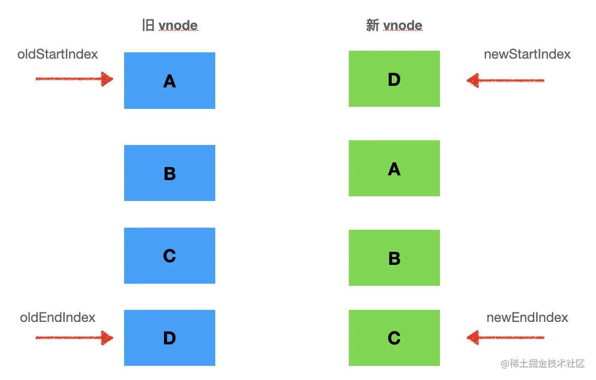

## 前言
>vue中diff算法是性能优化的一个重要的环节，在视图变更后vue会用新老两颗vnode树进行比对，做最大程度上的复用。而这一比对过程的核心就是diff算法，diff算法会根据dom位置进行最大程度的复用以及最小程度的移动，下面就一起来看看他到底是怎么实现的吧

## 双端diff
vue2采用的是双端diff算法，所谓的双端diff算法就是准备4个指针，分别只想新旧两个vnode数组的首尾，像下面这样

头尾指针像中间移动，直到oldStartIdx <= oldEndIdx并且newStartIdx <= newEndIdx，说明已经遍历完整个数组。
每次遍历的过程中都会去比对头头 尾尾 头尾 尾头，也就是下面这样
```js
while (oldStartIdx <= oldEndIdx && newStartIdx <= newEndIdx) {
  if (oldStartVNode.key === newStartVNode.key) { // 头头
    patch(oldStartVNode, newStartVNode, container)
    oldStartVNode = oldChildren[++oldStartIdx]
    newStartVNode = newChildren[++newStartIdx]
  } else if (oldEndVNode.key === newEndVNode.key) {//尾尾
    patch(oldEndVNode, newEndVNode, container)
    oldEndVNode = oldChildren[--oldEndIdx]
    newEndVNode = newChildren[--newEndIdx]
  } else if (oldStartVNode.key === newEndVNode.key) {//头尾，需要移动
    patch(oldStartVNode, newEndVNode, container)
    insert(oldStartVNode.el, container, oldEndVNode.el.nextSibling)

    oldStartVNode = oldChildren[++oldStartIdx]
    newEndVNode = newChildren[--newEndIdx]
  } else if (oldEndVNode.key === newStartVNode.key) {//尾头，需要移动
    patch(oldEndVNode, newStartVNode, container)
    insert(oldEndVNode.el, container, oldStartVNode.el)

    oldEndVNode = oldChildren[--oldEndIdx]
    newStartVNode = newChildren[++newStartIdx]
  } else {
    
    // 头尾没有找到可复用的节点
  }
}
```
头头尾尾的比对如果相同则直接复用，指针相应的移动一位，而比对头尾或者尾头的话如果相同就需要移动元素了。如果头尾相同则会把旧vnode的头结点移动到尾节点的位置，像这样
```js
insert(oldStartVNode.el, container, oldEndVNode.el.nextSibling)
```
如果旧节点的尾和新节点的头相同则需要把旧节点的尾移动到头的位置，最大程度上保持两棵树的相同节点在同一位置。这样方便复用这些节点

那如果以上四种情况都不满足的话，则会遍历整个旧vnode树查找是否存在当前遍历到的新节点的元素，如果存在则将其移动到当前新节点对应的位置，然后再旧vnode树里填上一个undefined，保持数组长度不变防止index错乱。
```js
const idxInOld = oldChildren.findIndex(
  node => node.key === newStartVNode.key
)
if (idxInOld > 0) {
  const vnodeToMove = oldChildren[idxInOld]
  patch(vnodeToMove, newStartVNode, container)
  insert(vnodeToMove.el, container, oldStartVNode.el)
  oldChildren[idxInOld] = undefined
} else {
  patch(null, newStartVNode, container, oldStartVNode.el)
}
```
因为会存在空节点的情况，所以需要多一个判断
```js
if (!oldStartVNode) {
    oldStartVNode = oldChildren[++oldStartIdx]
} else if (!oldEndVNode) {
    oldEndVNode = newChildren[--oldEndIdx]
}
```
因为前面一个循环的判断条件是 oldStartIdx <= oldEndIdx && newStartIdx <= newEndIdx，这样如果 old vnode 多了，最后 newStartIdx 会小于 newEndIdx。如果 new vnode 多了，最后 oldStartIdx 会小于 oldEndIdx。
```js
if (oldEndIdx < oldStartIdx && newStartIdx <= newEndIdx) {
  // 添加新节点
  for (let i = newStartIdx; i <= newEndIdx; i++) {
    patch(null, newChildren[i], container, oldStartVNode.el)
  }
} else if (newEndIdx < newStartIdx && oldStartIdx <= oldEndIdx) {
  // 移除操作
  for (let i = oldStartIdx; i <= oldEndIdx; i++) {
    unmount(oldChildren[i])
  }
}
```
这样就是一个完整diff算法了，采用双端diff算法可以最大程度的复用节点和节约移动节点的次数。比如ABCD和DABC这样，采用双端只需要移动一个D节点就可以完成两棵树的比对。

## 小结
**双端 diff 是头尾指针向中间移动的同时，对比头头、尾尾、头尾、尾头是否可以复用，如果可以的话就移动对应的 dom 节点。
如果头尾没找到可复用节点就遍历 vnode 数组来查找，然后移动对应下标的节点到头部。
最后还剩下旧的 vnode 就批量删除，剩下新的 vnode 就批量新增。**

完整的代码
```js
// src/vdom/patch.js

// 判断两个vnode的标签和key是否相同 如果相同 就可以认为是同一节点就地复用
function isSameVnode(oldVnode, newVnode) {
  return oldVnode.tag === newVnode.tag && oldVnode.key === newVnode.key;
}
// diff算法核心 采用双指针的方式 对比新老vnode的儿子节点
function updateChildren(parent, oldCh, newCh) {
  let oldStartIndex = 0; //老儿子的起始下标
  let oldStartVnode = oldCh[0]; //老儿子的第一个节点
  let oldEndIndex = oldCh.length - 1; //老儿子的结束下标
  let oldEndVnode = oldCh[oldEndIndex]; //老儿子的起结束节点

  let newStartIndex = 0; //同上  新儿子的
  let newStartVnode = newCh[0];
  let newEndIndex = newCh.length - 1;
  let newEndVnode = newCh[newEndIndex];

  // 根据key来创建老的儿子的index映射表  类似 {'a':0,'b':1} 代表key为'a'的节点在第一个位置 key为'b'的节点在第二个位置
  function makeIndexByKey(children) {
    let map = {};
    children.forEach((item, index) => {
      map[item.key] = index;
    });
    return map;
  }
  // 生成的映射表
  let map = makeIndexByKey(oldCh);

  // 只有当新老儿子的双指标的起始位置不大于结束位置的时候  才能循环 一方停止了就需要结束循环
  while (oldStartIndex <= oldEndIndex && newStartIndex <= newEndIndex) {
    // 因为暴力对比过程把移动的vnode置为 undefined 如果不存在vnode节点 直接跳过
    if (!oldStartVnode) {
      oldStartVnode = oldCh[++oldStartIndex];
    } else if (!oldEndVnode) {
      oldEndVnode = oldCh[--oldEndIndex];
    } else if (isSameVnode(oldStartVnode, newStartVnode)) {
      // 头和头对比 依次向后追加
      patch(oldStartVnode, newStartVnode); //递归比较儿子以及他们的子节点
      oldStartVnode = oldCh[++oldStartIndex];
      newStartVnode = newCh[++newStartIndex];
    } else if (isSameVnode(oldEndVnode, newEndVnode)) {
      //尾和尾对比 依次向前追加
      patch(oldEndVnode, newEndVnode);
      oldEndVnode = oldCh[--oldEndIndex];
      newEndVnode = newCh[--newEndIndex];
    } else if (isSameVnode(oldStartVnode, newEndVnode)) {
      // 老的头和新的尾相同 把老的头部移动到尾部
      patch(oldStartVnode, newEndVnode);
      parent.insertBefore(oldStartVnode.el, oldEndVnode.el.nextSibling); //insertBefore可以移动或者插入真实dom
      oldStartVnode = oldCh[++oldStartIndex];
      newEndVnode = newCh[--newEndIndex];
    } else if (isSameVnode(oldEndVnode, newStartVnode)) {
      // 老的尾和新的头相同 把老的尾部移动到头部
      patch(oldEndVnode, newStartVnode);
      parent.insertBefore(oldEndVnode.el, oldStartVnode.el);
      oldEndVnode = oldCh[--oldEndIndex];
      newStartVnode = newCh[++newStartIndex];
    } else {
      // 上述四种情况都不满足 那么需要暴力对比
      // 根据老的子节点的key和index的映射表 从新的开始子节点进行查找 如果可以找到就进行移动操作 如果找不到则直接进行插入
      let moveIndex = map[newStartVnode.key];
      if (!moveIndex) {
        // 老的节点找不到  直接插入
        parent.insertBefore(createElm(newStartVnode), oldStartVnode.el);
      } else {
        let moveVnode = oldCh[moveIndex]; //找得到就拿到老的节点
        oldCh[moveIndex] = undefined; //这个是占位操作 避免数组塌陷  防止老节点移动走了之后破坏了初始的映射表位置
        parent.insertBefore(moveVnode.el, oldStartVnode.el); //把找到的节点移动到最前面
        patch(moveVnode, newStartVnode);
      }
    }
  }
  // 如果老节点循环完毕了 但是新节点还有  证明  新节点需要被添加到头部或者尾部
  if (newStartIndex <= newEndIndex) {
    for (let i = newStartIndex; i <= newEndIndex; i++) {
      // 这是一个优化写法 insertBefore的第一个参数是null等同于appendChild作用
      const ele =
        newCh[newEndIndex + 1] == null ? null : newCh[newEndIndex + 1].el;
      parent.insertBefore(createElm(newCh[i]), ele);
    }
  }
  // 如果新节点循环完毕 老节点还有  证明老的节点需要直接被删除
  if (oldStartIndex <= oldEndIndex) {
    for (let i = oldStartIndex; i <= oldEndIndex; i++) {
      let child = oldCh[i];
      if (child != undefined) {
        parent.removeChild(child.el);
      }
    }
  }
}
```
