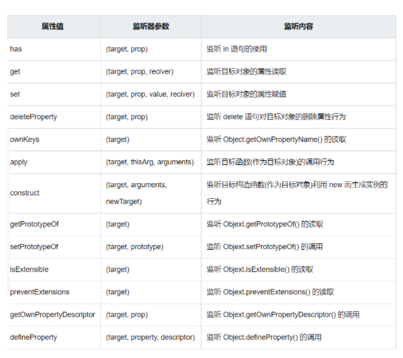

## 前言
>大家都知道在vue3中响应式原理有原先的object.defineProperty换成了es6的新特性Proxy。
那Proxy到底是什么呢，他和object.defineProperty又有什么区别，他的出现解决了vue2的哪些痛点？


**首先来回答Proxy到底是什么：**
::: tip 回答
可以简单的理解为一个拦截器，他可以对任何对象的绝大部分行为和操作进行干涉，也就是我们常说的拦截。一提到拦截是不是就有感觉了。有了拦截不就可以实现响应式了嘛！也的确如此，对new Proxy返回的代理对象进行大部分操作如增删改读都可以被拦截到，我们就可以在其中做一些其他的事情。Proxy当然不止这些功能，他提供了多达13种行为的拦截，具体的可以自行查阅文档
:::


本文只介绍```get``` ```set``` 以及```deleteProperty```。

回到第二个问题以及第三个问题，他和```object.defineProperty```的区别在哪儿，我们都知道```object.defineProperty```只能拦截到对象自身以有的属性，而后续新增的属性是无法拦截到的，所以```vue2```提供了```$set```等一系列的api来帮助完善响应式。并且```object.defineProperty```并没有办法拦截到数组的一些变更，而```vue2```则采用了重写js种能修改源数据的```数组api```来实现数组的```响应式```，这些问题在```proxy中```都不存在了，这就是二者区别以及他的出现解决了vue2的哪些问题

那接下来就一起来看看他是怎么使用的吧。
语法如下

```js
const proxyObj = new Proxy(target,{
get(target,key){
},
set(target,key,val){
},
deleteProperty(target,key){
}
...
})
```
其中```target```就是需要被代理的对象，而当我们修改读取新增或删除代理对象的某些值的时候就会触发一系列相关的函数，也就是我们在```new Proxy```的时候传入的第二个对象中的函数。

**这里会有一个疑问，修改proxyObj的时候会不会影响到原来的对象，以及直接修改原来的对象，proxyObj会被修改吗?**
::: tip 回答
经过实验我发现他们两个对象是互通的，也就是你改了我也会变我改了你也会变，只不过如果直接修改原对象则不会触发拦截。
至于是为什么，我的理解是在所有的拦截操作中，他都接收了target也就是原对象作为参数，那实际的操作也是在target上进行的，所以可以理解为target和proxyObj其实就是同一个对象，只不过proxyObj拦截你的各种操作，然后分发到原对象身上去而已。不知道理解的是不是有误。。
:::

接下来我们就来手动实现一下vue3中的王牌响应式api reactive和ref
要实现他们俩就得先知道他们俩是干什么的，其实两个api都是包装数据用的，使数据变为响应式，唯一的不同点就是reactive用于包装对象和数组ref则可以用于包装各种类型。经过ref包装后的值需要通过.value的方式获取。其实ref在包装对象和数组类型的时候也是调用的reactive，具体的步骤看后续实现就行。

## reactive

```js
const reactiveHandler = {
    get(target,key){
        console.log('拦截到了读取数据',key)
        return Reflect.get(target,key)
    },
    set(target,key,val){
        console.log('拦截到了更新或新增数据',key)
        return Reflect.set(target,key,val)
    },
    deleteProperty(target,key){
        console.log('拦截到了删除数据',key)
        return Reflect.deleteProperty(target,key)
    }
}
function reactive(target) {
    if(target&&typeof target==='object'){
        if(Array.isArray(target)){
            target.forEach((d,index)=>{
                target[index] = reactive(d)
            })
        }else{
            Object.keys(target).forEach(d=>{
                target[d] = reactive(target[d])
            })
        }
        return new Proxy(target,reactiveHandler)
    }
    return target
}
```
可以看到还是比较简单的，这里只实现了一下拦截，并没有实现更新视图。因为Proxy只能拦截到目标对象自身属性的变化，但是如果自身某个属性也是引用类型的话，他就拦截不到了。
比如当我们操作obj.user的时候，user是obj的属性，这个时候Proxy是完全可以拦截到任意行为的，但是如果user也是一个对象，我们要去操作obj.user.name的时候。此时Proxy就只能拦截到obj.user，并不能拦截到name属性的任意行为了。所以上文中reactive函数做了一个递归处理，将所有的对象和数组都转为代理形式。
vue3中还有个与reactive对应的api叫shallowReactive，他就是浅层的响应式，也就是只作用于目标对象自身属性，再往深了去就不进行代理了，他的实现就更简单了

## shallowReactive
```js
function shallowReactive(target) {
    if(target&&typeof target==='object'){
        return new Proxy(target,reactiveHandler)
    }
    return target
}
```
## ref
我们都知道proxy是用来代理对象的，但是js中可不止有对象和数组这两个数据类型。那当我们需要对基本数据类型进行响应式的时候该怎么办呢。这个时候ref就出现了。他其实就是利用了对象的get props 和set props函数。

```js
{
        _num:0,
        get num(){
            console.log('劫持到了get')
            return this._num
        },
        set num(val){
            console.log('劫持到了set',val)
            this._num= val
        }
    }
```
是不是很惊讶，对象中还有这种用法，get 和set可以指定一个属性名，当我们在访问这个属性名的时候就会触发get和set方法。就可以实现拦截的效果拉。现在是不是明白了为什么ref包裹的数据要.value的形式去访问了？

```js
function ref(target) {
    return{
        _value:reactive(target),
        get value(){
            console.log('劫持到了get')
            return this._value
        },
        set value(val){
            console.log('劫持到了set',val)
            this._value = val
        }
    }
}
```

其实ref 的内部就是这样的拉。我们在访问value属性的时候，所有的操作都会分发到_value身上去。那如果这个时候传入的是对象或者数组的话怎么办呢，很简单。用之前写好的reactive函数包裹一次就行拉。
因为对象中的get和set同样是只能监听到你指定的那个属性的变化的，如果你指定的那个属性是对象的话，那么深层的变化的是监听不到的。所以需要借助reactive来完善。
如果你不想拦截那么深层次的话，vue3也提供了一个shallowRef，他就只拦截value的变化了，value再往深了去就不会被监听到了。

## shallowRef

```js
function shallowRef(target) {
    return{
        _value:target,
        get value(){
            console.log('劫持到了get')
            return this._value
        },
        set value(val){
            console.log('劫持到了set',val)
            this._value = val
        }
    }
}
```
以上就是本文全部内容。仅供参考学习
