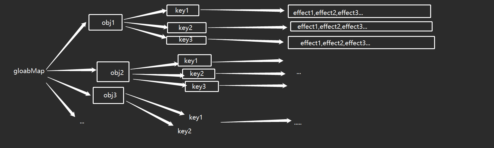

## 前言
>提到``Vue3``的响应式，大部分人都知道是通过``proxyApi``来实现的，就像提到``Vue2``响应式大家都会想到``Object.defineProperty``。但是你真的了解vue是如何通过这些api来实现的吗？其本身肯定不是单纯的调用一下Api就行了，本文将通过手写一个建议的响应式来深入理解一下vue3

## 开始
在开始之前，让我们先回顾一下``Vue2``的响应式。在Vue2中是通过``Object.defineProperty``去劫持``data``中的数据，在``get``某个属性的时候将``观察者实例``添加进``依赖数组``，然后在``set``的时候去``触发``依赖数组里的观察者对象的``更新函数``。而观察者对象的更新函数则是在``模板编译``的时候保存下来的一个函数。更详细的介绍可以看另一篇[文章](https://hanhanbuku.github.io/my_blog_vuepress/pages/a9112c/)

而在vue3中，则是将``响应式``从data中``剥离``了出来。使得我们可以在任意地方将一个变量变成响应式的，并且由于api的不同，也规避了Object.defineProperty的一些劣势，譬如无法对新增的属性进行拦截，只能通过扩展api来实现(``$set``)。下面就来简单实现一下Vue3的响应式吧

## reactive
首先来实现一下响应式Api Reactive
```js
    const handleProxy = {
        get(target, key) {
            const res = Reflect.get(target,key)
            // TODO 收集依赖
            return res
        },
        set(target,key,value){
           const res = Reflect.set(target,key,value)
            // TODO 触发依赖
            return res
        }
    }
    // 创建reactive函数
    function reactive(data){
        return new Proxy(data,handleProxy)
    }
```
这样，一个简单的``reactive``就完成了。接下来就是去补充``收集依赖``和``触发依赖``这两个步骤了。在进行这两个步骤之前，我们再回顾一下Vue2的响应式。
不知道大家还记不记得再Vue2的响应式过程中，有一个名叫``Dep``的角色。他是专门用来``收集依赖``的。换句话说，也就是用来收集``更新试图``的函数的。那Vue3里面其实也会需要这么一个角色。

### 依赖的数据解构

在vue3里通过各种各样的``map``结构来``保存依赖``。而每个依赖和响应式属性的关系大概如下



下面来解释一下图中的关系，``globalMap``是``最上层``的map对象，他采用``WeakMap``来存储每一个被响应式的对象，``key``就是这个``对象本身``，而``value``则是一个普通``Map``对象。这个Map的key就是``目标对象自身的每一个key``，他的``value``就是``这个key``所对应的``更新函数``的集合。而这个更新函数的集合则又是采用``set``结构来保存的。

这里讲个题外话，解析一下为什么vue要采用这么复杂的结构来保存依赖。首先是最上层的``WeakMap``，``WeakMap``是一个``以对象为key``的map解构，他的特点是对key采用``弱引用``，也就是说你将一个对象作为WeakMap的key时是``不会影响``这个对象被垃圾回收机制``回收``的。
而当这个对象被回收时，WeakMap里就会``自动删除``这个key以及他的value。这样对性能优化上就会非常的友好。第二层的map结构和第三层的set结构会更加方便我们查找某一个key，并且set还有``自动去重``的功能，防止依赖函数重复添加。

## 生成依赖
回归正题，下面我们要做的时收集依赖和触发依赖，那么这个所谓的``依赖（更新函数）``到底从何而来呢？这里需要准备一个创建依赖的函数。

```js
    // 存放所有依赖
    let globalMap = new WeakMap()
    let activityEffect = null //用于保存当前所需要被收集的依赖，对标Vue2中new Watcher时将自身保存在Dep的target属性上一样

    class CreateEffect {
        /**
         * @param fn 更新试图的函数
         * @param scheduler 计算属性的更新函数
         */
        constructor(fn,scheduler) {
            this.fn = fn
            this.scheduler = scheduler;
        }

        run(){
            activityEffect = this //将自身设置为当前需要被收集的依赖
            const res = this.fn()
            activityEffect = null
            return res
        }
    }
```
这个函数会创建出一个依赖实例，实例接受``更新函数``作为参数，然后提供一个``run``方法来执行更新函数，并且``重置``掉当前需要``被收集``的``依赖对象``

关于``activityEffect``的作用，注释里已经标明了，这里再详细的解析一下。在Vue2中，``watcher``类的初始化函数有如下步骤
```js
    /* Watcher */
    class Watcher {
        constructor(vm, key, cb) {
            //将自身保存在Dep的静态属性target上，供dep收集
            Dep.target = this
            //保存一下key的值，目的是为了触发这个属性的get，从而收集依赖
            this.oldVal = vm[key]
            //因为上一步已经触发了get收集了依赖，所以这里清空Dep.target,防止循环引用。
            Dep.target = null
        }
    }

```
而``observe``的代码如下
```js
    /* Observe */

    class Observe {
        ...
        defineReactive(data,key,value){
            ...
            //为当前这个属性创建一个依赖收集器
            const dep = new Dep()
            //开始劫持属性
            Object.defineProperty(data,key,{
                // 设置可枚举
                enumerable: true,
                // 设置可配置
                configurable: true,
                // 获取值
                get() {
                    //收集依赖
                    Dep.target&&dep.addSub(Dep.target)
                    return value
                },
                //设置值
                set(newValue){
                    if(newValue!==value){
                        //将新的值赋值给value
                        value = newValue
                        //如果新的值是引用类型的话，同时给新的值也添加上响应式
                        that.walk(value)
                        //派发通知，触发依赖更新视图
                        dep.notfiy()
                    }
                }
            })
        }
    }

```
注意这里的``dep``，在``拦截``属性的时候创建了一个``dep``。而这个``dep``的``target``对象就是指向的实例化后的``watcher``。这里关键的步骤是当我们实例化一个``watcher``的时候，会将当前实例保存到``dep``的``target``上。然后访问一下data上的属性从而``触发``get收集依赖。这个时候收集的就是``dep.target``。而此时``dep.target``不就正好保存的是我们刚刚实例化出来的``watcher``吗。
当收集完之后就会``重置``掉dep.target。而``activityEffect``就是用来``代替dep.target``的。

有了依赖实例，下面我们就可以着手去写一下触发和收集啦
## 收集依赖
```js
    // 收集依赖
    function track(target, key){
        if(!activityEffect) return;
        // 1. 获取 target 对应的依赖映射
        let effectMap = globalMap.get(target);
        if(!effectMap) globalMap.set(target, ( effectMap = new Map() ));
        // 2. 获取 key 对应的依赖集合
        let effectSet = effectMap.get(key);
        if(!effectSet) effectMap.set(key, ( effectSet = new Set() ));
        // 3. 收集依赖
        effectSet.add(activityEffect);
    }
    // 触发依赖
    function trigger(target, key){
        // 1. 获取 target 对应的依赖映射
        const effectMap = globalMap.get(target);
        if(!effectMap) return;
        // 2. 获取 key 对应的依赖集合
        const effectSet = effectMap.get(key);
        if(!effectSet) return;
        // 3. 触发依赖
        effectSet.forEach((effect) => effect.scheduler ? effect.scheduler() : effect.run());
    }
```
这两步就比较简单了，就是去globalMap里``存值取值``，注意前面提到的globalMap结构。用上对应的方法去存取就行了。下面我们把这个步骤加入到reactive中
```js
    const handleProxy = {
        get(target, key) {
            const res = Reflect.get(target,key)
            //  收集依赖
            track(target,key)
            return res
        },
        set(target,key,value){
           const res = Reflect.set(target,key,value)
            // 触发依赖
            trigger(target,key)
            return res
        }
    }
```
接下来就差最后一步，生成依赖了。在Vue2中这一步交由``watcher``来完成，而在Vue3中则有一个名为``effect``的函数来实现
```js
    // 生成依赖实例
    function effect(fn,options){
        const _effect = new CreateEffect(fn,options.scheduler)
        _effect.run()
        return _effect.run.bind(_effect);
    }
```
下面我们就将这些代码融入到一个例子当中去看看响应式有没有实现吧
```html
<!DOCTYPE html>
<html lang="en">
<head>
    <meta charset="UTF-8">
    <title>vue3响应式</title>
</head>
<body>
<input id="input">
<div id="text"></div>
<script>
    const handleProxy = {
        get(target, key) {
            const res = Reflect.get(target,key)
            //  收集依赖
            track(target,key)
            return res
        },
        set(target,key,value){
           const res = Reflect.set(target,key,value)
            // 触发依赖
            trigger(target,key)
            return res
        }
    }
    // 创建reactive函数
    function reactive(data){
        return new Proxy(data,handleProxy)
    }

    // 存放所有依赖
    let globalMap = new WeakMap()
    let activityEffect = null //用于保存当前所需要被收集的依赖，对标Vue2中new Watcher时将自身保存在Dep的target属性上一样

    class CreateEffect {
        /**
         * @param fn 更新试图的函数
         * @param scheduler 计算属性的更新函数
         */
        constructor(fn,scheduler) {
            this.fn = fn
            this.scheduler = scheduler;
        }

        run(){
            activityEffect = this //将自身设置为当前需要被收集的依赖
            const res = this.fn()
            activityEffect = null
            return res
        }
    }
    // 收集依赖
    function track(target, key){
        if(!activityEffect) return;
        // 1. 获取 target 对应的依赖映射
        let effectMap = globalMap.get(target);
        if(!effectMap) globalMap.set(target, ( effectMap = new Map() ));
        // 2. 获取 key 对应的依赖集合
        let effectSet = effectMap.get(key);
        if(!effectSet) effectMap.set(key, ( effectSet = new Set() ));
        // 3. 收集依赖
        effectSet.add(activityEffect);
    }
    // 触发依赖
    function trigger(target, key){
        // 1. 获取 target 对应的依赖映射
        const effectMap = globalMap.get(target);
        if(!effectMap) return;
        // 2. 获取 key 对应的依赖集合
        const effectSet = effectMap.get(key);
        if(!effectSet) return;
        // 3. 触发依赖
        effectSet.forEach((effect) => effect.scheduler ? effect.scheduler() : effect.run());
    }
    // 生成依赖实例
    function effect(fn,options){
        const _effect = new CreateEffect(fn,options?.scheduler)
        _effect.run()
        return _effect.run.bind(_effect);
    }
    const data = reactive({
        name:''
    })

    const input = document.getElementById("input");

    input.addEventListener("change", (event) => {
        data.name = event.target.value
    });
    function updateView (){
        const dom = document.getElementById('text')
        dom.innerText = data.name
    }
    effect(updateView)
</script>

</body>
</html>

```
效果这里就不贴图了，自行测试。到这里我们就完成了一个建议的vue3响应式。里面还有很多细节和边界问题没考虑。想更具体学习的话可以直接去看源码

## 总结
Vue3的响应式主要是通过``proxy``去代理对象，然后拦截``get``和``set``等一系列操作。在响应式系统的内部维护了一个``WeakMap``结构的依赖对象用于存放所有的响应式``key``和其对应的``依赖（这里其实就对标的是Vue2的Dep实例）``。而产生依赖则是通过``Effect``这个函数去``创建依赖``，这里其实对应的就是``Vue2里的Watcher观察者``。然后在``get``和``set``的拦截操作里去``收集``和``触发``依赖。学习响应式主要搞清楚在整个系统中有哪些角色，以及每个角色是干嘛的包括他们之间是如何串联起来的。搞明白了这些，就会学的非常轻松了。换句大白话概述一下vue的响应式：编译模板的时候生成更新函数也就是大家口中所说的依赖。然后在拦截到get的时候把当前生成的依赖保存起来，接着在set的时候去调用他们就行了。
